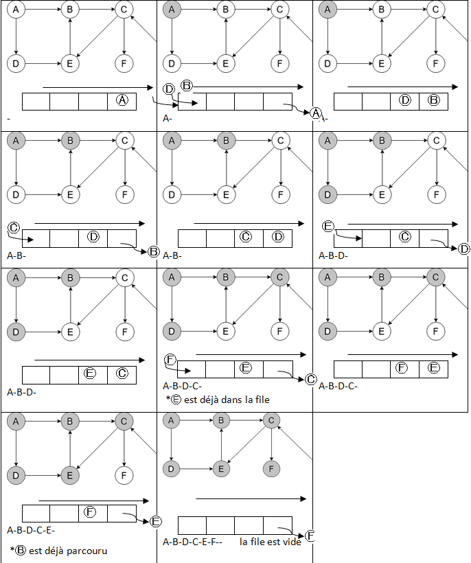
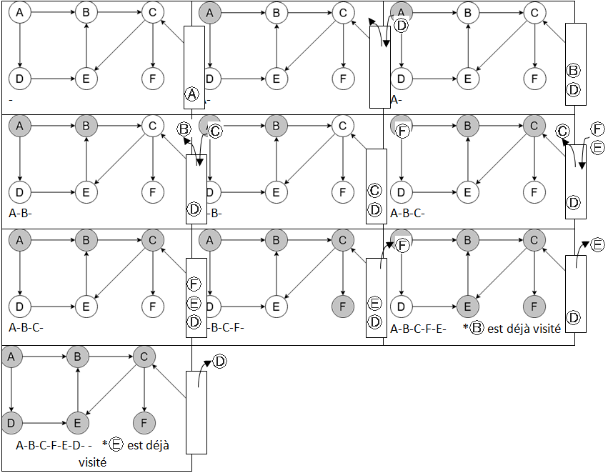

# Algorithmes sur les graphes.

!!! abstract "Cours" 
    Parcourir un graphe consiste à visiter ses sommets, en suivant les arêtes qui les relient.

On a vu dans le chapitre sur les [structures de données](../structures-de-donnees/8-graphes.md#liste-ou-dictionnaire-dadjacence) plusieurs implémentations possibles d'un graphe : avec une matrice d'adjacente ou avec une liste ou dictionnaire d'adjacence. 

Nous utilisons la seconde mettant en œuvre un dictionnaire d'adjacence dans ce chapitre où les voisins sont stockés dans des tableaux.


``` py
class Graphe:
    """ """
    def __init__(self, oriente = True):
        self.A = {}                # Dictionnaire d'adjacence
        self.oriente = oriente     # Graphe orienté ou pas

    def est_vide(self):
        return len(self.A) == 0

    def ordre(self):
        return len(self.A)

    def __repr__(self):
        return str(self.A)

  def ajouter_sommet(self, x):
        """ Ajoute un sommet x """
        if not x in self.A:
            self.A[x] = []

    def ajouter_arete(self, x, y):
        """ Ajoute une arête entre les sommets x et y """
        self.ajouter_sommet(x)
        self.ajouter_sommet(y)
        self.A[x].append(y)
        if not self.oriente:
            self.A[y].append(y)

    def voisins(self, x):
        """ Renvoie le tableau des voisins de x"""
        return self.A[x]

``` 


et pour les exemples, le graphe orienté suivant :
{width="50%" align=right}
{width="50%" align=right}

Créons le graphe :

```py
G = Graphe(True)
G.ajouter_sommet("A")   # sommet A
G.ajouter_sommet("B")   # sommet B
G.ajouter_sommet("C")   # sommet C
G.ajouter_sommet("D")   # sommet D
G.ajouter_sommet("E")   # sommet E
G.ajouter_sommet("F")   # sommet F
G.ajouter_sommet("G")   # sommet G
G.ajouter_arc("A", "B")  
G.ajouter_arc("A", "D")  
G.ajouter_arc("B", "C")  
G.ajouter_arc("C", "E")  
G.ajouter_arc("C", "F")  
G.ajouter_arc("D", "E")  
G.ajouter_arc("E", "B")
G.ajouter_arc("G", "C")  
```

A la différence des arbres binaires, dans les graphes il n'y a pas de notion de gauche ou droite ou d'un ordre quelconque entre les voisins d'un sommet,  ni de « racine » du graphe. On parcourt donc les voisins dans n'importe quel ordre. Selon l'ordre dans lequel on regardera les voisins de chaque sommet, on pourra faire des parcours complètement différents en partant d'un même sommet.

## Parcours en largeur (BFS)

!!! abstract "Cours" 
    Le **parcours en largeur** ou **BFS** (*Breadth First Search*), consiste à visiter tous les sommets en « cercle concentriques » autour du sommet de départ : d'abord les sommets à une distance de 1, puis ceux à une distance de 2, etc. 

A la différence du parcours en largeur dans un arbre binaire, il n'y a pas de notion de gauche et droite dans les sommets suivants, on les parcourt donc dans n'importe quel ordre.

{width="80%" }
{width="80%" }

Le parcours en largeur du graphe ci-dessus est A-B-D-C-E-F, mais on peut aussi avoir A-D-B-E-C-F.

Comme pour le parcours en largeur d'un arbre binaire, l'implémentation nécessite l'utilisation une structure de file : pour chaque sommet visité on met en attente dans une file (enfiler) les voisins qu'on n'a pas encore visités et qui ne sont pas déjà dans la file, puis on visite le premier sommet présent dans la file (défiler).


{width="100%" }


Voilà un exemple d'implémentation avec une file de type Python list.

``` py
    def parcours_larg(self, depart):
        """ Renvoie le parcours en largeur à partir du sommet depart"""
        parcours = []   # liste des sommets visités
        file = [depart]   # file des sommets en attente
        while file != []:
            s = file.pop(0)        # on défile
            parcours.append(s)      # on l'ajoute au parcours
            for v in self.voisins(s):
                # on enfile les voisins qui n'ont pas été visités ou en attente
                if v not in parcours and v not in file:
                    file.append(v)
        return parcours
```

Chaque sommet entre une et une seule fois dans la file, la boucle ```while``` sera donc répétée $n$ fois ($n$ est l'ordre du graphe). Pour chaque sommet de la file : on suppose que le défilement  est à cout constant (ce qui n'est pas le cas avec ```.pop(0)``` sur le type ```list```)[^2.2]; alors la boucle ```for``` est répétée pour chaque voisin, donc une fois pour chaque arête. Si on nomme $m$ le nombre d'arête du graphe, **la complexité du parcours en largeur est en $O(n+m)$**.


[^2.2]: Le type ```list``` n'est pas l'implémentation optimale d'une file car ```.pop(0)``` est en cout linéaire, une liste chaînée ou la classe la classe ```collections.deque``` serait mieux adaptée.

Il existe de nombreuses utilisations du parcours en largeur. Une première utilisation toute simple permet de vérifier si un graphe est fortement connexe[^2.3]  ou pas. Peut-on accéder à tous les sommets du graphe depuis de chaque sommet ?

[^2.3]: Un graphe orienté est fortement connexe si pour toute paire (x, y) de sommets, il existe un chemin de x à y et un chemin de y à x.

``` py
    def fort_connexe(self):
        """ True si le graphe est fortement connexe"""
        for s in self.sommet:
            if self.parcours_largeur(s) != self.ordre():
                return False
        return True
```

###	Application : Plus court chemin

A l'issue du parcours en largeur, ``` parcours``` contient l'ensemble des sommets qui ont été visités, on peut ainsi vérifier facilement s'il existe ou pas un chemin menant du sommet de départ vers un autre sommet. En revanche, l'ordre du parcours, donnant le chemin n'est pas mémorisé par ce type de parcours.

Pour calculer la distance ou le plus court chemin entre deux sommets, il faut conserver le sommet qui permet d'accéder à chaque sommet, par exemple en utilisant  un dictionnaire ``` viens_de```  qui associe à chaque sommet visité au sommet qui a permis de l'atteindre (ou None pour au sommet de départ). Il suffit ensuite de partir de l'arrivée et de remonter jusqu'au sommet de départ pour calculer  la distance ou construire le chemin.

``` py
    def chemin(self, depart, arrivee):
        """ Renvoie le chemin entre deux sommets"""
        viens_de = {depart: None}  # dict des sommets avec le sommet qui permet d'y accéder
        file = [depart]        # file des sommets en attente
        while file != []:      # tant que la file n'est pas vide
            s = file.pop(0)        # on défile le premier sommet
            for v in self.voisins(s):
                # on enfile les voisins qui n'ont pas été visités ou en attente
                if v not in viens_de and v not in file:
                    file.append(v)      # on l'enfile
                    viens_de[v] = s     # et on note qu'on y accède depuis s
        # on construit le chemin en partant d'arrivee
        chemin = [arrivee]
        if arrivee not in viens_de: return -1 # pas de chemin possible
        s = viens_de[arrivee]
        while s is not None:
            chemin.insert(0, s)
            s = viens_de[s]
        return chemin
``` 

de même pour la distance:

``` py
   def distance(self, depart, arrivee):
	….
       # on calcule la distance en partant d'arrivee
        distance = 0
        if arrivee not in viens_de: return -1 # pas de chemin possible
        s = viens_de[arrivee]
        while s is not None:
            distance = distance + 1
            s = viens_de[s]
        return distance
``` 

Une autre utilisation typique du parcours en largeur est la coloration d'un graphe: comment attribuer une « couleur » à chacun de ses sommets de manière que deux sommets reliés par une arête soient de couleurs différentes ?  On cherche souvent à utiliser le nombre minimal de couleurs, appelé nombre chromatique.

##	Parcours en profondeur (DFS)

!!! abstract "Cours" 
    
    Le **parcours en profondeur** ou **DFS** (*Depth First Search*) d'un graphe à partir d'un sommet consiste à suivre les arêtes arbitrairement, le plus loin possible jusqu'à un cul-de-sac ou alors jusqu'à atteindre un sommet déjà visité. Il revient alors sur le dernier sommet où on pouvait suivre un autre chemin puis explore un autre chemin. 

    L'exploration s'arrête quand tous les sommets ont été visités.


{width="80%" }
{width="80%" }

Le parcours en profondeur du graphe ci-dessus est A-B-C-F-E-D, mais les arêtes étant choisies arbitrairement[^2.4], il faut s'attendre à des visites dans des ordres complétements différents. Ici, on pourrait tout aussi bien obtenir A-B-C-E-F-D ou A-D-E-B-C-F.

[^2.4]: On peut aussi faire quelque chose de plus « fin » en utilisant un algorithme glouton qui va sélectionner le sommet non visité minimisant ou maximisant une fonction de score ou de coût. C'est le cas de A*, par exemple.

{width="40%" align=right }
{width="40%" align=right }
Comme pour les arbres, le parcours en  profondeur d'un graphe s'exprime naturellement de façon récursive, à la différence qu'**il faut marquer les sommets déjà visités** afin de ne pas y retourner depuis un autre sommet et risquer de « tourner en rond ». Le parcours se termine lorsqu'il n'y a plus de sommets à parcourir.

``` py
    def parcours_prof_rec(self, s, parcours=None):
        """ Parcours en profondeur récursif à partir du sommet s
        parcours contient l'ensemble des sommets visités
        """
        if parcours is None:  # on initialise parcours
            parcours = []
        if s not in parcours:
            parcours.append(s)   # on l'ajoute au parcours
            for v in self.voisins(s):  # on parcourt chaque voisin
                self.parcours_prof_rec(v, parcours)
        return parcours
```

Note : pour l'appel initial de la fonction avec le sommet de départ, ```parcours``` est vide. Si on veut définir une valeur par défaut par mot clé, on ne peut pas écrire ```def parcours_prof_rec(self, s, parcours=[])``` car le type list est de type muable ce qui engendrera des erreurs[^2.5]. 

[^2.5]: Voir [https://docs.python.org/fr/3/tutorial/controlflow.html#default-argument-values](https://docs.python.org/fr/3/tutorial/controlflow.html#default-argument-values)
 
En cas de très grand nombre de sommets, la méthode récursive peut vite atteindre sa limite[^2.6].  On peut alternativement utiliser une **approche itérative**, à l'aide d'une **pile*, de façon très similaire au parcours en largeur.

[^2.6]: 1000 par défaut en Python.


{width="100%" }


Voilà un exemple d'implémentation avec une pile de type Python list[^2.7]. 

[^2.7]: Ici, le type Python ```list``` est adapté à l'implémentation d'une pile car le cout des méthodes ```.append()``` et  ```.pop()``` est en $O(1)$.

``` py
    def parcours_prof(self, depart):
        """ Renvoie le parcours en profondeur au depart d'un sommet"""
        parcours = []   # listes des sommets visités
        pile = [depart]   # pile des sommets en attente
        while pile != []:
            s = pile.pop()        # on dépile
            parcours.append(s)  # on l'ajoute au parcours
            for v in self.voisins(s):
                # on empile les voisins qui n'ont pas été visités ou en attente
                if v not in parcours and v not in pile:
                    pile.append(v)
        return parcours
```

De la même façon que le parcours en largeur, la **complexité du parcours en profondeur est en $O(n+m)$** où $n$ est le nombre de sommets et $m$ le nombre d'arêtes.

Comme pour le parcours en largeur, à la fin du parcours en profondeur, ```parcours``` contient l'ensemble des sommets qui ont été visités ce qui permet de vérifier facilement s'il existe ou pas un chemin menant du sommet de départ vers un autre sommet. Par contre, le parcours en profondeur est mal adapté pour déterminer la distance entre deux sommets ou le chemin le plus court entre deux sommets, car rien n'indique qu'un chemin trouvé est le plus court. 

###	Application : Recherche de cycles

Le parcours en profondeur est particulièrement bien adapté à la recherche de cycles dans un graphe. Voici un exemple de détection de cycle qui utilise un parcours en profondeur (applicable aussi à un parcours en largeur). On empile les voisins jusqu'à ce qu'on retombe sur un sommet qui a déjà été parcouru

``` py
    def possede_cycle(self, depart):
        """ Renvoie True si un cycle est detécté"""
        parcours = []
        pile = [depart]
        while pile != []:
            s = pile.pop()
            if s in parcours:          # S a-t-il été parcouru ?
                return True     # dans ce cas on a un cycle
            parcours.append(s)
            for v in self.voisins(s):
                # on empile les voisins qui n'ont pas été visités ou en attente
                if v not in parcours:
                    pile.append(v)
        return False

```

