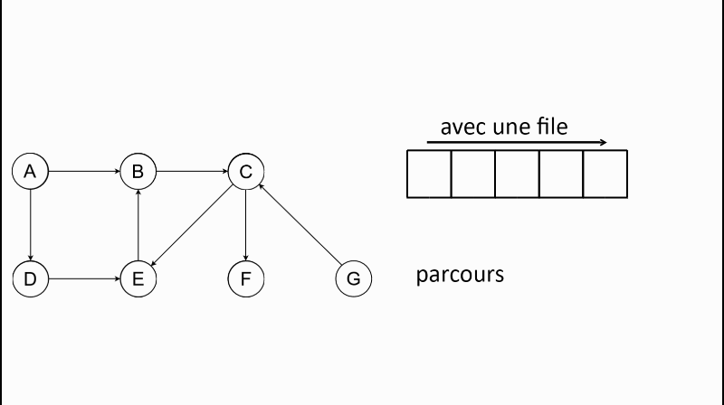
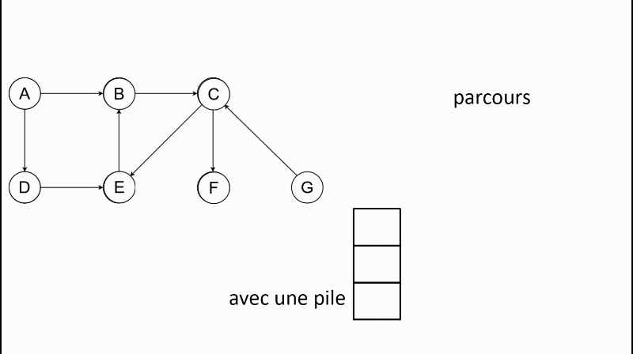

# Algorithmes sur les graphes.

!!! abstract "Cours" 
    Parcourir un graphe consiste à visiter ses sommets, en suivant les arêtes qui les relient.

On a vu dans le chapitre sur les [structures de données](../structures-de-donnees/8-graphes.md#liste-ou-dictionnaire-dadjacence) plusieurs implémentations possibles d'un graphe : avec une matrice d'adjacente ou avec une liste ou dictionnaire d'adjacence. 

Nous utilisons la seconde mettant en œuvre un dictionnaire d'adjacence dans ce chapitre où les voisins sont stockés dans des tableaux.


``` py
class Graphe:
    """ """
    def __init__(self, oriente=True):
        self.A = {}                # Dictionnaire d'adjacence
        self.oriente = oriente     # Graphe orienté ou pas

    def est_vide(self):
        return len(self.A) == 0

    def ordre(self):
        return len(self.A)

    def __repr__(self):
        return str(self.A)

    def ajouter_sommet(self, s):
        if not s in self.A:
            self.A[s] = []

    def ajouter_arete(self, s1, s2):
        """ Ajoute une arête entre les sommets s1 et s2 """
        self.ajouter_sommet(s1)
        self.ajouter_sommet(s2)
        if s2 not in self.A[s1]:
            self.A[s1].append(s2)
        if not self.oriente:        
            self.A[s2].append(s1)


    def voisins(self, s):
        """ Renvoie le tableau des voisins de s"""
        return self.A[s]

``` 


et pour les exemples, le graphe orienté suivant :
{width="50%" align=right}
{width="50%" align=right}

Créons le graphe :

```py
G = Graphe(True)
G.ajouter_sommet("A")   # sommet A
G.ajouter_sommet("B")   # sommet B
G.ajouter_sommet("C")   # sommet C
G.ajouter_sommet("D")   # sommet D
G.ajouter_sommet("E")   # sommet E
G.ajouter_sommet("F")   # sommet F
G.ajouter_sommet("G")   # sommet G
G.ajouter_arete("A", "B")  
G.ajouter_arete("A", "D")  
G.ajouter_arete("B", "C")  
G.ajouter_arete("C", "E")  
G.ajouter_arete("C", "F")  
G.ajouter_arete("D", "E")  
G.ajouter_arete("E", "B")
G.ajouter_arete("G", "C")  
```

À la différence des arbres binaires, dans les graphes il n'y a pas de notion de gauche ou droite ou d'un ordre quelconque entre les voisins d'un sommet,  ni de « racine » du graphe. On parcourt donc les voisins dans n'importe quel ordre. Selon l'ordre dans lequel on regardera les voisins de chaque sommet, on pourra faire des parcours complètement différents en partant d'un même sommet.

## Parcours en largeur (BFS)

!!! abstract "Cours" 
    Le **parcours en largeur** ou **BFS** (*Breadth First Search*), consiste à visiter tous les sommets en « cercle concentriques » autour du sommet de départ : d'abord les sommets à une distance de 1, puis ceux à une distance de 2, etc. 


{width="100%" }
{width="100%" }

Un parcours en largeur du graphe ci-dessous est A-B-D-C-E-F, mais les voisins étant choisis arbitrairement ce n'est pas le seul, on peut aussi parcourir le graphe dans l'ordre A-D-B-E-C-F.


Comme pour le parcours en largeur d'un arbre binaire, l'implémentation peut se faire avec une file : pour chaque sommet visité on enfile les voisins qui n'ont pas été encore visités et qui ne sont pas déjà dans la file, puis on defile le premier sommet de la file.


{width="100%"}


Voilà un exemple d'implémentation avec une file construite avec un tableau de type `list`.

``` py
    def BFS(self, depart):
        """ Renvoie le parcours en largeur à partir du sommet depart"""
        parcours = []   # liste des sommets visités
        file = [depart]   # file des sommets en attente
        while file != []:
            sommet = file.pop(0)        # on défile un sommet en attente
            parcours.append(sommet)      # on ajoute le sommet au parcours
            for voisin in self.voisins(sommet):
                # on enfile les voisins qui n'ont pas été visités ou en attente
                if voisin not in parcours and voisin not in file:
                    file.append(voisin)
        return parcours
```

Chaque sommet entre une et une seule fois dans la file, la boucle ```while``` sera donc répétée $n$ fois ($n$ est l'ordre du graphe). Pour chaque sommet de la file : on suppose que le défilement  est à coût constant (ce qui n'est pas le cas avec ```.pop(0)``` sur le type ```list```)[^2.2]; alors la boucle ```for``` est répétée pour chaque voisin, donc une fois pour chaque arête. Si on nomme $m$ le nombre d'arête du graphe, **la complexité du parcours en largeur est en $O(n+m)$**.


[^2.2]: Le type ```list``` n'est pas l'implémentation optimale d'une file car ```.pop(0)``` est en coût linéaire, une liste chaînée ou de la classe ```collections.deque``` serait mieux adaptée.

Il existe de nombreuses utilisations du parcours en largeur. Une première utilisation toute simple permet de vérifier si un graphe est fortement connexe[^2.3] ou pas. Peut-on accéder à tous les sommets du graphe depuis de chaque sommet ?

[^2.3]: Un graphe orienté est fortement connexe si pour toute paire (x, y) de sommets, il existe un chemin de x à y et un chemin de y à x.

``` py
    def fort_connexe(self):
        """ True si le graphe est fortement connexe"""
        for s in self.sommet:
            if self.BFS(s) != self.ordre():
                return False
        return True
```

###	Application : Plus court chemin

A l'issue du parcours en largeur, ``` parcours``` contient l'ensemble des sommets qui ont été visités, on peut ainsi vérifier directement s'il existe ou pas un chemin menant du sommet de départ vers un autre sommet. Mais pour connaître quel est ce chemin il faut modifier l'algorithme pour conserver dans la file des sommets en attente le chemin qui a mené à chacun des sommets :

``` py
    def chemin(self, depart, arrivee):
        """ Renvoie le chemin du sommet depart au sommet arrivee"""
        parcours = []   # liste des sommet visités
        file = [(depart, [])]   # file des couples (sommet, chemin) en attente
        while file != []:
            sommet, chemin = file.pop(0)        # on défile le couple (sommet, chemin)
            parcours.append(sommet)      # on ajoute le sommet au parcours
            # si on a trouvé un chemin qui mène à arrivee, inutile de continuer
            if sommet == arrivee:
                return chemin + [sommet]

            for voisin in self.voisins(sommet):
                # on enfile les voisins qui n'ont pas été visités ou en attente
                if voisin not in parcours and voisin not in [s for s, c in file]:
                    file.append((voisin, chemin  + [sommet]))
        # si on n'a jamais trouvé le sommet arrivee, il n'y a pas de chemin
        return None  
```

Comme l'algorithme explore les sommets niveau par niveau (d'abord tous les voisins directs, puis leurs voisins, etc.), il garantit de trouver le **chemin le plus court** , car il atteint toujours l'arrivée par le chemin le plus direct possible. La méthode `distance` entre deux sommets est donc tout simplement :

``` py
    def distance(self, depart, arrivee):
        c = self.chemin(depart, arrivee)
        if c is None:
            return -1
        else:
            return len(c)
```


##	Parcours en profondeur (DFS)

!!! abstract "Cours" 
    
    Le **parcours en profondeur** ou **DFS** (*Depth First Search*) d'un graphe à partir d'un sommet consiste à suivre les arêtes arbitrairement, le plus loin possible jusqu'à un cul-de-sac ou alors jusqu'à atteindre un sommet déjà visité. Il revient alors sur le dernier sommet où on pouvait suivre un autre chemin puis explore un autre chemin. 

    L'exploration s'arrête quand tous les sommets ont été visités.


Un parcours en profondeur du graphe ci-dessous est  A-B-C-F-E-D, mais les voisins étant choisis arbitrairement[^2.4] ce n'est pas le seul on peut aussi parcourir le graphe dans l'ordre A-B-C-E-F-D ou A-D-E-B-C-F.


{width="100%" }
{width="100%" }


[^2.4]: On peut aussi faire quelque chose de plus « fin » en utilisant un algorithme glouton qui va sélectionner le sommet non visité minimisant ou maximisant une fonction de score ou de coût. C'est le cas de A*, par exemple.

{width="40%" align=right }
{width="40%" align=right }


Comme pour les arbres, le parcours en  profondeur d'un graphe s'exprime naturellement de façon récursive, à la différence qu'**il faut marquer les sommets déjà visités** afin de ne pas y retourner depuis un autre sommet et risquer de « tourner en rond ». Le parcours termine lorsqu'il n'y a plus de sommets à parcourir.

``` py
    def DFS_rec(self, s, parcours=None):
        """ Parcours en profondeur récursif à partir du sommet s
        parcours contient l'ensemble des sommets visités
        """
        if parcours is None:  # on initialise parcours
            parcours = []
        if s not in parcours:
            parcours.append(s)   # on l'ajoute au parcours
            for v in self.voisins(s):  # on parcourt chaque voisin
                self.DFS_rec(v, parcours)
        return parcours
```

Note : pour l'appel initial de la fonction avec le sommet de départ, ```parcours``` est vide. Si on veut définir une valeur par défaut par mot clé, on ne peut pas écrire ```def parcours_prof_rec(self, s, parcours=[])``` car le type list est de type muable ce qui engendrera des erreurs[^2.5]. 

[^2.5]: Voir [https://docs.python.org/fr/3/tutorial/controlflow.html#default-argument-values](https://docs.python.org/fr/3/tutorial/controlflow.html#default-argument-values)
 
En cas d'un très grand nombre de sommets, la méthode récursive peut vite atteindre sa limite[^2.6].  On peut alternativement utiliser une **approche itérative**, à l'aide d'une **pile*, de façon très similaire au parcours en largeur.

[^2.6]: 1000 par défaut en Python.


{width="100%"}


Voilà un exemple d'implémentation avec une pile de type Python list[^2.7]. 

[^2.7]: Ici, le type Python ```list``` est adapté à l'implémentation d'une pile car le coût des méthodes ```.append()``` et  ```.pop()``` est en $O(1)$.

``` py
    def DFS(self, depart):
        """ Renvoie le parcours en profondeur au depart d'un sommet"""
        parcours = []   # listes des sommets visités
        pile = [depart]   # pile des sommets en attente
        while pile != []:
            sommet = pile.pop()        # on dépile un sommet
            parcours.append(sommet)  # on ajoute le sommet au parcours
            for voisin in self.voisins(sommet):
                # on empile les voisins qui n'ont pas été visités ou en attente
                if voisin not in parcours and voisin not in pile:
                    pile.append(voisin)
        return parcours
```

De la même façon que le parcours en largeur, la **complexité du parcours en profondeur est en $O(n+m)$** où $n$ est le nombre de sommets et $m$ le nombre d'arêtes.

À la fin du parcours en profondeur, ```parcours``` contient l'ensemble des sommets qui ont été visités ce qui permet de vérifier facilement s'il existe ou pas un chemin menant du sommet de départ vers un autre sommet. Par contre, le parcours en profondeur est mal adapté pour déterminer la distance entre deux sommets ou  le plus court chemin entre deux sommets, car rien n'indique qu'un chemin trouvé est le plus court. 

###	Application : Recherche de cycles

Le parcours en profondeur est particulièrement bien adapté à la recherche de cycles dans un graphe. Voici un exemple de détection de cycle qui utilise un tel parcours : on empile les voisins jusqu'à ce qu'on retombe sur un sommet qui a déjà été parcouru.

``` py
    def cycle(self, depart):
        """ Renvoie True si un cycle est détecté"""
        parcours = []
        pile = [depart]
        while pile != []:
            sommet = pile.pop()
            if sommet in parcours:          # sommet a-t-il été parcouru ?
                return True     # dans ce cas on a un cycle
            parcours.append(sommet)
            for voisin in self.voisins(sommet):
                # on empile les voisins qui n'ont pas été visités ou en attente
                if voisin not in parcours:
                    pile.append(voisin)
        return False

```

