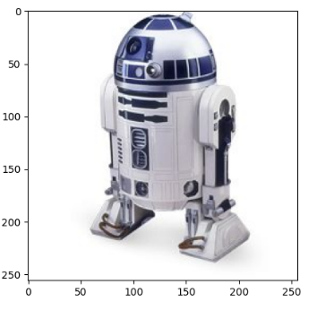
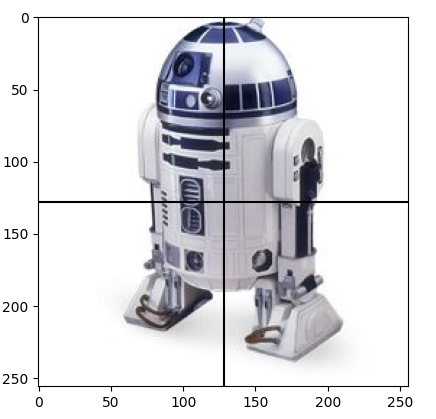
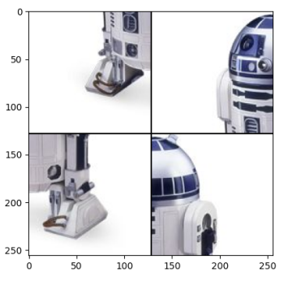
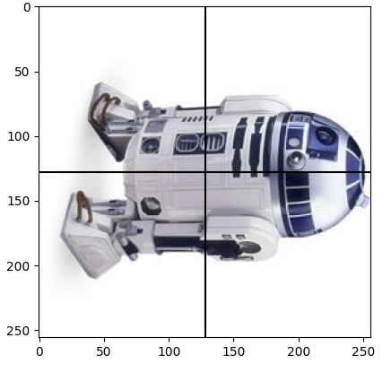
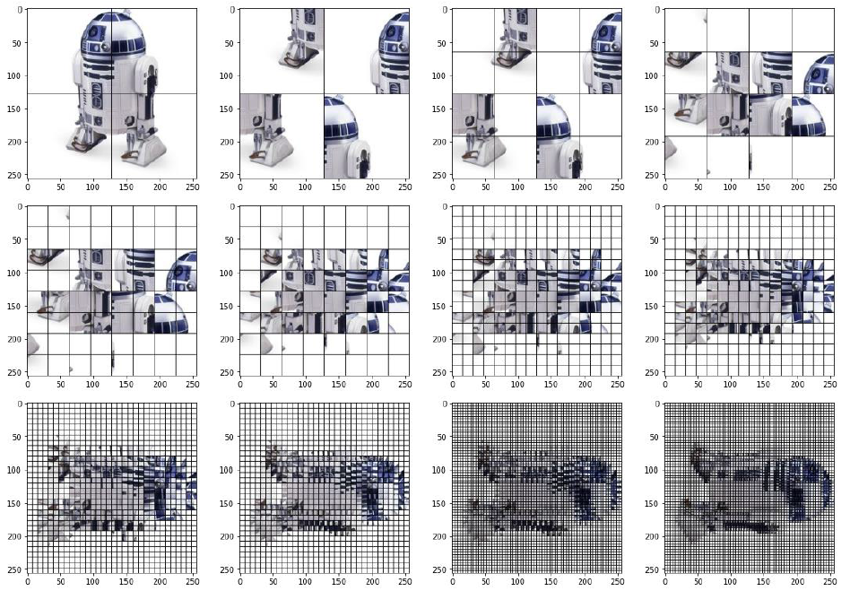
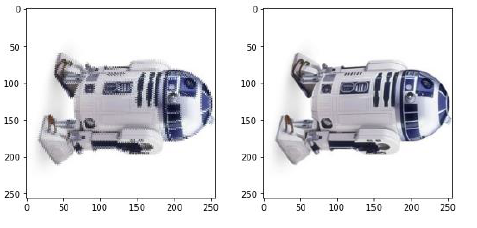

# Méthode « diviser pour régner »

!!! abstract "Cours" 

    La méthode « **diviser pour régner** » consiste à découper un problème en sous-problèmes similaires de plus en plus petits jusqu'à obtenir des cas simples permettant une résolution directe. Elle consiste en trois étapes :  
    
    1.	**Diviser** : découper un problème initial de **taille n** en **sous-problèmes indépendants de taille n/2** (ou une fraction de n);
    2.	**Régner** : résoudre les sous-problèmes (récursivement ou directement s'ils sont assez petits) ;
    3.	**Combiner** : calculer une solution au problème initial à partir des solutions des sous-problèmes.

    Cette méthode tire souvent avantage de la **récursivité**.  Le **faible coût** des algorithmes diviser pour régner est l'un de leurs principaux intérêts.


Cette technique fournit des algorithmes efficaces pour de nombreux problèmes, comme la recherche dichotomique d'un élément dans un tableau trié, le tri fusion, la multiplication de grands nombres (algorithme de Karatsuba), etc.

##	Recherche dichotomique dans un tableau trié

Considérons un algorithme naïf de recherche dans un tableau en parcourant tous les éléments du tableau :

``` py
def recherche(x, T):
    for elt in T:
        if x == elt: return True
    return False
```

Dans le pire des cas (x n'est pas dans le tableau), l'algorithme parcourt l'ensemble du tableau, le coût est donc en $O(n)$.

Le principe de la **recherche dichotomique dans un tableau trié** est celui suivi naturellement par les enfants quand ils jouent à un jeu bien connu : un des joueurs doit découvrir en un minimum d'essais un nombre secret compris entre 0 et 100 choisi par l'autre joueur. A chaque proposition du permier joueur, l'autre lui répond s'il a trouvé le nombre secret ou s'il est plus petit ou plus grand. La meilleure technique pour le joueur qui cherche le nombre secret consiste à proposer un nombre « au milieu » de tous les nombres possibles.

Au début le joueur propose le nombre au milieu entre 0 et 100, c'est-à-dire 50. 

- Si on lui répond « gagné », il a eu de la chance et il a trouvé le nombre secret immédiatement. 
- Si on lui répond « perdu, c'est plus grand », alors il sait que le nombre secret est entre 51 et 100, il va donc proposer le nouveau milieu entre 51 et 100, c'est-à-dire 75.
- Si la réponse est « perdu, c'est moins », alors le nombre secret est entre 0 et 49, il va proposer 25. 

Il va continuer ainsi de suite jusqu'à trouver le nombre secret. Cette technique consiste à **diviser un problème en deux sous-problèmes indépendants**, c'est un algorithme du type **diviser pour régner**.

Recherche dichotomique de `x` dans un tableau **trié** `T` :

|Etape|Description|
|:--|:--|
|**Diviser** |Découper le tableau trié `[T[debut], T[debut+1], ..., T[fin]]` en son milieu (`(debut + fin)//2`) pour avoir deux sous-tableaux  `[T[debut], T[debut+1], ..., T[milieu-1]]` et `[T[milieu + 1], ..., T[fin]]`|
|**Régner**	 |- si `x < T[milieu]`, chercher `x` dans `[T[debut], T[debut+1], ..., T[milieu-1]]` <br>- si `x > T[milieu]` , chercher `x` dans `[T[milieu + 1], ..., T[fin]]`<br>- si `x == T[milieu]`,  `x` a été trouvé|
|**Combiner**| |

 Faisons par exemple des recherches dans le tableau **trié** [5, 7, 12, 14, 23, 27, 35, 40 ,41, 45]. 
 
 Plusieurs cas se présentent :
    
=== "Recherche de la valeur 40"

    ![Recherche dichotomique de 40 dans le [5, 7, 12, 14, 23, 27, 35, 40 ,41, 45]](assets/3-recherche-dichotomique-40-light-mode.png#only-light){width="50%"}
    ![Recherche dichotomique de 40 dans le [5, 7, 12, 14, 23, 27, 35, 40 ,41, 45]](assets/3-recherche-dichotomique-40-dark-mode.png#only-dark){width="50%"}

    1. On cherche la valeur `40` dans le tableau `[5, 7, 12, 14, 23, 27, 35, 40 ,41, 45]`. 
    2. On partage le tableau en deux parties en son milieu : `T[milieu] =  23`.
    3. `40 > T[milieu]`, on cherche la valeur `40` dans la partie supérieure du tableau `[27, 35, 40 ,41, 45]`.
    4. On partage le tableau en deux parties en son milieu : `T[milieu] = 40`.
    5. `40 = T[milieu]`, on a trouvé la valeur `40`.
        
    

=== "Recherche de la valeur 35"
                
    ![Recherche dichotomique de 35 dans le [5, 7, 12, 14, 23, 27, 35, 40 ,41, 45]](assets/3-recherche-dichotomique-35-light-mode.png#only-light){width="50%"}
    ![Recherche dichotomique de 35 dans le [5, 7, 12, 14, 23, 27, 35, 40 ,41, 45]](assets/3-recherche-dichotomique-35-dark-mode.png#only-dark){width="50%"}

    1. On cherche la valeur `35` dans le tableau `[5, 7, 12, 14, 23, 27, 35, 40 ,41, 45]`. 
    2. On partage le tableau en deux parties en son milieu : `T[milieu] =  23`.
    3. `35 > T[milieu]`, on cherche la valeur `35` dans la partie supérieure du tableau `[27, 35, 40 ,41, 45]`.
    4. On partage le tableau en deux parties en son milieu : `T[milieu] = 40`.
    5. `35 < T[milieu]`, on cherche la valeur `35` dans la partie inférieure du tableau `[27, 35]`.
    6. On partage le tableau en deux parties en son milieu : `T[milieu] = 27`.
    7. `35 > T[milieu]`, on cherche la valeur `35` dans la partie supérieure du tableau `[35]`.
    8. On partage le tableau en deux parties en son milieu : `T[milieu] = 35`.
    5. `35 = T[milieu]`, on a trouvé la valeur `35`.

    On voit ici que la recherche s'effectue jusqu'à ce que le tableau n'ait plus qu'une seule valeur, c'est à dire que `debut` est égal à `fin`. 


=== "Recherche de la valeur 34"
                
    ![Recherche dichotomique de 34 dans le [5, 7, 12, 14, 23, 27, 35, 40 ,41, 45]](assets/3-recherche-dichotomique-34-light-mode.png#only-light){width="50%"}
    ![Recherche dichotomique de 34 dans le [5, 7, 12, 14, 23, 27, 35, 40 ,41, 45]](assets/3-recherche-dichotomique-34-dark-mode.png#only-dark){width="50%"}

    1. On cherche la valeur `34` dans le tableau `[5, 7, 12, 14, 23, 27, 35, 40 ,41, 45]`. 
    2. On partage le tableau en deux parties en son milieu : `T[milieu] =  23`.
    3. `34 > T[milieu]`, on cherche la valeur `34` dans la partie supérieure du tableau `[27, 35, 40 ,41, 45]`.
    4. On partage le tableau en deux parties en son milieu : `T[milieu] = 40`.
    5. `34 < T[milieu]`, on cherche la valeur `34` dans la partie inférieure du tableau `[27, 35]`.
    6. On partage le tableau en deux parties en son milieu : `T[milieu] = 27`.
    7. `34 > T[milieu]`, on cherche la valeur `34` dans la partie supérieure du tableau `[35]`.
    8. On partage le tableau en deux parties en son milieu : `T[milieu] = 35`.
    5. `34 < T[milieu]`, on cherche la valeur `34` dans la partie inférieure du tableau `[]`
    6. On n'a pas trouvé la valeur `34`.

    On voit ici que la recherche s'effectue jusqu'à ce que le tableau soit vide , c'est-à-dire que `debut` est plus grand que `fin`. 


Voilà ce que l'on peut écrire en mode itératif :

``` py linenums="1"
def recherche(x, T) :
    debut = 0
    fin = len(T) - 1
    while debut <= fin:      
        milieu = (debut + fin)//2
        if x < T[milieu]: 
            fin = milieu - 1
        elif x > T[milieu]: 
            debut = milieu + 1
        else:       # donc x == T[milieu]: 
            return True   # ou return milieu si on veut la position dans T
        
    return False    # ou return None par exemple si on veut la position dans T 
```
:warning: Un bug classique est d'écrire  `while debut < fin:` à la ligne 4, alors qu'on a vu que la recherche doit se poursuivre jusqu'à ce que `debut` soit plus grand que `fin`, c'est-à-dire quand le tableau est vide. 

Ce programme contient une boucle `while`, il faut donc s'assurer qu'il se termine. Ici le variant de boucle est `fin - debut`. A chaque itération de boucle, on voit qu'il y a trois cas :

- `x < T[milieu]` : dans ce cas, `fin` devient `milieu - 1`, donc le variant décroit strictement ; 
- `x > T[milieu]` : dans ce cas, `debut` devient `milieu + 1`, donc le variant décroit strictement ;
- `x == T[milieu]` : dans ce cas, l'instruction `return True` sort de la boucle et même de la fonction.

Tant qu'on est dans la boucle, le variant de boucle `fin - debut` décroit strictement, la boucle `while debut <= fin:` se terminera donc.

Pour prouver la correction de cet algorithme, on va utiliser la technique de l'invariant de boucle. Ici, un invariant de boucle est : si x est dans T alors `T[debut] <= x <= T[fin]`. Si l'invariant est vrai quand on entre dans la boucle, alors il y a les mêmes trois possibilités :

- `x < T[milieu]` : alors la recherche se poursuit dans `[T[debut], ..., T[milieu-1]]`, l'invariant est encore vrai quand on retourne dans la boucle; 
- `x > T[milieu]` : alors la recherche se poursuit dans `[T[milieu+1], ..., T[fin]]`, l'invariant est encore vrai quand on retourbne dans la boucle ;  
- `x == T[milieu]` : alors on l'a trouvé.

On a donc bien un invariant de boucle et l'algorithme trouve bien si une valeur est dans un tableau trié ou pas.


Etudions la complexité temporelle pour un tableau de taille $n$. A chaque itération de la boucle on divise la taille du tableau par 2, cela revient donc à se demander combien de fois faut-il diviser la taille du tableau par 2 pour obtenir dans le cas le plus défavorable (`x` n'est pas dans `T`) un tableau vide ? Cela revient à trouver le nombre $a$ tel que $2^a  = n$ . La solution est  $a= log_2(n)$.


!!! abstract "Cours" 
    La **complexité en temps de l'algorithme de recherche dichotomique est logarithmique en  $O(log_2(n))$**.

On peut bien sûr écrire le même algorithme en mode récursif, en passant en paramètre de la fonction les valeurs de `debut`et `fin`. Les paramètres sont des paramètres facultatifs par mot-clé, ils sont initialisés à `0`et `lent(T)-1` au premier appel.


``` py linenums="1"
def recherche(x, T, debut=None, fin=None):

    # initialisation de debut et fin au premier appel
    if debut is None or fin is None:
        debut = 0
        fin = len(T)-1

    if debut > fin:
        return False
    else:
        milieu = (debut + fin)//2
        if x < T[milieu]:
            return recherche(x, T, debut, milieu-1)
        elif x > T[milieu]:
            return recherche(x, T, milieu+1, fin)
        else:
            return True

assert recherche(35, [5, 7, 12, 14, 23, 27, 35, 40 ,41, 45])
assert not recherche(34, [5, 7, 12, 14, 23, 27, 35, 40 ,41, 45])

```


##	Tri fusion (*mergesort*)

On a vu en classe de première plusieurs algorithmes de tri simples comme le tri par sélection, tri par insertion  ou tri à bulle. 

=== "Tri par sélection"
    
    Le début du tableau étant déjà trié, on parcourt le reste pour trouver le plus petit élément à rajouter en fin de la partie triée.	

    ``` py
    def tri_selection(T):
        n = len(T)
        for i in range(n-1):
            mini = i
            for j in range(i+1, n):
            if T[j] < T[mini]:
                mini = j
            T[i], T[mini] = T[mini], T[i]
        return T
    ```

=== "Tri par insertion"
    
    Le début du tableau étant déjà trié, on insère l'élément suivant à la bonne place dans la partie déjà triée.	
	
    ``` py
    def tri_insertion(T):
        n = len(T)
        for i in range(1, n):
            elt = T[i]
            j = i
            while j > 0 and elt < T[j-1]:
                T[j] = T[j-1]
                j = j - 1
            T[j] = elt
        return T	
    ```

=== "Tri à bulles"

    La fin du tableau étant déjà triée, on parcourt le début du tableau en inversant les éléments successifs qui ne sont pas en ordre croissant.

    ``` py
    def tri_a_bulle(T):
        n = len(T)
        for i in range(n):
            for j in range(n-i-1):
            if T[j] > T[j+1]:
                T[j], T[j+1] = T[j+1], T[j]
        return T
    ```

Ces algorithmes sont considérés comme inefficaces car d'une **complexité quadratique en $O(n^2)$**. 

L'efficacité du tri fusion repose sur la facilité de réunir deux tableaux triés en un seul (leur « fusion »). En effet, pour construire le nouveau tableau élément par élément, il suffit de choisir à chaque fois le plus petit entre le premier élément du premier tableau et le premier élément du second tableau. Inutile de regarder les éléments suivants de chaque tableau puisqu'ils seront plus grands que les premiers. De cette façon, la fusion entre deux tableaux triés se fait en temps linéaire.


Tri Fusion d'un tableau  `T` de taille `n`:


|Etape|Description|
|:--|:--|
|**Diviser** |Découper le tableau  `T` en son milieu (`n//2`) pour avoir deux sous-tableaux  `T1` et `T2` de moitié de taille|
|**Régner**	 |Trier les deux sous tableaux `T1` et `T2`|
|**Combiner**|Fusionner les deux sous-tableaux triés `T1` et `T2` |


{width="30%" align=right}
{width="30%" align=right}

Commençons par écrire une fonction qui fusionne deux tableaux triés T1 et T2. On construit le nouveau tableau élément par élément en retirant tantôt le premier élément du premier tableau, tantôt le premier élément du deuxième tableau, en prenant à chaque fois le plus petit des deux (à supposer qu'aucun des deux tableaux ne soit vide, sinon la réponse est immédiate).

En voici une version itérative[^3.1] : 

``` py linenums="1"
def fusion(T1: list, T2: list) -> list:
    """ (list, list) -> list
    T1 et T2 sont des tableaux triés
    Renvoie le tableau trié des éléments de T1 et T2 ensembles
    """
    T = []
    i1, i2 = 0, 0     # Indices des éléments à comparer de T1 et T2
    # Tant qu'il reste des éléments dans les deux tableaux
    while i1 < len(T1) and i2 < len(T2):
        # On ajoute le plus petit des deux éléments dans T
        if T1[i1] <= T2[i2]:
            T.append(T1[i1])
            i1 += 1
        else:
            T.append(T2[i2])
            i2 += 1
    # Un des deux tableaux et vide, on transfère tous les élements restants dans T
    while i1 < len(T1):
        T.append(T1[i1])
        i1 += 1
    while i2 < len(T2):
        T.append(T2[i2])
        i2 += 1
    return T

```

[^3.1]: Il existe aussi une version récursive en utilisant les tranches de tableau :
    ``` py
    def fusion(T1: list, T2: list) -> list:
        """ (list, list) -> list
        T1 et T2 sont des tableaux triés
        renvoie le tableau trié des éléments de T1 et T2 ensembles 
        """
        if len (T1) == 0: return T2
        if len (T2) == 0: return T1
        if T1[0] < T2[0]:
            return [T1[0]] + fusion(T1[1:], T2)
        else:
            return [T2[0]] + fusion(T1, T2[1:])
    ```

A partir de là, le tri-fusion se construit naturellement de façon récursive :

1.	Si le tableau n'a qu'un élément, il est déjà trié.
2.	Sinon, "diviser" le tableau en deux parties à peu près égales.
3.	Trier récursivement les deux parties avec l'algorithme du tri fusion.
4.	Fusionner les deux tableaux triés en un seul tableau trié.

``` py linenums="1"
def tri_fusion(T: list) -> list:
    """ (list) -> list
    Renvoie le tableau trié (tri-fusion) des éléments de T
    """
    if len(T) <= 1:            # Si le tableau n'a qu'un élément, il est déjà trié
        return T
    else:
        # On divise en deux parties à peu près égales
        T1 = T[:len(T)//2]     
        T2 = T[len(T)//2:]
        # Et on fusionne les deux tableaux après les avoir triés
        return fusion(tri_fusion(T1), tri_fusion(T2))
``` 

Etudions la complexité temporelle pour un tableau de taille $n$.  Comme pour l'algorithme du tri par dichotomie, à chaque appel récursif du tri fusion, la taille du tableau à trié est divisée par 2, la complexité en donc en $log_2(n)$. Mais fusionner les deux tableaux nécessite de faire entre $k/2$ et $k$ comparaisons, où $k$ est la taille des sous-tableaux, c'est donc de l'ordre de $O(n)$.  La complexité du tri fusion est donc de l'ordre  $O(n \times log_2(n))$

!!! abstract "Cours" 
    La complexité en temps de l'algorithme de tri fusion est donc **linéarithmique en  $O(n \times log_2(n))$**.

Avec un tableau d'un milliard de valeurs, l'algorithme naïf en $O(n^2)$ demande de l'ordre de $10^{18}$ opérations. Avec des ordinateurs effectuant $10^9$ opérations par secondes, il faut de l'ordre de $10^9$ secondes, soit environ 30 ans.

Avec le tri fusion, le nombre d'opérations est de l'ordre de $10^9 × log_2(10^9) \simeq 10^9 \times 30$, ce qui s'exécute en 30 secondes sur les ordinateurs précédants[^3.2]. 


[^3.2]:
    ``` py
    >>> import math
    >>> math.log(10**9,2)
    29.897352853986263
    ``` 

## 	Rotation d'une image d'un quart de tour

Commençons par analyser un algorithme naïf de rotation d'image pixel par pixel.

Observons la rotation de deux pixel A et B sur le schéma suivant : Le pixel  initialement en position  `[2][4]` se déplace en position `[4][3]` dans une image de  6 x 6 pixels. 
De façon générale, un pixel en position `[ligne][colonne]` se déplace en position`[colonne][nb pixels – 1 - ligne]`.  


Utilisons cette observation pour écrire une rotation pixel par pixel en utilisant l'import d'une image par la fonction `imread` de `matplotlib.pyplot` qui donne un tableau de tableaux des pixels :

``` py
import matplotlib.pyplot as plt

def rotation_naif(image):
    n = len(image)
    new = [[0 for i in range(n)] for j in range(n)]
    for lig in range(n):
        for col in range(n):
            new[col][n-1-lig] = image[lig][col]
    return new

image = plt.imread('R2D2.jpg')
image = rotation_naif (image)

plt.imshow(image)
plt.show()
```

Avec deux boucles imbriquées de taille $n$, la complexité temporelle de cet algorithme naif est donc en $O(n^2)$. 

Comparons cette algorithme naïf à une méthode « diviser pour régner » effectuant une rotation d'un quart de tour sur une image carrée, dont le côté est une puissance de 2.

1. Considérons l'image suivante de 256 x 256 pixels :

    {width="25%"}

2. La première étape consisite à diviser l'image en 4 sous-images :

    {width="25%"}

3. puis à effectuer une permutation circulaire de ces quatre sous-images :

    {width="25%"}

4. Effectuons maintenant une rotation d'un quart de tour de chaque sous-image :

    {width="25%"}
 
5. Il ne reste plus qu'à réunir les quatres sous-images en une seule. La rotation d'un quart de tour a bien été effectuée.

L'étape 4 consiste à effectuer une rotation des quatres sous-images, la méthode « diviser pour régner » est encore utilisée. Le processus est donc récursif, il se répète jusqu'à obtenir des sous-images qui ne contiennent qu'un seul pixel, un pixel étant uniformément colorié, il est inutile de le tourner.

Rotation d'une image d'un quart de tour par la méthode « diviser pour régner »: 

|Etape|Description|
|:--|:--|
|**Diviser** |Découper l'image en 4 sous-images et effectuer une permutation circulaire |
|**Régner**	 |Effectuer une rotation d'1/4 de tour pour chaque sous-image|
|**Combiner**|Réunir les 4 sous-images ensemble|

Voilà ce qu'on obtient étape par étape :



On poursuit sans représenter le quadrillage devenu trop fin pour les deux dernières étapes.

{width="50%"} 

Traduisons ce processus en Python :

``` py
import matplotlib.pyplot as plt

def rotation(image):
    n = len(image)

    if n == 1:             # Il ne reste qu'un seul pixel
        return image       # Inutile de le tourner
    
    # Diviser en 4 sous-image
    # Sous-image qaurt haut gauche
    hg = [[image[lig][col] for col in range(n//2)] for lig in range(n//2)]
    # Sous-image qaurt haut droit
    hd = [[image[lig][col] for col in range(n//2, n)] for lig in range(n//2)]
    # Sous-image qaurt bas gauche
    bg = [[image[lig][col] for col in range(n//2)] for lig in range(n//2, n)]
    # Sous-image qaurt bas droit
    bd = [[image[lig][col] for col in range(n//2, n)] for lig in range(n//2, n)]

    # Permutation circulaire des 4 sous-images
    hg, hd, bg, bd = bg, hg, bd, hd

    # Rotation récursive d'1/4 de tour de chaque sous-image
    hg = rotation(hg)
    hd = rotation(hd)
    bd = rotation(bd)
    bg = rotation(bg)

    # Réunir les 4 sous-images
    image = []
    for li in range(n//2):   # les lignes du haut
        image.append(hg[li] + hd[li])
    for li in range(n//2):   # les lignes du bas
        image.append(bg[li] + bd[li])           
        
    return image

image = plt.imread('R2D2.jpg')
image = rotation(image)
plt.imshow(image)
plt.show()

```

Essayons d'estimer la complexité de cette rotation d'un quart de tour. La fonction `rotation` exécute 4 boucles imbriquées de taille $n/2$ pour découper l'image en 4 sous-images, chaque boucle a donc une compléxité en $O(n^2)$. Ensuite, la fonction fait appel 4 fois à elle-même sur ces images d'une taille réduite par un facteur 2, suivi à nouveau de boucles imbriquées en $O(n^2)$ pour combiner les 4 sous-images. On a donc un nombre d'opérations qui vérifie la relation $C(n) = 4 \times O(n^2) + 4 \times C(n/2) + 4 \times O(n^2)$. On peut montrer par un calcul mathématique que la complexité de cette rotation par la méthode est de l'ordre de $O(n^2 \times log_2(n))$, donc un peu moins bonne que celle de l'algorithme naïf[^3.3].

[^3.3]: L'implémentation présentée ici de la méthode « diviser pour régner » n'est pas optimale en terme de compléxité spacitale non plus. En copiant les quatre sous-image dans des images temporaires, elle nécessite une utilisation de l'espace place mémoire supérieure à la taille de l'image ! Il existe une implémentation « en place » permettant de réduire l'espace mémoire utilisé. Source: [https://eduscol.education.fr/document/10100/download](https://eduscol.education.fr/document/10100/download)


##	Tri Rapide (*quicksort*)


La méthode consiste à choisir un élément du tableau, appelé **pivot**, pour le mettre à sa place définitive en plaçant tous les éléments du tableau qui lui sont inférieurs dans un sous-tableau à sa gauche et tous ceux qui lui sont supérieurs dans un autre sous-tableau à sa droite. Le pivot peut être choisi au hasard ou de façon systématique, par exemple le premier ou le dernier élément du tableau. 

L'algorithme est récursif, pour trier chacun des sous-tableaux on choisit un nouveau pivot et on répète l'opération jusqu'à ce que tous les sous-tableaux n'aient plus qu'une ou aucune valeur. Il ne reste plus qu'à réunir tous les sous-tableaux et l'ensemble sera trié.

Voyons un exemple dans lequel le pivot choisi est toujours le dernier élément du tableau :

{width=80% }
{width=80%}


Tri Rapide d'un tableau `T[1, …, n]`

|Etape|Description|
|:--|:--|
|**Diviser** |Découper le tableau `T[1, …, n]` de part et d'autre d'un pivot en trois sous-tableaux : le premier contenant toutes les valeurs inférieures au pivot, le second contenant celles égales au pivot et le dernier celles supérieures au pivot|
|**Régner**	 |Trier les sous-tableaux des valeurs inférieures et des valeurs supérieures au pivot (celui des valeurs égales au pivot est déjà trié)|
|**Combiner**|Regrouper les trois sous-tableaux triés|


En pratique, le programme Python est construit en utilisant trois sous-tableaux contenant respectivement les valeurs inférieures, supérieures et égales au pivot. On trie les deux premiers et on combine les trois.


``` py
from random import randint

def tri_rapide(T):
    """ list[int]-> list[int]
    Renvoie le tableau T trié par tri rapide
    """
    if len(T) <= 1:    # si T n'a plus qu'une valeur ou qu'il est vide
        return []       # il n'y a rien à trier

    # Diviser
    pivot = T[randint(0, len(T)-1)]  # pivot au hasard, on peut utiliser T[-1] pour prendre le dernier élement
    val_inferieures = []
    val_egales = []
    val_superieures = []

    for elem in T:
        if elem < pivot: val_inferieures.append(elem)
        elif elem > pivot: val_superieures.append(elem)
        else: val_egales.append(elem)

    # Regner
    return tri_rapide(val_inferieures) + val_egales + tri_rapide(val_superieures)


tab = [randint(0, 100) for i in range(10000)]
print(tri_rapide(tab))
```

Dans le pire des cas où à chaque itération toutes les valeurs se trouvent toutes du même côté du pivot, la complexité du tri rapide est quadratique en $O(n^2)$. 
Cependant en pratique,  pour des données réparties aléatoirement, la complexité moyenne est en $O(n \times log_2(n))$, faisant du tri rapide un des tris les plus rapides.
