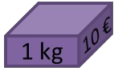

# Programmation dynamique

## Un exemple simple

{width=30% align=right}
Le jeu de Dames se pratique sur un damier de 10 cases sur 10. Les pions sont placés sur les cases foncées et ne peuvent se déplacer que d'une case à la fois, toujours vers l'avant en diagonale. Une des stratégies du jeu consiste à amener un pion sur la dernière rangée pour être promu en dame. 

La question est la suivante :  Sur le damier ci-contre, combien de chemins peut emprunter le pion blanc depuis cette case de départ pour arriver à la case vide sur la rangée du haut et être promu en dame ? 

Si on essaie de compter tous les chemins on risque de vite perdre le compte. Une idée simple pour répondre à ce problème efficacement consiste à noter à chaque intersection le nombre de chemins en partant de la fin. Découpons le processus en plusieurs étapes.

=== "Etape 1"

    On peut déjà observer qu'un certain nombre de cases ne peuvent pas être atteintes par le pion blanc depuis sa position de départ, ou ne peuvent pas mener à la case d'arrivée, on peut donc les exclure de nos calculs.

    {width=30%}

=== "Etape 2"
    Il n'y a que deux cases sur la deuxième rangée qui permettent d'aller sur la case d'arrivée, et pour chacune il n'y a qu'un seul chemin possible. 

    Marquons ces cases avec leur nombre de chemins possibles.

    
    {width=30%}

=== "Etape 3"
    Il y a trois cases sur la troisième rangée pouvant aller sur les deux cases précédentes. 
    
    Un pion sur la case à gauche ou celle à droite n'a qu'un seul chemin possible. 
    
    Par contre un pion sur la case au milieu peut se déplacer soit vers le haut à droite, soit vers le haut à gauche. Dans les deux cas, il n'a plus qu'un chemin possible ensuite. Il y a donc deux chemins possibles au départ de cette case.
    
    {width=30%}


=== "Etape 4"
    Continuons à la rangée suivante. Comme dans la rangée précédente, un pion sur la case à gauche ou celle à droite n'a qu'un seul chemin possible.

    Les deux pions placés au milieu peuvent se déplacer soit vers le haut à droite, soit vers le haut à gauche. Selon le choix que l'on fait, ils pourront emprunter 1 ou 2 chemins différents. Au total, il y a donc 3 chemins possibles au départ de ces deux cases. On comprend que le nombre de chemins possibles à partir d'une case est égal à  la somme des nombres de chemins au départ des cases à gauche et à droite de la rangée du dessus.


    **On a décomposé un problème en deux sous-problèmes plus simples**.
    
    {width=30%}


=== "Etape 5"
    Appliquons cette même idée à la rangée suivante, et notons le nombre de chemins possibles égal à la somme des nombres de chemins indiqués dans les cases à gauche et à droite sur la rangée du dessus.
    
    On constate le nombre de chemins calculé pour une case, par exemple 3, est utilisé deux fois : pour la case qui a 4 chemins possibles et pour la case qui a 6 chemins possibles.

    **Il faut donc garder en mémoire les résultats intermédiaires pour ne pas recalculer la même chose plusieurs fois**.

    
    {width=30%}

=== "Etape 6"
    Continuons à descendre dans le damier rangé par rangée en appliquant le même principe : pour chaque case on ajoute les nombres de chemins trouvés pour les cases à gauche et à droite de la rangée de dessus.  

    On arrive au résultat final : il y a  126 chemins possibles pour aller de la case de départ jusqu'à l'arrivée.

    
    {width=30%}


On peut observer deux choses dans la réalisation de cet algorithme : 

1.	Pour chaque case, il suffit de faire la somme du nombre de chemins depuis la case de gauche et depuis la case de droite sur la rangée au-dessus : on **découpe le problème en sous-problèmes plus faciles à résoudre**.  

2.	Le nombre de chemins calculé pour une case est utilisé pour calculer les nombres de chemins de plusieurs autres cases. Les sous-problèmes se chevauchent. Il faut **garder en mémoire les résultats intermédiaires pour ne pas recalculer la même chose plusieurs fois**.

Ce sont les deux principes de la **programmation dynamique**.


!!! question "Exercice corrigé"
    Mario veut rejoindre la princesse Peach. Il ne peut se déplacer que vers la gauche et vers le haut, et ne peut jamais revenir en arrière. Combien de chemins différents peut-il emprunter ?

    {width=50%}
    {width=50%}


??? Success "Réponse"
    Notons à chaque intersection le nombre de chemins en partant de la fin. Pour chaque intersection, il suffit de faire la somme du nombre de chemins depuis l‘intersection à sa gauche et des chemins depuis l'intersection au dessus.   

    {width=50%}
    {width=50%}


    Mario peut prendre 10 chemins différents.

!!! abstract "Cours" 
    La **programmation dynamique**[^4.1] résout un problème en combinant des solutions de **sous-problèmes qui se chevauchent**, c'est à dire qu'il possède des sous-sous-problèmes identiques.  
    
    Afin d'éviter les calculs redondants, **chaque sous-sous-problème n'est résolu qu'une seule fois et sa réponse est gardée en mémoire**.

[^4.1]:   Cette méthode a été introduite au début des années 1950 par Richard Bellman.  Le terme "programmation" dans "programmation dynamique", ne doit pas s'entendre comme "utilisation d'un langage de programmation", mais comme synonyme de planification et ordonnancement.

On peut voir la programmation dynamique comme une amélioration ou une adaptation de la méthode « diviser pour régner » puisqu'on divise un problème en sous problèmes, à la différence que la programmation dynamique s'applique quand les sous-problèmes se chevauchent, autrement dit un sous-problème peut être utilisé dans la solution de plusieurs sous-problèmes différents. Tandis que l'approche  « diviser pour régner » crée des sous-problèmes qui sont complètement séparés et peuvent être résolus indépendamment les uns des autres.

{width=80% }
{width=80% }

## Rendu de monnaie

Problème : On dispose d'un nombre illimité de pièces de ①, ②, ⑤ et ⑩ euros pour rendre une certaine somme. Quel est le plus petit nombre de pièces nécessaire ?

### Algorithme glouton

On a vu en classe de première une solution donnée par un algorithme glouton, qui consiste à faire, étape par étape, un choix optimum local, dans l'espoir d'obtenir un résultat optimum global : dans ce cas on choisit de façon répétitive la pièce de plus grande valeur qui ne dépasse pas la somme restante : 

=== "Programme itératif"

    ``` py
    pieces = [10, 5, 2, 1]

    def rendu_monnaie_glouton(n):
        nombre_pieces = 0
        i = 0 # on commence par la plus grande pièce
        while n > 0:
            if n >= pieces[i]: # on peut rendre pieces[i]
                nombre_pieces += 1
                n = n - pieces[i]
            else:    # on passe à la pièce suivante
                i = i + 1
        return nombre_pieces	
    ```

=== "Programme récursif"
    ``` py
    pieces = [10, 5, 2, 1]

    def rendu_monnaie_glouton(n, i=0):
        if n == 0: 
           return 0  
        if pieces[i] <= n:  # on peut rendre pieces[i]
            return 1 + rendu(n - pieces[i], i)
        return rendu(n, i + 1)   # on passe à la pièce suivante
    ```


Testons l'algorithme glouton pour rendre 13 euros. On obtient bien les 3 pièces ⑩ + ② + ① qui font un total de 13.

``` py
>>> rendu_monnaie_glouton(13)
3
```

Mais que se passe-t-il si on n'a pas de pièce de 1 euro ? Remplaçons `pieces = [10, 5, 2]` et testons l'algorithme : 

```py
IndexError: list index out of range
```

Pourtant on peut rendre ⑤ + ② + ② + ② + ② qui font aussi un total de 13 euros !

C'est le **propre des algorithmes gloutons : une fois qu'une décision a été prise, on ne revient pas en arrière**. Dans certains cas l'algorithme ne trouve pas de solution, ou pas la meilleure solution.  Ici l'algorithme choisit la pièce de 10 euros qui ne mène à rien, il ne peut pas revenir en arrière et ressayer avec une autre pièce !

### Programmation dynamique

La programmation dynamique consiste à résoudre notre problème en combinant les solutions de sous-problèmes. Ici, rendre une somme $n$ peut se faire de plusieurs manières  :

-	rendre $n – 10$ et rajouter une pièce de ⑩, ou
-	rendre $n – 5$ et rajouter une pièce de ⑤, ou
-	rendre $n – 2$ et rajouter une pièce de ②.

Dans notre exemple, pour rendre 13 euros on peut :

-	rendre 3 et rajouter une pièce de ⑩, ou
-	rendre 8 et rajouter une pièce de ⑤, ou
-	rendre 11 et rajouter une pièce de ②.

{width=80% }
{width=80% }


Chacun de ces sous-problèmes peut être résolus de la même façon. Constituons l'arbre des possibilités :

{width=80% }
{width=80% }

Certaines branches mènent à une solution, quand il reste 0 euros à rendre, d'autres pas. 

Implémentons cet algorithme en considérant trois cas :

-	Si $n$ est égal à 0, alors on a rendu $n$, il n'y a pas de pièces supplémentaires à rendre, on renvoie 0.
-	Si $n$ est plus petit que la valeur de la plus petite pièce, on ne pourra pas rendre $n$, on renvoie une très grande valeur, par exemple en utilisant `inf` la valeur infinie du module avec ` math`, afin de ne pas impacter une autre branche qui mènerait à une solution.
-	Sinon, on renvoie 1 plus le plus petit nombre de pièces de tous les rendus de $n – p$, pour toutes les pièces de valeur $p$ telles que $p <= n$. 

Traduisons cet algorithme en Python :

```py
from math import inf     # valeur infinie du module math

pieces = [10, 5, 2]

def rendu_monnaie_dynamique(n):
    if n == 0:  # Il faut 0 piece pour rendre 0 euro
        return 0                
    if n < min(pieces):   # n est plus petit que la plus petite piece
        return inf          # on ne peut pas rendre n avec ces pieces
    # Tableau de tous les rendus possibles de n - p
    rendus = [rendu_monnaie_dynamique(n - p) for p in pieces if p <= n]
    # On rend 1 piece + le plus petit nombre de pieces de tous les rendus
    return 1 + min(rendus)  

>>> rendu_monnaie_dynamique(13)
5
```

Avec la programmation dynamique, tous les cas possibles ont été traités, et plusieurs cas ont renvoyé la même solution. On a donc une solution optimale au problème.


Mais testons maintenant cette fonction avec quelques valeurs plus grandes que `13`. Très vite la fonction prend beaucoup de temps pour s'exécuter. Quelques secondes pour exécuter `rendu_monnaie_dynamique(60)`, dizaines de secondes pour `  rendu_monnaie_dynamique(70)`, plusieurs minutes pour `  rendu_monnaie_dynamique(80)`, etc.  Le programme devient vite trop lent, même pour des rendus très simples de quelques pièces de ⑩ euros !

Essayons d'estimer la complexité temporelle de cette fonction. Le nombre d'opérations pour rendre un montant $n$ avec des pieces de 10, 5 et 2 est le nombre d'opérations pour rendre $n-10$, plus le nombre d'opérations pour rendre $n-5$, plus celui pour rendre $n-2$, plus quelques opérations élémentaires. Si on appelle $T(n)$ le nombre d'opérations pour rendre $n$, alors on peut donc écrire que :

$T(n) = T(n-10) + T(n-5) + T(n-2) + O(1)$,

avec $O(1)$ pour les quelques opérations supplémentaires. Pour de grandes valeurs de $n$, on peut faire l'approximation que retirer 10, 5, 2 ou 1 euro à $n$ ne change pas grand chose, donc que $T(n-10)$, $T(n-5)$, et $T(n-2)$ sont du même ordre de grandeur que $T(n-1)$, autrement dit  $T(n) \approx 3 \times T(n-1) + O(1)$. A chaque fois que $n$ augmente de 1, le nombre d'opérations est multiplié par 3, plus quelques opérations. La complexité est donc exponentielle en $O(3^n)$ ici, ou de façon générale en $O({nbPieces}^n)$ pour un rendu avec $nbPieces$ pieces.  

### Version descendante (*top-down*), récursivité et mémoïsation

Les appels récursifs sont trop nombreux, la complexité est trop importante pour calculer un solution en temps raisonnable.

En programmation dynamique les sous-problèmes se chevauchent et les mêmes calculs reviennent plusieurs fois. Dans un exemple aussi simple que celui de rendre 13 euros, on retrouve 2 fois la branche qui part de "6" :

{width=80% }
{width=80% }


La solution pour limiter le nombre d'opérations consiste à ne calculer les solutions des sous-problèmes qu'une seule fois et de les garder en mémoire. C'est la technique de **mémoïsation**.

!!! abstract "Cours" 
    La mémoïsation consiste à garder en mémoire les valeurs déjà calculées.

Par exemple, avec un dictionnaire déclaré en variable globale :

```py
from math import inf     # valeur infinie du module math

memoise = {0: 0}       # Il faut 0 piece pour rendre 0 euro
pieces = [10, 5, 2]

def rendu_monnaie_dynamique(n):
    if n in memoise:             # Si on a déjà calculé le nombre de pièces pour n
        return memoise[n]
    if n < min(pieces):   # n est plus petit que la plus petite piece
        return inf          # On ne peut pas rendre n avec ces pieces

    # Tableau de tous les rendus possibles de n - p
    rendus = [rendu_monnaie_dynamique(n - p) for p in pieces if p <= n]
    # On rend 1 piece + le plus petit nombre de pieces de tous les rendus
    memoise[n] = 1 + min(rendus)
    return memoise[n] 
```

Cette fois ci, le résultat est immédiat, même avec des valeurs de `n` de quelques milliers (dans la limite de la pile d'appels récursifs).


### Version ascendante (*bottom-up*)

On a déjà vu dans l'exemple précédent comment écrire un algorithme récursif en utilisant la mémoïsation. Une autre approche de la programmation dynamique consiste à calculer d'abord les sous-problèmes en partant d'un cas de base et à  « remonter » jusqu'à résoudre le problème initial : c'est la version ascendante, ou *bottom-up*.

{width=30% align=right}
{width=30% align=right}

Appelons $nb_i$ le nombre de pièces pour rendre une somme $i$. Comme dans l'approche *top-down*,  $nb_i$ est égal à 1 + le plus petit nombre de pièces de tous les rendus de $i – p$, pour toutes les pièces $p$ telles que $p <= i$. Si aucune pièce p ne convient, alors il n'est pas possible de rendre $i$, on peut représenter $nb_i$ par l'infini[^4.3].

[^4.3]:  $nb_i$ est donné par la formule de récurrence $nb_i = \underset{p \leq i}{\min}⁡ (1+ nb_{i-p})$.


On va créer le même dictionnaire que celui utilisé pour la mémoïsation, mais en le remplissant itérativement en partant cette fois de 0 et en incrémentant jusqu'à n.

``` py
from math import inf

nb = {0: 0}       # dictionnaire {montant i: nombres de pieces pour rendre i}
pieces = [10, 5, 2]

def rendu_bottom_up(n):
    # On remplit le dictionnaire pour tous les montants i allant de 1 à n
    for i in range(1, n + 1):   
        # Tableau de tous les rendus possibles de i - p
        rendus = [nb[i - p] for p in pieces if p <= i]

        if rendus == []:   # Si c'est impossible de rendre i 
            nb[i] = inf
        else:           # Sinon on prend le plus petit nombre de pieces des i - p et on ajoute 1 
            nb[i] = 1 + min(rendus)
    return nb[n]              # On renvoie la valeur pour la clé correspondant au montant n

```


Ici, aucun soucis avec la complexité de la fonction (ni de limite de pile d'appels récursifs), la fonction s'exécute instantanément même avec de très grandes valeurs de `n`. En effet, la fonction fait une double boucle imbriquée, sur la valeur à rendre $n$, et sur le nombre de pièces disponibles. La complexité est donc simplement linéaire en $O(n \times nbPieces)$, ou plus simplement en $O(n)$ si on considère un nombre limité de pièces disponibles.


!!! abstract "Cours" 
    La programmation dynamique peut prendre deux formes :

    - Une forme récursive descendante de haut en bas, ou *top-down*, avec mémoïsation : 
        - On utilise directement la formule de récurrence.
        - Lors d'un appel **récursif**, avant d'effectuer un calcul on regarde si son résultat n'est pas gardé en mémoire.
        - Sinon, on fait le calcul et on le garde en mémoire.

    -   Une forme itérative ascendante de bas en haut, ou *bottom-up* :
        - On résout de façon **itérative** d'abord les sous-problèmes de la plus "petite taille", puis ceux de la taille "d'au dessus", etc. Au fur et à mesure on garde les résultats en mémoire.
        - On continue jusqu'à la taille voulue.

##	Découpe d'une tige d'acier

Problème : Soit une tige d'acier que l'on peut découper en plusieurs morceaux pour les revendre selon la grille de prix suivante :

|Longueur (m)| 0 | 1 | 2 | 3 | 4 | 5 | 6 | 7 | 8 | 9 | 10 |
|:--     |:-:|:-:|:-:|:-:|:-:|:-:|:-:|:-:|:-:|:-:|:-: |
|Prix (€)   | 0 | 1 | 5 | 8 | 9 | 10| 17| 17| 20| 24| 30 |

Comment découper la tige de façon optimale pour en tirer un revenu maximum ?

Prenons, l'exemple d'une tige de longueur 4 m. On peut la découper de 8 façons différentes :

{width=80% }
{width=80% }

On voit que le revenu maximum est donc 10 €, obtenu en découpant la tige en 2 morceaux de 2 m. Mais comment le calculer de façon systématique ? 

Un algorithme glouton simple qui consiste à choisir en priorité les longueurs de morceaux les plus chers ne donne pas le meilleur revenu puisqu'il proposera toujours de garder les morceaux les plus longs possibles, ce sont les plus chers selon la grille de prix. Une approche plus fine consiste à prendre en compte le prix linéaire (ratio prix/longueur) pour optimiser les découpes. Reprenons la grille de prix de l'exemple précédant pour les morceaux jusqu'à 4 m :

|Longueur (m)       | 0 | 1 |  2 | 3   | 4   |
|:--                |:-:|:-:|:--:|:---:|:---:|
|Prix (€)           | 0 | 1 |  5 | 8   | 9   |
|Prix linéaire (€/m)| 0 | 1 | 2,5| 2,67| 2,25|

Cet algorithme glouton commence par choisir le meilleur ratio prix/longueur, c'est une découpe d'un morceau de 3 m, mais ensuite il ne reste plus qu'un autre morceau de 1 m, qui lui a une très faible valeur linéaire ! C'est trop tard, l'algorithme ne peut pas revenir en arrière sur la découpe du premier morceau de 3 m, on obtient un revenu de 9 €, ce n'est pas le revenu maximum.

ici encore, la programmation dynamique nous permet de trouver la solution optimale. 

Appelons `R[n]` le revenu maximum d'une tige de longueur `n` et `Prix` le tableau de la grille de prix pour différentes longueurs. 

Comment calculer `R[4]`, le revenu maximum pour découper une tige de longueur `4` m ?  On peut voir ce qu'il se passe si on fait une découpe d'un premier morceau de 1 m, ou bien de 2 m, ou encore de 3 m, ou même ne pas couper la tige, puis comparer le revenu obtenu dans chaque cas pour prendre le plus grand. `R[4]` est donc égal à la plus grande valeur entre :

-	Le prix d'un morceau de longueur `1`  + le revenu maximum d'un tige de longueur `3` : `Prix[1] + R[3]`
-	Le prix d'un morceau de longueur `2`  + le revenu maximum d'un tige de longueur `2` : `Prix[2] + R[2]`
-	Le prix d'un morceau de longueur `3`  + le revenu maximum d'un tige de longueur `1` : `Prix[3] + R[1]`
-	Le prix d'un morceau de longueur `4`  + le revenu maximum d'un tige de longueur `0`:  `Prix[4] + R[0]`

{width=100% }
{width=100% }

La valeur de `R[0]` est immédiate, c'est le revenu maximum d'une tige de longueur de zéro, c'est-à-dire `0`. Mais comment calculer `R[1]`, `R[2]` et `R[3]` ? On applique le même principe.

{width=100% }
{width=100% }

On voit qu'on a ici **découpé le problème en plusieurs sous-problèmes**. Par ailleurs, les résultats de certains sous-problèmes, par exemple le calcul de `R[2]`, sont réutilisés plusieurs fois. Les **sous-problèmes se chevauchent**. Ce sont les deux grands principes de la **programmation dynamique**.


Généralisons cet algorithme à une tige de longueur `n ` pour écrire `R[n]` en considérant les deux cas :

-	Si `n` est égal à `0`, alors la tige a une longueur de `0`, son revenu maximum est `0`.
-   Sinon, `R[n]` est égal à la plus grande valeur entre les prix d'un morceau de longueur `i` (`prix[i]`) auquel on ajoute le revenu maximum d'une tige de longueur `n - i` (`R[n-i]`), calculés pour toutes les longueurs `i` possibles, c'est-à-dire toutes les valeurs de `i` allant de `1` à `n + 1` (exclus) sans dépasser la taille de la grille des prix :  `1 <= i < min(len(Prix), n + 1)`.

On peut donc écrire la formule :  `R[n] = max(Prix[i] + R[n - i] pour 1 ≤ i  < min(len(Prix), n + 1)`  et `R[0] = 0`. 


Traduisons maintenant cet algorithme de programmation dynamique en version descendante :

``` py
Prix = [0, 1 ,5, 8, 9, 10, 17, 17, 20, 24, 30]

def R(n):
    if n == 0: # Le revenu d'une tige de longueur 0 est 0
        return 0

    # Tableau des revenus max de toutes les découpes possibles de la grille de prix
    decoupes = [Prix[i] + R(n - i) for i in range(1, min(len(Prix), n + 1))]

    # On renvoie le plus grand revenu de toutes les découpes possibles
    return max(decoupes)
```


Avec la programmation dynamique, tous les cas possibles ont été traités, et plusieurs cas ont renvoyé la même solution. On obtient donc une solution optimale au problème. 

```
>>> R(4)
10
```

Mais testons maintenant cette fonction avec quelques valeurs plus grandes que `4`. Très vite la fonction prend beaucoup de temps pour s'exécuter. Essayons d'estimer la complexité temporelle de cette fonction.

Si on appelle $T(n)$ le nombre d'opérations pour calculer le revenu maximum pour une tige de longueur $n$, il est égal aux nombres d'opérations de toutes les découpes de tiges de longueurs $n - i$, $T(n - i)$, pour toutes les valeurs de $i$ de la grille de prix, plus quelques opérations élémentaires.

$T(n) = T(n-1) + T(n-2) + T(n-3) + ..T(n-i)+... + T(n - 10) + O(1)$,

Si on suppose que pour les grandes valeurs de $n$, $i$ reste très petit en comparaison, par exemple ici il vaut entre 1 et 10, alors on peut écrire que :

$T(n) \approx 10 \times T(n-1) + O(1)$

A chaque fois que $n$ augmente de 1, le nombre d'opérations est multiplié par la taille de la grille de prix, plus quelques opérations. La complexité est donc exponentielle en $O(10^n)$ ici, ou de façon générale en $O({tailleGrillePrix}^n)$ pour une grille de prix de longueur $tailleGrillePrix$ . 

Cette solution n'est donc pas utilisable pratiquement, mais on constate une fois de plus que les sous-problèmes se chevauchent, on peut donc garder les résultats des sous-problèmes en mémoire pour améliorer cette situation. Appliquons la technique de mémoïsation :

```py
Prix = [0, 1 ,5, 8, 9, 10, 17, 17, 20, 24, 30]

memo = {0: 0}    # Le revenu d'une tige de longueur 0 est 0
def R(n):
    if n in memo:  return memo[n]
        
    # Tableau des revenus max de toutes les découpes possibles de la grille de prix
    decoupes = [Prix[i] + R(n - i) for i in range(1, min(len(Prix), n + 1))]
    
    # On renvoie le plus grand revenu de toutes les découpes possibles
    memo[n] = max(decoupes)
    return memo[n]
```

L'ajout d'une variable globale dans la fonction permet de se convaincre facilement de l'effet sur la complexité temporelle :
``` py

cpt = 0
def R(n):
    global cpt
    cpt + = 1
    if n == 0: 
        #...
```

Alors que la première fonction, sans mémoïsation, s'appelle 1024 fois pour le calcul de R(10) et 1 043 456 fois pour R(20), la version avec mémoïsation s'appelle seulement 56 et 156 pour les mêmes calculs ! Mais cela se fait aux dépends de la complexité spatiale.


La version ascendante est une autre façon efficace de palier au problème de complexité temporelle :

```py
Prix = [0, 1, 5, 8, 9, 10, 17, 17, 20, 24, 30]

revenus = {0: 0}    # dictionnaire {longueur m :  revenu max pour une tige de longueur m}

def R(n):
    # On remplit le dictionnaire pour toutes les longueurs m allant de 1 à n
    for m in range(1, n + 1):
        
        # Tableau des revenus max de toutes les découpes possibles de m
        decoupes = [Prix[i] + revenus[m - i] for i in range(1, min(len(Prix), m + 1))]
        revenus[m] = max(decoupes)

    return revenus[n]          # On renvoie la valeur pour la clé correspondant à la longueur n

```


Ici, aucun soucis avec la complexité de la fonction (ni de limite de pile d'appels récursifs), la fonction s'exécute instantanément même avec de très grandes valeurs de `n`. En effet, la fonction fait une double boucle imbriquée, sur la longueur de la tige $n$, et sur la longueur de la grille des prix. La complexité est donc simplement linéaire en $O(n \times tailleGrillePrix)$, ou plus simplement en $O(n)$ si on considère une grille de prix de petite taille.

## Alignement de séquences

Un problème utile aux généticiens est celui de l'alignement de séquences, qui se décline en de nombreuses variations, dont plusieurs peuvent être abordées à l'aide de la programmation dynamique.

Nous nous intéressons ici à la recherche d'une plus longue sous-chaîne commune. Étant donné deux chaîne de caractères `str1`  et `str2`, on cherche une chaîne de caractères, la plus longue possible, qui soit à la fois extraite de `str1`  et de `str2`. Dire qu'une sous-chaîne est extraite de `str1` signifie que l'on peut obtenir cette sous-chaîne en effaçant certains caractères de `str1`. Autrement dit, tous les caractères de la sous-chaîne commune doivent apparaître dans l'ordre dans `str1` et `str2`, même s'ils ne sont pas consécutifs dans ces deux chaînes, seul l'ordre des caractères compte.

Prenons l'exemple de :
``` py
str1 = 'CGCATA'
str2 = 'GACT'
```

Une plus longue sous-chaîne commune est  `'GAT'`. En effet, tous les caractères de `'GAT'` apparaissent dans le même ordre dans `str1` :

``` py
CGCATA
-G-AT-
```

de même dans `str2` :

``` py
G-ACT 
G-A-T
```
On peut aligner les deux chaines l'une sous l'autre et faire apparaître la sous-chaîne commune dans la troisième ligne :
``` py
CGCA-TA
-G-ACT- 
-G-A-T-
```

Les caractères `G`, `A` et `T` sont alignés, on peut donc extraire la sous-chaîne `'GAT'` à la fois de `str1` et `str2`

Notons bien qu'il n'y a pas unicité de la plus longue sous-chaîne commune ! `'GCT'` est également une plus longue sous-chaîne commune, de même longueur 3 :
``` py
CG-CATA
-GAC-T-
-G-C-T-
```

Abordons ce problème sous l'approche de programmation dynamique. Pour trouver la plus longue sous-chaîne commune entre `'CGCATA'` et `'GACT'` , on commence par aligner les deux chaines en partant de la fin et par comparer les deux derniers caractères :

{width=100% }
{width=100% }


Les deux caractères `A` et `T` sont différents, ils ne pourront pas être alignés dans une plus longue sous-chaîne commune. On peut avancer dans notre recherche en cherchant ces deux sous-problèmes : 

1.	la plus longue sous-chaîne commune entre la première chaîne, `'CGCATA'`, et la seconde chaîne réduite de son dernier caractère,  `'GAC'`, ou 
2.	la plus longue sous-chaîne commune entre la première chaîne réduite de son dernier caractère, `'CGCAT'`, et la seconde chaîne, `'GACT'`.

{width=100% }
{width=100% }


La  plus longue sous-chaîne commune entre `str1` et `str2` sera la solution trouvée la plus longue à ces deux sous-problèmes.
 
Commençons par le premier sous-problème : trouver la plus longue sous-chaîne commune entre `'CGCATA'` et `'GAC'`. A nouveau, les deux derniers caractères sont différents, ils ne pourront pas être alignés dans une plus longue sous-chaîne commune, on peut encore partager ce problème en deux sous problèmes.

Abordons ensuite, le second sous-problème : trouver la plus longue sous-chaîne commune entre `'CGCAT'` et `'GACT'`. Cette fois-ci, les deux derniers caractères sont identiques, ils pourront être alignés dans la plus longue sous-chaîne commune. On garde en mémoire le caractère `'T'` qu'on rajoutera au résultat de la plus longue sous-chaîne commune entre ces deux dernière chaines réduites de ce `'T'`  :   `'CGCA'` et `'GAC'`.

{width=100% }
{width=100% }

Passons à l'étape suivante. Les chaînes `'CGCATA'` et `'GA'`  ont le même dernier caractère, ils pourront être alignés dans la plus longue sous-chaîne commune. On garde en mémoire le caractère `'A'` qu'on rajoutera au résultat de la plus longue sous-chaîne commune entre ces deux dernière chaines réduites de ce `'A'`  :  `'CGCAT'` et `'G'`.

Par contre, les chaînes `'CGCAT'` et `'GAC'`  ont un dernier caractère différent, on va donc chercher les plus longues chaines communes entre `'CGCAT'` et `'GA'` d'une part  et `'CGCAT'` et `'GA'` d'autre part. Notons que le sous problème de la plus longue chaîne commune entre `'CGCA'` et `'GAC'` a déjà été rencontré. C'est le propre de la programmation dynamique, les sous-problèmes se chevauchent, il ne faut pas les recalculer plusieurs fois !

{width=100% }
{width=100% }

On continue ainsi jusqu'à trouver des sous-chaines vide, il n'y a alors plus de sous-chaîne commune à chercher.

{width=100% }
{width=100% }

On trouve ici deux chemins qui permettent d'aligner 3 caractères entre les deux chaines : `'GAT'`et `'GCT'`.

Généralisons l'approche que l'on vient de faire sur l'exemple. Soit deux sous-chaines `str1` et `str2` et essayons de calculer  la plus longue sous-chaîne commune entre les deux, que l'on note `T(str1, str2)`. Deux cas se présentent :

-	Si l'une des deux sous-chaîne est vide, alors il n'y a pas de plus longue sous-chaîne commune : `T(str1, str2) = ''`.

-	Si les deux sous-chaîne ont un ou plusieurs caractères, alors :

    1.	Si les deux sous-chaînes ont le même dernier caractère, `str1[-1] == str2[-1]`, alors ces caractères pourront être alignés, la plus longue chaîne commune est la plus longue chaîne commune entre les deux sous-chaînes réduite de leur dernier caractère, à laquelle on ajoute ce caractère commun : `T(str1, str2) = T(str1[:-1], str2 [:-1]) + str[-1]`. 

    2.	Si les derniers caractères sont différents, `str1[-1] != str2[-1]`, alors ces caractères ne  pourront pas être alignés, la plus longue chaîne commune est la chaîne qui a le plus de caractères entre :

        -	la plus longue chaîne commune de la première chaîne et de la seconde réduite de son dernier caractère d'une part, et

        -	La plus longue chaîne commune de la seconde chaîne et de la première réduite de son dernier caractère d'autre part,

        Donc   `T(str1, str2) =  max_len(T(str1, str2[:-1]), T(str1[:-1], str2))`, où `max_len` renvoie la chaîne la plus longue entre les deux.

Cette relation de récurrence se traduit directement en Python en version dynamique descendante :

``` py
str1 = 'CGCATA'
str2 = 'GACT'

def max_len(str1, str2):
    """ str, str -> str
    Renvoie la plus longue chaîne des deux
    ou la premiere si les deux chaines ont la même longueur
    """
    if len(str1) >= len(str2):
        return str1
    else:
        return str2


memo = {}
def alignement_sequence_top_down(str1, str2):
    """ str, str -> str
    Renvoie une plus longue chaîne commune
    """
    if (str1, str2) in memo: return memo[(str1, str2)]
    if str1 =='' or str2 == '': memo[(str1, str2)] = ''
    elif str1[-1] == str2[-1]:
        memo[(str1, str2)] = alignement_sequence_top_down(str1[:-1], str2[:-1]) + str1[-1]
    else:
        # on garde str1 et enlève le dernier car de str2
        lsc1 = alignement_sequence_top_down(str1, str2[:-1])
        # on garde str2 et enlève le dernier car de str1
        lsc2 = alignement_sequence_top_down(str1[:-1], str2)
        if len(lsc1) >= len(lsc2):
            memo[(str1, str2)] = lsc1
        else:
            memo[(str1, str2)] = lsc2
    return memo[(str1, str2)]


print(alignement_sequence_top_down(str1, str2))
```

La version ascendante utilise la même relation de récurrence mais de façon un peu plus complexe que les exemples précédents. L'idée est de construire un tableau de tableaux `T` rempli des résultats des sous-problèmes rencontrés, c'est-à-dire des plus longues sous-chaînes communes entre les chaines `str1[ :i+1]` et `str[:j+1]` pour les valeurs de `i` allant et `j` allant de `0` à `len(str1)` et `len(str2)` respectivement.

On peut faire les constatations suivantes : 

-	Pour `i = 0` on remplit la première ligne pour les valeur de `j` avec `''` si `str1[0]`  n'est pas présent dans  `str2[:j+1]` car il n'y a pas d'alignement possible ; ou sinon avec `str1[0]` s'il est présent. 

-	Pour  `j = 0`, alors on remplit la première colonne pour les valeur de `i` avec `''` si `str2[0]`  n'est pas présent dans  `str1[:i+1]` car il n'y a pas d'alignement possible ; ou sinon  avec `str2[0]` s'il est présent. 

-	Ensuite pour chaque valeur de `i` et `j` à partir de `1`, deux cas de figure se présentent :

    -	Si les deux dernier caractères de `str1[:i+1]` et `str2[:j+1]` sont identiques ,  c'est-à-dire `str1[i] == str2[j]`, alors ils peuvent être alignés :  
    `T[i][j] = T[i-1][j-1] + str[i]`

    - S'ils sont différents, c'est-à-dire `str1[i] != str2[j]`, alors ils ne peuvent pas être alignés, il faut prendre la plus longue sous-chaîne entre les deux sous-chaînes calculées en enlevant l'un des dernier caractère :   
    `T[i][j] = max_len(T[i][j-1], T[i-1][j])`

    La plus longue sous-chaîne commune est calculée dans la dernière ligne dernière colonne du tableau de tableaux.

{width=100% }
{width=100% }


Traduite en Python, on obtient le code suivant :

``` py
def alignement_sequence_bottom_up(str1, str2):
    """ str, str -> str
    Renvoie une plus longue chaîne commune
    """
    n1, n2 = len(str1), len(str2)
    T = [['' for j in range(n2)] for i in range(n1)]
    for i in range(n1):
        if str2[0] in str1[:i+1]:
            T[i][0] = str2[0]
    for j in range(n2):
        if str1[0] in str2[:j+1]:
            T[0][j] = str1[0]

    for i in range(1, n1):
        for j in range(1, n2):
            if str1[i] == str2[j]:
                T[i][j] = T[i-1][j-1] + str1[i]
            else:
                T[i][j] = max_len(T[i][j-1], T[i-1][j])

    return T[n1-1][n2-1]

print(alignement_sequence_bottom_up(str1, str2))

```


## Problème du sac à dos


{width=30%  align=right}

Problème : On dispose d'un sac à dos avec une capacité maximum de poids à transporter. Parmi plusieurs objets de poids et de valeurs différents, lesquels peut-on mettre dans le sac à dos de façon à maximiser la somme des valeurs des objets choisis sans que leur poids total ne dépasse la capacité du sac. C'est un problème d'**optimisation avec contrainte**.

Par exemple, on peut considérer les objets suivants et un sac à dos avec une capacité maximum de 15 kg.

|Poids (kg)| 12 | 4 | 2 |1 | 1 | 
|:--      |:-:|:-:|:-:|:-:|:-:|
|Prix (€) |  40 | 100 | 20 | 20 | 10 | 


On peut choisir plusieurs combinaisons d'objets, par exemple les objets de poids 12 kg, 2 kg, 1 kg et 1 kg ont un poids total inférieur à la capacité du sac de 15kg et une valeur totale de 90 €, ou encore les objets de poids 4 kg, 2 kg, 1 kg et 1 kg pour une valeur totale de 150 €. Mais comment trouver la combinaison optimale dans toutes les situations ?

{width=60% }
{width=60% }


Représentons les objets dans une liste de p-uplets nommés :

```py
objets = [{'poids': 12, 'valeur': 40},
           {'poids': 4, 'valeur': 100},
           {'poids': 2, 'valeur': 20},
           {'poids': 1, 'valeur': 20},
           {'poids': 1, 'valeur': 10}]
```


### Algorithme glouton

L'algorithme glouton le plus simple consiste à prendre les objets en ordre de valeur décroissante tant que leur poids ne fait pas dépasser la capacité du sac. On peut écrire le code suivant :

!!! note inline end "" 
    L'utilisation de la fonction `sorted()` permet de ne pas modifier la liste `objets`.

``` py linenums="1"
def sac_glouton(poids_max):
    """ int -> int
    Renvoie la valeur maximale d'une liste d'objets [{'poids', 'valeur'}]
    qui peuvent être mis dans le sac sans que leur poids dépasse poids_max
    """

    poids_sac = 0
    valeur_sac = 0
    # objets pris en ordre de valeur décroissante
    for objet in sorted(objets, key=lambda x: x['valeur'], reverse=True):
        # si le poids de objet ne fait pas dépasser la capacité du sac
        if objet['poids'] + poids_sac <= poids_max:
            # on le met dans le sac
            poids_sac += objet['poids']
            valeur_sac += objet['valeur']
    return valeur_sac

assert sac_glouton(15) == 150
```

L'algorithme glouton renvoie `150` pour l'exemple précédent, c'est bien la valeur maximale que l'on peut mettre dans le sac :

{width=50%}
{width=50%}


{width=40% align=right}
{width=40% align=right}

Mais en favorisant les objets ayant la plus grande valeur, l'algorithme ne prend pas en compte leur poids ce qui conduit à une solution qui n'est pas optimale dans tous cas. 


Regardons ce qu'il se passe avec la liste d'objets suivante :


```py
objets = [{'poids': 12, 'valeur': 40},
          {'poids': 15, 'valeur': 100},
          {'poids': 1, 'valeur': 90}]
```


L'algorithme choisit d'abord l'objet de 15 kg, il n'est plus possible d'en ajouter d'autres, ni de revenir en arrière pour enlever l'objet. C'est le principe des algorithmes gloutons, on ne revient pas en arrière sur une décision qui a été prise. L'algorithme renvoie donc `100`, ce n'est pas optimal, les objets de 1 kg et 12 kg avaient une valeur totale de 130 €.


Une approche plus fine consiste à prendre en priorité les objets ayant le meilleur ratio valeur/poids. Modifions la boucle `for` dans le programme pour trier les objets par ce ratio :

```py linenums="9"
    # objets pris en l'ordre de ratio valeur/poids décroissant
    for objet in sorted(objets, key=lambda x: x['valeur']/x['poids'], reverse=True):
```


Ce nouvel algorithme glouton renvoie aussi la valeur attendue `150` pour le premier exemple, c'est à nouveau la valeur maximale : 


{width=50%}
{width=50%}

Essayons maintenant cette nouvelle liste d'objets :

{width=40% align=right}
{width=40% align=right}


``` py
objets = [{'poids': 12, 'valeur': 70},
          {'poids': 9, 'valeur': 100},
          {'poids': 5, 'valeur': 20},
          {'poids': 2, 'valeur': 10}]
```

Les objets triés par ratio valeur/poids décroissants sont 9 kg, 12 kg, 2 kg puis 5 kg. L'algorithme glouton commence par mettre l'objet de 9 kg dans le sac et ensuite celui de 2 kg, il renvoie donc la valeur `110`.  La solution n'est encore pas optimale, le premier algorithme glouton par valeur décroissante renvoyait `120` ! 


###	Programmation dynamique


Une fois de plus la programmation dynamique offre une solution optimale au problème.

Reprenons l'exemple d'un sac de capacité 15 kg avec les objets du premier exemple et calculons la valeur maximale des objets qui peuvent être mis dans ce sac. On la note `V[15]`.

{width=10% align=right}


Au début le sac est vide. On se pose la question de mettre un premier objet dans le sac, par exemple l'objet de 1 kg avec une valeur de 10 €. Deux cas se présentent :

1.	Cas 1 : On met l'objet d'1 kg dans le sac, il restera à calculer la valeur maximale d'un sac de 14 kg, `V[14]`, puis de lui ajouter la valeur de 10 € de cet objet.
2.	Cas 2 : On ne met pas l'objet dans le sac, il restera à calculer la valeur maximale  d'un sac de 15 kg, `V[15]`, sans lui ajouter aucune valeur ensuite.

Si on peut trouver la solution de ces deux sous-problèmes, il suffira ensuite de prendre la plus grande valeur entre les deux.
On remarque que pour calculer `V[15]`, le deuxième cas consiste à calculer `V[15]`, c'est circulaire ! Alors quelle est la différence ? 

La différence réside dans la liste d'objets disponibles. Au début, tous les objets sont disponibles pour être mis, ou pas, dans la sac à dos. Ensuite l'objet pesant 1 kg de valeur 10 € n'est plus disponible, soit il a été mis dans le sac (cas 1), soit il a été écarté (cas 2) et on ne le considère plus pour être mis dans le sac.


-light-mode.png#only-light){width=100% }
-dark-mode.png#only-dark){width=100%}

On en déduit que le calcul de la valeur maximale d'un sac de capacité $p$ ne dépend pas que de la valeur de $p$, mais aussi de la liste d'objets disponibles. On identifie les objets par leur indice $i$ dans la liste, et on notera $V_{i,p}$ la valeur maximale d'un sac de capacité $p$ en choisissant parmi les objets d'indices $0$, $1$, $2$, …, $i-1$, $i$.

Généralisons cette approche. Soit un sac de capacité p et une liste d'objet  d'indices $0$, $1$, $2$, …, $i-1$, $i$, et essayons de calculer $V_{i,p}$. On se pose la question de mettre le dernier objet de la liste, de poids $poids_{i}$  et de valeur $valeur_{i}$ dans le sac, ou pas. Plusieurs cas se présentent :

- Si $poids_{i} > p$, alors l'objet est trop lourd pour le sac, il est écarté. On calculera la valeur maximale pour la même capacité de sac $p$, mais avec une liste d'objet qui s'arrête à $i-1$ : $V_{i, p}= V_{i-1, p}$.

- Si $poids_{i} \leq p$, alors l'objet $i$ peut rentrer dans le sac. On retombe sur les deux cas de l'exemple précédant :

    1. 	Cas 1 : On met l'objet $i$ dans le sac, il reste à calculer la valeur maximale d'un sac de capacité $p - poids_{i}$ avec les objets restants, $V_{i-1,p - poids_i}$,  puis de lui ajouter la valeur de l'objet $valeur_{i}$.

	2. Cas 2 : On ne met pas l'objet $i$ dans le sac, il reste à calculer la valeur maximale d'un sac de capacité $p$ avec les objets restants, sans lui ajouter aucune valeur ensuite : $V_{i-1, p}$.

    3. $V_{i, p}$ est le cas le plus favorable entre les deux : $V_{i, p} = \max(valeur_{i} + V_{i-1, p - poids_{i}}, V_{i-1, p})$
    
Bien sûr, une fois qu'on a considéré tous les objets de la liste les uns après les autres pour les mettre dans le sac, ou pas, et qu'il ne reste plus que le premier objet de la liste, la solution est immédiate car il suffit de vérifier si son poids est inférieur à la capacité du sac ou pas. Si c'est le cas, on met l'objet dans le sac et la valeur maximale du sac est donc la valeur de l'objet. Sinon, on ne peut pas prendre l'objet, la valeur maximale est 0. 

{width=80% }
{width=80%}


Cette relation de récurrence se traduit directement en Python en version dynamique descendante (noter l'ordre des paramètres inversé, `i` est après `p_max` car les paramètres par mots clés sont toujours placés après les positionnels) :

```py
objets = [{'poids': 12, 'valeur': 40},
           {'poids': 4, 'valeur': 100},
           {'poids': 2, 'valeur': 20},
           {'poids': 1, 'valeur': 20},
           {'poids': 1, 'valeur': 10}]
           
V = {}   # dictionnaire {(capacité du sac, objets jusqu'à i): valeur maximale} de memoisation

def sac_dynamique_top_down(poids_max, i=len(objets)-1):
    """ int, int -> int
    Renvoie la valeur maximale d'une liste d'objets [{'poids', 'valeur'}]
    qui peuvent être mis dans le sac sans que leur poids dépasse poids_max
    Note : on ne considère que premiers objets de la liste jusqu'à l'indice i (inclus)
    """
    # s'il ne reste plus qu' objets[0] à considérer dans la liste 
    if i == 0:
        # s'il est moins lourd que la capacité du sac, on le met dans le sac
        if objets[i]['poids'] <= poids_max:
            val_max = objets[i]['valeur']
        # sinon il est trop lourd pour le sac
        else:
              val_max = 0

    # s'il reste plusieurs objets, on considère objets[i]
    # soit il est plus lourd que la capacité du sac, on ne le met pas dans le sac
    elif objets[i]['poids'] > poids_max:
        val_max = sac_a_dos_dynamique(poids_max, i-1)
    else:   # soit il est moins lourd  et
        # on garde la plus grande valeur entre ne pas prendre objets[i] 
        val_max = max(sac_dynamique_top_down(poids_max, i-1),
        # et ajouter objets[i] dans le sac
     objets[i]['valeur'] + sac_dynamique_top_down(poids_max - objets[i]['poids'], i-1))

    # on met à jour le dictionnaire et on renvoie la valeur maximale pour poids_max
    V[(poids_max, i)] = val_max
    return val_max


assert sac_dynamique_top_down(15) == 150
```

La version ascendante consiste à construire un tableau de tableaux `V` dont les éléments `V[i][p]` sont les valeurs maximales du problème pour un sac de capacité `p` en ne considérant que les premiers objets de la liste jusqu'à l'objet `objets[i]` inclus . 


La première ligne du tableau, quand `i` est égal à `0`, donne la valeur du sac en ne considérant que le premier objet de la liste, `objet[0]`. Deux cas se présentent :

- si `objet[0]` est plus lourd que la capacité du sac (`objet[0][poids] > p`), alors on ne peut pas le mettre dans le sac et la valeur maximale du sac est 0.

- si `objet[0]` est moins lourd que la capacité du sac (`objet[0][poids] <= p`), alors on le met dans le sac et la valeur maximale du sac est la valeur de l'objet : `objet[0][valeur]`.

Les autres valeurs de `V[i][p]` sur les autres lignes sont calculées à partir de la relation de récurrence précédente. La solution du problème se trouve sur la dernière ligne et la dernière colonne de `V`:


{width=80% }
{width=80%}


``` py
def sac_dynamique_bottom_up(poids_max):
    """ int -> int
    Renvoie la valeur maximale d'une liste d'objets [{'poids', 'valeur'}]
    qui peuvent être mis dans le sac sans que leur poids dépasse poids_max
    """

    # on crée le tableau de tableau, une ligne par objet ajouté (ou pas)
    # une colonne pour chaque capacité de sac
    V = [[None]*(poids_max + 1) for i in range(len(objets))]


    # V[i][p] est la valeur max d'un sac de capacité p
    # avec les premiers objets jusqu'à objets[i] inclus

    # s'il n'y a qu' objets[0] à considérer dans la liste
    for p in range(poids_max + 1):
        # s'il est moins lourd que la capacité du sac, on le met dans le sac
        if objets[0]['poids'] <= p:
            V[0][p] = objets[0]['valeur']
        # sinon il est trop lourd pour le sac
        else:
            V[0][p] = 0


    # s'il reste plusieurs objets, on regarde l'objet d'indice i
    for i in range(1, len(objets)):

    # on remplit les lignes suivantes
        for p in range(poids_max + 1):
            # soit il est plus lourd que la capacité du sac
            if p < objets[i]['poids']:
                # on ne le met pas dans le sac
                V[i][p] = V[i-1][p]
            # soit il est moins lourd
            else:
                # on prend la plus grande valeur entre ne pas prendre objets[i]
                V[i][p] = max(V[i-1][p],
                    # et ajouter objets[i] au sac
                    V[i-1][p - objets[i]['poids']] + objets[i]['valeur'])
    return V[len(objets)-1][poids_max]

assert sac_dynamique_bottom_up(15) == 150
```


