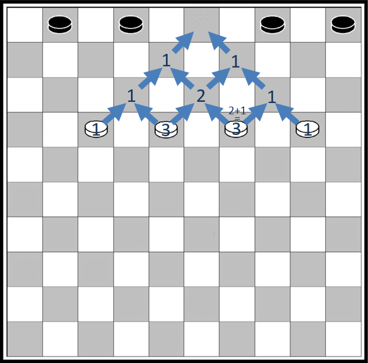

# Programmation dynamique

## Un exemple simple

{width=30% align=right}
Le jeu de Dames se pratique sur un damier de 10 cases sur 10. Les pions sont placés sur les cases foncées et ne peuvent se déplacer que d'une case à la fois, toujours vers l'avant en diagonale. Une des stratégies du jeu consiste à amener un pion sur la dernière rangée pour être promu en dame. 

La question est la suivante :  Sur le damier ci-contre, combien de chemins peut emprunter le pion blanc depuis cette case de départ pour arriver à la case vide sur la rangée du haut et être promu en dame ? 

Si on essaie de compter tous les chemins on risque de vite perdre le compte. Une idée simple pour répondre à ce problème efficacement consiste à noter à chaque intersection le nombre de chemins en partant de la fin. Découpons le processus en plusieurs étapes.

=== "Etape 1"

    On peut déjà observer qu'un certain nombre de cases ne peuvent pas être atteintes par le pion blanc depuis sa position de départ, ou ne peuvent pas mener à la case d'arrivée, on peut donc les exclure de nos calculs.

    {width=30%}

=== "Etape 2"
    Il n'y a que deux cases sur la deuxième rangée qui permettent d'aller sur la case d'arrivée, et pour chacune il n'y a qu'un seul chemin possible. 

    Marquons ces cases avec leur nombre de chemins possibles.

    
    {width=30%}

=== "Etape 3"
    Il y a trois cases sur la troisième rangée pouvant aller sur les deux cases précédentes. 
    
    Un pion sur la case à gauche ou celle à droite n'a qu'un seul chemin possible. 
    
    Par contre un pion sur la case au milieu peut se déplacer soit vers le haut à droite, soit vers le haut à gauche. Dans les deux cas, il n'a plus qu'un chemin possible ensuite. Il y a donc deux chemins possibles au départ de cette case.
    
    {width=30%}


=== "Etape 4"
    Continuons à la rangée suivante. Comme dans la rangée précédente, un pion sur la case à gauche ou celle à droite n'a qu'un seul chemin possible.

    Les deux pions placés au milieu peuvent se déplacer soit vers le haut à droite, soit vers le haut à gauche. Selon le choix que l'on fait, ils pourront emprunter 1 ou 2 chemins différents. Au total, il y a donc 3 chemins possibles au départ de ces deux cases. On comprend que le nombre de chemins possibles à partir d'une case est égal à  la somme des nombres de chemins au départ des cases à gauche et à droite de la rangée du dessus.


    **On a décomposé un problème en deux sous-problèmes plus simples**.
    
    {width=30%}


=== "Etape 5"
    Appliquons cette même idée à la rangée suivante, et notons le nombre de chemins possibles égal à la somme des nombres de chemins indiqués dans les cases à gauche et à droite sur la rangée du dessus.
    
    On constate le nombre de chemins calculé pour une case, par exemple 3, est utilisé deux fois : pour la case qui a 4 chemins possibles et pour la case qui a 6 chemins possibles.

    **Il faut donc garder en mémoire les résultats intermédiaires pour ne pas recalculer la même chose plusieurs fois**.

    
    {width=30%}

=== "Etape 6"
    Continuons à descendre dans le damier rangé par rangée en appliquant le même principe : pour chaque case on ajoute les nombres de chemins trouvés pour les cases à gauche et à droite de la rangée de dessus.  

    On arrive au résultat final : il y a  126 chemins possibles pour aller de la case de départ jusqu'à l'arrivée.

    
    {width=30%}


On peut observer deux choses dans la réalisation de cet algorithme : 

1.	Pour chaque case, il suffit de faire la somme du nombre de chemins depuis la case de gauche et depuis la case de droite sur la rangée au-dessus : on **découpe le problème en sous-problèmes plus faciles à résoudre**.  

2.	Le nombre de chemins calculé pour une case est utilisé pour calculer les nombres de chemins de plusieurs autres cases. Les sous-problèmes se chevauchent. Il faut **garder en mémoire les résultats intermédiaires pour ne pas recalculer la même chose plusieurs fois**.

Ce sont les deux principes de la **programmation dynamique**.


!!! question "Exercice corrigé"
    Mario veut rejoindre la princesse Beach. Il ne peut se déplacer que vers la gauche et vers le haut, et ne peut jamais revenir en arrière. Combien de chemins différents peut-il emprunter ?

    {width=50%}
    {width=50%}


??? Success "Réponse"
    Notons à chaque intersection le nombre de chemins en partant de la fin. Pour chaque intersection, il suffit de faire la somme du nombre de chemins depuis l‘intersection à sa gauche et des chemins depuis l'intersection au dessus.   

    {width=50%}
    {width=50%}


    Mario peut prendre 10 chemins différents.

!!! abstract "Cours" 
    La **programmation dynamique**[^4.1] résout un problème en combinant des solutions de **sous-problèmes qui se chevauchent**, c'est à dire qu'il possède des sous-sous-problèmes identiques.  
    
    Afin d'éviter les calculs redondants, **chaque sous-sous-problème n'est résolu qu'une seule fois et sa réponse est gardée en mémoire**.

[^4.1]:   Cette méthode a été introduite au début des années 1950 par Richard Bellman.  Le terme "programmation" dans "programmation dynamique", ne doit pas s'entendre comme "utilisation d'un langage de programmation", mais comme synonyme de planification et ordonnancement.

On peut voir la programmation dynamique comme une amélioration ou une adaptation de la méthode « diviser pour régner » puisqu'on divise un problème en sous problèmes, à la différence que la programmation dynamique s'applique quand les sous-problèmes se chevauchent, autrement dit un sous-problème peut être utilisé dans la solution de plusieurs sous-problèmes différents. Tandis que l'approche  « diviser pour régner » crée des sous-problèmes qui sont complètement séparés et peuvent être résolus indépendamment les uns des autres.

{width=80% }
{width=80% }

## Rendu de monnaie

Problème : On dispose d'un nombre illimité de pièces de ①, ②, ⑤ et ⑩ euros pour rendre une certaine somme. Quel est le plus petit nombre de pièces nécessaire ?

### Algorithme glouton

On a vu en classe de première une solution donnée par un algorithme glouton, qui consiste à faire, étape par étape, un choix optimum local, dans l'espoir d'obtenir un résultat optimum global : dans ce cas on choisit de façon répétitive la pièce de plus grande valeur qui ne dépasse pas la somme restante : 

=== "Programme itératif"

    ``` py
    pieces = [10, 5, 2, 1]

    def rendu_monnaie_gouton(x):
        nombre_pieces = 0
        i = 0 # on commence par la plus grande pièce
        while x > 0:
            if x >= pieces[i]: # on peut rendre pieces[i]
                nombre_pieces += 1
                x = x - pieces[i]
            else:    # on passe à la pièce suivante
                i = i + 1
        return nombre_pieces	
    ```

=== "Programme récursif"
    ``` py
    pieces = [10, 5, 2, 1]

    def rendu_monnaie_gouton(x, i=0):
        if x == 0: 
           return 0  
        if pieces[i] <= x:  # on peut rendre pieces[i]
            return 1 + rendu(x - pieces[i], i)
        return rendu(x, i + 1)   # on passe à la pièce suivante
    ```


Testons l'algorithme glouton pour rendre 13 euros. On obtient bien les 3 pièces ⑩ + ② + ① qui font un total de 13.

``` py
>>> rendu_monnaie_gouton(13)
3
```

Mais que se passe-t-il si on n'a pas de pièce de 1 euro ? Remplaçons `pieces = [10, 5, 2]` et testons l'algorithme : 

```py
IndexError: list index out of range
```

Pourtant on peut rendre ⑤ + ② + ② + ② + ② qui font aussi un total de 13 euros !

C'est le **propre des algorithmes gloutons : une fois qu'une décision a été prise, on ne revient pas en arrière**. Dans certains cas l'algorithme ne trouve pas de solution, ou pas la meilleure solution.  Ici l'algorithme choisit la pièce de 10 euros qui ne mène à rien, il ne peut pas revenir en arrière et ressayer avec une autre pièce !

### Programmation dynamique

La programmation dynamique consiste à résoudre notre problème en combinant les solutions de sous-problèmes. Ici, rendre une somme x peut se faire de plusieurs manières  :

-	rendre x – 10 et rajouter une pièce de ⑩, ou
-	rendre x – 5 et rajouter une pièce de ⑤, ou
-	rendre x – 2 et rajouter une pièce de ②.

Dans notre exemple, pour rendre 13 euros on peut :

-	rendre 3 et rajouter une pièce de ⑩, ou
-	rendre 8 et rajouter une pièce de ⑤, ou
-	rendre 11 et rajouter une pièce de ②.

{width=80% }
{width=80% }


Chacun de ces sous-problèmes peut être résolus de la même façon. Constituons l'arbre des possibilités :

{width=80% }
{width=80% }

Certaines branches mènent à une solution, quand il reste 0 euros à rendre, d'autres pas. 

Implémentons cet algorithme en considérant trois cas :

-	Si x est égal à 0, alors on a rendu x, il n'y a pas de pièces supplémentaires à rendre, on renvoie 0.
-	Si x < la plus petite pièce, on ne pourra pas rendre x de cette façon, on renvoie une valeur infinie (`from math import inf`) afin de ne pas impacter une autre branche qui ménerait à une solution.
-	Sinon, on renvoie  1 + le plus petit nombre de pièces de tous les rendus de x – p, pour toutes les pièces p telles que p <= x. 

Traduit en Python, on obtient la fonction suivante :
```py
from math import inf

pieces = [10, 5, 2]
def rendu_monnaie_dynamique(x):
    if x == 0: return 0
    if x < min(pieces): return inf
    return 1 + min([rendu_monnaie_dynamique(x - p) for p in pieces if p <= x]) 

>>> rendu_monnaie_dynamique(13)
5
```

Avec la programmation dynamique, tous les cas possibles ont été traités, et plusieurs cas ont renvoyé la même solution. On a donc une solution optimale au problème.


Mais testons maintenant cette fonction avec quelques valeurs plus grandes que `13`. Très vite la fonction prend beaucoup de temps pour s'exécuter. Quelques secondes pour exécuter `rendu_monnaie_dynamique(60)`, dizaines de secondes pour `  rendu_monnaie_dynamique(70)`, plusieurs minutes pour `  rendu_monnaie_dynamique(80)`, etc.  Le programme devient vite trop lent, même pour des rendus très simples de quelques pièces de ⑩ euros !

Essayons d'estimer la complexité temporelle de cette fonction. Le nombre d'opérations pour rendre un montant $n$ avec des pieces de 10, 5 et 2 est le nombre d'opérations pour rendre $n-10$, plus le nombre d'opérations pour rendre $n-5$, plus celui pour rendre $n-2$, plus quelques opérations élémentaires. 

Si on appelle $T(n)$ le nombre d'opérations pour rendre $n$, alors on peut donc écrire que :

$T(n) = T(n-10) + T(n-5) + T(n-2) + O(1)$,

avec $O(1)$ pour les quelques opérations supplémentaires. Pour de grandes valeurs de $n$, on peut faire l'approximation que retirer 10, 5, 2 ou 1 euro à $n$ ne change pas grand chose, donc que $T(n-10)$, $T(n-5)$, et $T(n-2)$ sont du même ordre de grandeur que $T(n-1)$,  donc que  $T(n) \approx 3 \times T(n-1) + O(1)$. A chaque fois que $n$ augmente de 1, le nombre d'opérations est mutliplié par 3, plus quelques opérations, la complexité est donc exponentielle en $O(3^n)$ ici, ou de façon générale en $O({nbPieces}^n)$ pour un rendu avec $nbPieces$ pieces.  

### Version descendante (*top-down*), récursivité et mémoïsation

Les appels récursifs sont trop nombreux, la complexité est trop importante pour calculer un solution en temps raisonnable.


En programmation dynamique les sous-problèmes se chevauchent et les mêmes calculs reviennent plusieurs fois. Dans un exemple aussi simple que celui de rendre 13 euros, on retrouve 2 fois la branche qui part de "6" :

{width=80% }
{width=80% }


La solution pour limiter le nombre d'opérations consiste à ne calculer les solutions des sous-problèmes qu'une seule fois et de les garder en mémoire. C'est la technique de **mémoïsation**.

!!! abstract "Cours" 
    La mémoïsation consiste à garder en mémoire les valeurs déjà calculées.

Par exemple, avec un dictionnaire déclaré en variable globale :

```py
from math import inf

memoise = {0: 0}       # on peut déjà mettre 0 pieces pour rendre 0 euros
pieces = [10, 5, 2]

def rendu_monnaie_dynamique(x):
    if x in memoise:
        return memoise[x]
    if x < min(pieces) : return inf     # on ne peut pas mettre inf dans le dictionnaire memoise
    memoise[x] = 1 + min([rendu_monnaie_dynamique(x - p) for p in pieces if p <= x])
    return memoise[x] 
```

Cette fois ci, le résultat est immédiat, même avec des valeurs de `x` de quelques milliers (dans la limite de la pile d'appels récursifs).


### Version ascendante (*bottom-up*)

On a déjà vu dans l'exemple précédent comment écrire un algorithme récursif en utilisant la mémoïsation. Une autre approche de la programmation dynamique consiste à calculer d'abord les sous-problèmes en partant d'un cas de base et à  « remonter » jusqu'à résoudre le problème initial : c'est la version ascendante, ou *top-down*.

{width=30% align=right}
{width=30% align=right}

Appelons $nb_i$ le nombre de pièces pour rendre une somme $i$. Comme dans l'approche *top-down*,  $nb_i$ est égal à 1 + le plus petit nombre de pièces de tous les rendus de i – p, pour toutes les pièces p telles que p <= i. Si aucune pièce p ne convient, alors il n'est pas possible de rendre $i$, on peut représenter $nb_i$ par l'infini[^4.3].

[^4.3]:  $nb_i$ est donné par la formule de récurrence $nb_i = \underset{p \leq i}{\min}⁡ (1+ nb_{i-p})$.


On va créer le même dictionnaire que celui utilisé pour la mémoïsation, mais en le remplissant itérativement en partant cette fois de 0 et en incrémentant jusqu'à x.

``` py
from math import inf
nb = {0: 0}
pieces = [10, 5, 2]

def rendu_bottom_up(x):
    for i in range(1, x + 1):
        q = inf                     # on cherche le minimum pour rendre i
        for p in pieces:             # on essaie chaque piece p
            if p <= i:               
                 q = min(q, 1 + nb[i-p])
        nb[i] = q
    return nb[x]
```

Ici, aucun soucis avec la complexité de la fonction (ni de limite de pile d'appels récursifs), la fonction s'exécute instantanément même avec de très grandes valeurs de `x`. En effet, la fonction fait une double boucle imbriquée, sur la valeur à rendre $n$, et sur le nombre de pièces disponibles. La complexité est donc simplement linéaire en $O(n \times nbPieces)$.


!!! abstract "Cours" 
    La programmation dynamique peut prendre deux formes :

    - Une forme récursive descendante de haut en bas, ou *top-down*, avec mémoïsation : 
        - On utilise directement la formule de récurrence.
        - Lors d'un appel **récursif**, avant d'effectuer un calcul on regarde si son résultat n'est pas gardé en mémoire.
        - Sinon, on fait le calcul et on le garde en mémoire.

    -   Une forme itérative ascendante de bas en haut, ou *bottom-up* :
        - On résout de façon **itérative** d'abord les sous-problèmes de la plus "petite taille", puis ceux de la taille "d'au dessus", etc. Au fur et à mesure on garde les résultats en mémoire.
        - On continue jusqu'à la taille voulue.
