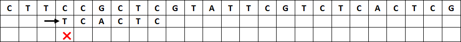
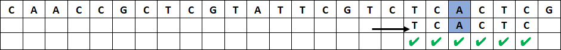

# Recherche textuelle


Chercher un mot dans une chaîne de caractères est un besoin très fréquent, par exemple quand on utilise `CTRL+F`  dans un fichier ou sur une page web.  En Python, la recherche textuelle est nativement présente avec les instructions `motif in chaine` ou `chaine.index(motif)` et `chaine.find(motif)`. En Linux, la commande `grep motif nom_fichier `permet de rechercher une chaîne de caractère `motif`dans le fichier `nom_fichier`.

!!! abstract "Cours" 
    La recherche  textuelle consiste à trouver les occurrences d'une sous-chaîne, appelée **motif** ou **clé**, dans une **chaîne** de caractères. 

Il existe de nombreux algorithmes de recherche textuelle, on étudie dans ce chapitre l'algorithme de Boyer-Moore et sa version simplifiée de Horpsool sur un exemple de bio-informatique : chercher la séquence `TCACTC` (le motif) dans un brin d'ADN `CTTCCGCTCGTATTCGTCTCACTCG` (la chaîne).

##	 Recherche naïve par « force brute »

Il s'agit de faire « glisser » caractère après caractère le motif de gauche à droite pour parcourir toute la chaîne, et de vérifier pour chaque caractère du motif s'il correspond à celui de la chaîne. Ce traitement est long, mais on est certain d'obtenir le bon résultat.

Commençons par aligner le motif à gauche de la chaîne et par comparer le premier caractère du motif à celui de la chaîne :


Le `T` du motif ne correspond pas au `C` de la chaîne. On décale le motif d'un caractère vers la droite et on essaie à nouveau :


Cette fois le `T` du motif correspond à celui de la chaîne. On passe au caractère suivant à droite : le `C` du motif ne correspond pas au `T`. On décale le motif d'un caractère vers la droite :


Le `T` puis le `C` du motif correspondent aux caractères de la chaîne, mais le `A` ne correspond pas au `C`. On décale le motif d'un caractère vers la droite :



Le `T` du motif ne  correspond pas au `C` de la chaîne. On décale le motif d'un caractère vers la droite :

L'opération se répète jusqu'à trouver tous les caractères du motif qui correspondent à ceux de la chaîne. 


Le recherche naïve est très longue car il faut parcourir toute la chaîne, caractère par caractère, et à chaque fois comparer un ou plusieurs caractères du motif avec ceux de la chaîne jusqu'à en trouver un qui ne coïncide pas.  Dans le pire des cas, le motif et la chaîne contiennent tous les deux une seule et même lettre, le coût est donc en $O(n \times m)$, où $n$ est la longueur de la chaîne et $m$ celle du motif. Et dans le meilleur des cas, le premier caractère du motif n'est pas présent dans la chaîne, le coût est en $O(n)$.


!!! abstract "Cours" 
    L'algorithme de recherche naïve, ou par « force brute », consiste à comparer les caractères du motif avec ceux de la chaîne un par un de gauche à droite jusqu'à trouver une différence. Quand une différence est trouvée, on fait « glisser » le motif d'un caractère vers la droite et on recommence.

    
Traduit en Python, on obtient le programme suivant :

``` py linenums="1"

def naive(motif, chaine):
    """ str, str -> list
    Renvoie la liste des positions trouvées du motif dans la chaîne
    """
    positions = []
    n = len(chaine)
    m = len(motif)
    i = 0    # position du début du motif dans la chaine
    while i <= n - m :
        j = 0       # position du caractère dans le motif
        while j <= m - 1 and chaine[i + j] == motif[j]:
            j = j + 1
        if j == m:       # on a trouvé le motif
            positions.append(i)
        i = i + 1   # on décale d'un caractère vers la droite
    return positions


chaine = 'CTTCCGCTCGTATTCGTCTCACTCG'
motif = 'TCACTC'

assert naive(motif, chaine) == [18]
assert naive('AAA', 'AAAAA') == [0, 1, 2]
assert naive('AT', 'ATATAT') == [0, 2, 4]
assert naive('AZ', chaine) == []

```

{width="30%" align=right}
{width="30%" align=right}

Attention à prendre soin de terminer la boucle sur le dernier caractère quand `i` vaut `n – m` **inclus**.


On constate que si l'algorithme fonctionne très bien, il est coûteux en temps machine et peut donc être optimisé. 

##	Recherche naïve à rebours

Une première modification consiste à inverser l'ordre dans lequel on compare les caractères du motif à ceux de la chaine : on part du dernier caractère du motif et s'il correspond à celui de la chaîne on passe au caractère précédent jusqu'à trouver une discordance ou avoir parcouru l'ensemble du motif (on a alors trouvé le motif).


Le `C` du motif  ne correspond pas au `G` de la chaine, on décale le motif d'un caractère vers la droite et on essaie à nouveau :


Le `C` du motif correspond à celui de la chaîne, mais le `T` ne correspond pas au `G`, on décale le motif d'un caractère vers la droite :


Le `C` du motif ne correspond pas au `T`, on décale le motif d'un caractère vers la droite :


Le dernier `C`, puis le `T`  et encore le `C` correspondent aux caractères de la chaîne, mais pas le `A`, on décale le motif d'un caractère vers la droite :

Et ainsi de suite...

Il suffit de modifier le code de la fonction Python pour parcourir les caractères du motif de droite à gauche, c'est-à-dire pour que `j` aille de `n - 1` jusqu'à `0` en décroissant :

``` py linenums="9"
    while i <= n - m:
        j = m -  1       # position du caractère dans le motif
        while j >= 0 and chaine[i + j] == motif[j]:
            j = j - 1
        if j == -1:       # on a trouvé le motif
            positions.append(i)
        i = i + 1   # on décale d'un caractère vers la droite
    return positions
```

La modification n'a pas changé le coût de l'algorithme. Mais alors quel est l'intérêt ?

##	L'algorithme de Horspool

Horspool[^5.1] propose une version simplifiée de l'algorithme de Boyer-Moore.

[^5.1]:[https://webhome.cs.uvic.ca/~nigelh/Publications/stringsearch.pdf](https://webhome.cs.uvic.ca/~nigelh/Publications/stringsearch.pdf)

Dans la recherche naïve à rebours, lorsque que le dernier caractère ne correspond pas au caractère de la chaîne, on décale le motif d'un caractère vers la droite. Mais on peut faire beaucoup mieux en regardant si ce caractère de la chaîne est présent, ou pas, autre part dans le motif :


Le `C` du motif ne correspond pas au `G` de la chaîne. Plutôt que de décaler le motif d'un seul caractère vers la droite, on voit qu'il n'y a aucun `G` dans tout le motif. Il est inutile de comparer le motif après l'avoir décalé d'un seul caractère vers la droite, il y aura toujours une différence avec ce `G` dans la chaîne.

On décale donc le motif vers la droite en  « sautant » de toute la longueur du motif ce qui permet de gagner beaucoup de temps :


Le `C` du motif ne correspond pas au `A` de la chaîne. Mais il y a un `A` autre part dans la motif qui pourrait correspondre.  Il est placé 3 caractères avant le dernier caractère du motif. Alignons ce `A` du motif sur le `A` de la chaîne. On décale le motif en « sautant » de 3 caractères vers la droite :


Le dernier `C` puis le `T` du motif correspondent aux caractères de la chaîne, mais pas le `C` placé avant. Le caractère de la chaîne qui est aligné sur le dernier caractère du motif est un `C`, or il y a d'autres `C` dans le motif qui pourraient correspondre : un placé 5 caractères avant le dernier caractère du motif et un autre 2 caractères avant.

On ne peut pas aligner le premier `C`, celui placé 5 caractères avant le dernier caractère du motif, car on irait trop loin sans avoir l'occasion d'essayer le deuxième `C`. Alignons plutôt ce deuxième `C`, celui placé 2 caractères avant le dernier caractère du motif, sur celui de la chaîne. On décale le motif en « sautant » de 2 caractères vers la droite : 


Le `C` du motif ne correspond pas au `T` de la chaîne. Or il y a d'autres `T` dans le motif qui pourraient correspondre : un placé 6 caractères avant le dernier caractère du motif et un autre 1 caractère avant. Comme à l'étape précédente, on choisit le deuxième `T` du motif pour l'aligner sur celui de la chaîne. On décale le motif en « sautant » de 1 caractère vers la droite :


Le `C` et le `T` du motif correspondent aux caractères de la chaîne, mais ensuite le  `C` ne correspond pas au `G` de la chaîne. On décale le motif en « sautant » de 2 caractères vers la droite pour aligner les `C` :


Le `C`, le `T` et le `C` du motif correspondent aux caractères de la chaîne, mais pas le `A` au `T` de la chaîne. On décale le motif en « sautant » de 2 caractères vers la droite pour aligner les `C` :


Le `C` du motif correspond à la chaîne, mais pas le `T` avec le `A` de la chaîne. On décale encore le motif en « sautant » de 2 caractères vers la droite pour aligner les `C` :


Tous les caractères du motif correspondent à ceux de la chaîne. On a trouvé le motif en 8 étapes, au lieu de 18 avec l'algorithme naïf !

On voit que les sauts sont déterminés par le **caractère de la chaine qui est aligné sur le dernier caractère du motif**, appelons le « **caractère de droite** » . Ce saut est toujours le même pour un même caractère, quelle que soit la position où la différence est trouvée. Ici, dans notre exemple :

-   Quand le caractère de droite est un `A`, on fait toujours un saut de 3 caractères.

{height="10%"}

-	Quand le caractère de droite est un `C`, on fait toujours un saut de 2 caractères quel que soit l'endroit où l'on trouve une différence avec la chaîne.

{height="10%" }


On voit aussi que si le caractère de droite apparaît plusieurs fois dans le motif, on ne considère que celui qui est le plus à droite du motif.  Par exemple, ici `T` apparaît plusieurs fois dans le motif, on calcule son saut en considérant celui qui est le plus à droite du motif, c'est-à-dire un saut de 1 caractère.

{height="10%"}

Enfin, on voit que le dernier caractère du motif n'est pas pris en compte pour calculer les sauts (puisqu'il aurait un saut de 0). Par exemple, ici le dernier `C` n'est pas pris en compte pour calculer le saut correspondant au caractère `C`, on utilise celui qui est 2 caractères avant le dernier caractère du motif.

{height="10%" }

Plutôt que de recalculer ces sauts à chaque fois qu'une différence est trouvée, on peut donc faire un prétraitement de l'algorithme de Horspool en calculant au début une seule fois le saut de chaque lettre du motif. 

Dans notre exemple, la table des sauts pour le motif  `'TCACTC'` est donc la suivante :

|A|C|T|autres|
|:-:|:-:|:-:|:-:|
|3|2|1|6|

Un dictionnaire Python permet d'enregistrer simplement les valeurs des sauts calculés pendant le prétraitement : `{'A': 3, 'C': 2, 'T': 1}`. Les autres caractères qui n'apparaissent pas dans le dictionnaire auront un saut égal à la longueur du motif.


!!! abstract "Cours" 
    L'algorithme de Horspool consiste à comparer les caractères du motif avec ceux de la chaîne un par un en remontant **de droite à gauche** jusqu'à trouver une différence.

    Quand une différence est trouvée, on regarde le **caractère de la chaîne aligné sur le dernier caractère du motif**. 

    -   Si ce caractère est présent dans le motif, on décale le motif d'un **saut** pour aligner ce caractère de la chaîne avec sa **dernière** occurrence dans le motif.

    -   Si ce caractère n'est pas présent dans le motif, on décale le motif d'un **saut** de la longueur du motif pour passer au delà de ce caractère.

    Prétraitement des sauts :  Pour chaque lettre du motif (sauf la dernière), le saut à effectuer est égal à l'écart entre la dernière occurrence de cette lettre dans le motif et la fin du motif. On ne calcule pas de saut pour le dernier caractère.


Ecrivons le prétraitement en Python :

``` py
def table_sauts(motif):
    d = {}
    m = len(motif)
    for i in range(m - 1):  # on exclut la derniere lettre du motif
        d[motif[i]] = m - i - 1
    return d

```

et le reste de l'algorithme de Horspool :

``` py linenums="1"
def horspool(motif, chaine):
    positions = []
    n = len(chaine)
    m = len(motif)
    sauts = table_sauts(motif) # on construit le dictionnaire « table de saut »
    print(chaine)
    i = 0
    while i <= n - m:
        print(' ' * i + motif)     # affiche le motif aligné avec la chaine
        j = m -  1       # position du caractère dans le motif
        car_droite = chaine[j]    # caractère de droite
        while j >= 0 and chaine[i + j] == motif[j]:
            j = j - 1
        # si on a trouvé le motif
        if j == -1:
            positions.append(i)
            i = i + sauts[car_droite] 
        # sinon si le caractère de droite est dans la table des sauts
        elif car_droite in sauts:
            i = i + sauts[car_droite]   # on saute de la table de sauts
        # sinon
        else:      # le caractère de droite n'est pas dans le motif
            i = i + m    # on saute tout le motif
    return positions
```

L'algorithme de Horspool n'améliore pas le pire des cas de la recherche naïve, si le motif et la chaine contiennent tous les deux une seule et même lettre, le coût est toujours en $O(n \times m)$, où $n$ est la longueur de la chaine et $m$ celle du motif. Par contre dans le meilleur des cas, si le dernier caractère du motif n'est pas présent dans la chaine, les sauts permettent d'améliorer fortement le coût en $O(n/m)$.


## L'algorithme de Boyer-Moore

On présente ici une version de l'algorithme de Boyer-Moore que l'on trouve sur la page [https://en.wikipedia.org/wiki/Boyer–Moore_string-search_algorithm](https://en.wikipedia.org/wiki/Boyer%E2%80%93Moore_string-search_algorithm) et dans certains livres de NSI[^5.2] , il en existe d'autres légèrement différentes.

[^5.2]: Thibaut Balabonski, Sylvain Conchon, Jean-Christophe Filliâtre, Kim Nguyen, *Numérique et Sciences Informatiques, 24 leçons avec exercices corrigés*, Ellipses

### La règle du mauvais caractère (*bad-character rule*)

On peut adapter l'idée d'un saut calculé sur le caractère de droite en utilisant à la place le premier mauvais caractère.


Comme avec Horspool, quand on trouve dans la chaine un caractère qui n'est pas présent dans le motif, on peut « sauter »  derrière celui-ci. Le `C` du motif ne correspond pas au `G` de la chaine. Il n'y a aucun `G` dans le motif, on décale  le motif vers la droite en « sautant » de toute la longueur du motif :


Le `C` du motif ne correspond pas au `A` de la chaine, mais il y a un `A` dans la chaîne 3 caractères à droite du dernier caractère du motif. On peut aligner ce dernier `A` du motif en « sautant » de 3 caractères (même chose qu'avec Horspool) :


Le `C` et le `T` du motif correspondent aux caractères de la chaine, mais pas le `C` avec le `T` de la chaine. Plutôt que de calculer le saut en fonction du `C` aligné avec le caractère à droite du motif comme le fait l'algorithme d'Horspool (c'est-à-dire un saut de 2 caractères), on utilise le premier **mauvais caractère**, ici `T`, pour calculer le saut. Il y a un `T` dans le motif à gauche de ce mauvais caractère, on peut aligner ces `T` et  sauter de 3 caractères.  Attention, on ne prend pas en compte le `T` dans le motif placé à droite du mauvais caractère.

C'est comme si on calculait la table des sauts pour un motif réduit à la sous-chaine réduite à la gauche du mauvais caractère, `TCAC` :

|A|C|T|autres|
|:-:|:-:|:-:|:-:|
|1|2|3|4|


Le `C`  et le `T` du motif correspondent à la chaine, mais pas le `C` avec le `G` de la chaine.  Il n'y a pas de `G` dans la partie droite du motif (il n'y en a pas du tout), on « saute » de toute la longueur du motif à gauche du mauvais caractère, c'est-à-dire de 4 caractères, pour placer le motif après le `G` :


Le `C` du motif correspond à la chaine, mais pas le `T` avec le `A`. Le mauvais caractère est un `A` et il y a un `A` dans le motif à droite du mauvais caractère, on « saute » de 2 caractères pour aligner les `A`. 



Tous les caractères correspondent. On a trouvé le motif en 6 étapes, au lieu de 8 avec Horspool !


A la différence de Horspool, les sauts ne dépendent pas que d'un seul caractère dans la chaine (le caractère à droite), ils dépendent du mauvais caractère et de sa position dans le motif.  La table des sauts a donc deux entrées : les caractères du motif qui pourraient être des mauvais caractères et la position `j` à laquelle ils se trouveraient dans le motif :

-	Pour `j = 5`, les sauts sont calculés sur la position du dernier caractère du motif, on retrouve les sauts de Horspool.

-	Pour les autres valeurs de `j`, il faut calculer les sauts sans prendre en compte les caractères qui coïncident, par exemple pour `j = 3`, les sauts correspondent aux sauts Horpsool pour le motif  `TCAC`, c'est-à-dire en ignorant les derniers caractères `TC` (puisqu'ils coïncident avec la chaîne).

-	Certaines valeurs ont un `X` pour les caractères qui correspondent au motif (ce n'est pas un mauvais caractère). 

|j (lettre)|A|C|T|autres|
|:-:|:-:|:-:|:-:|:-:|
|0 (T)|1|1|X|1|
|1 (C)|2|X|1|2|
|2 (A)|X|1|2|3|
|3 (C)|1|X|3|4|
|4 (T)|2|1|X|5|
|5 (C)|3|X|1|6|


!!! abstract "Cours" 
    L'algorithme de Boyer-Moore consiste à comparer les caractères du motif avec ceux de la chaine un par un en remontant **de droite à gauche** jusqu'à trouver une différence.

    Règle du mauvais caractère : Quand une différence est trouvée, on regarde le **caractère de la chaine qui est différent du motif**, c'est le **mauvais caractère**. 

    -   Si ce mauvais caractère de la chaine est aussi présent dans la partie du motif qui est à gauche de l'emplacement du mauvais caractère, on décale le motif d'un **saut** pour aligner ce mauvais caractère de la chaine avec sa **dernière** occurrence dans le motif à gauche de la différence trouvée.

    -   Si ce mauvais caractère de la chaine n'est pas présent dans la partie du motif qui à gauche de l'emplacement du mauvais caractère, on décale le motif d'un **saut** pour passer au delà de la différence trouvée.

   
    Prétraitement des sauts :  Pour chaque lettre du motif (sauf la dernière), et pour chaque position du mauvais caractère, le saut à effectuer est égal à l'écart entre la dernière occurrence de cette lettre dans le motif (en restant à gauche du mauvais caractère) et la position du mauvais caractère. On ne calcule pas de saut pour le dernier caractère.


En Python, on peut construire cette table des sauts avec un tableau de dictionnaire :

``` py
[{},
 {'T': 1},
 {'C': 1, 'T': 2},
 {'A': 1, 'T': 3},
 {'A': 2, 'C': 1},
 {'A': 3, 'T': 1}]
```

La programmation de l'algorithme de Boyer-Moore dépasse le niveau attendu en NSI. 

``` py linenums="1"
def table_sauts_bm(motif):
    """ str -> list(dict)
    Renvoie un tableau de dictionnaires de sauts pour les valeurs de j
    """
    tab = []
    for j in range(len(motif)):
        tab.append(table_sauts(motif[:j+1]))
    return tab

def boyer_moore(motif, chaine):
    positions = []
    n = len(chaine)
    m = len(motif)
    sauts = table_sauts_bm(motif) # on construit le dictionnaire « table de saut »
    print(chaine)
    i = 0
    while i <= n - m: 
        print(' ' * i + motif)     # affiche le motif aligné avec la chaine
        j = m - 1   # position du caractère dans le motif
        coincide = 0
        while j >= 0 and chaine[i + j] == motif[j]:
            j = j - 1
        # si on a trouvé le motif
        if j == -1:
            positions.append(i)
            i = i + 1
        # sinon si le mauvais caractère est dans le motif
        elif chaine[i + j] in sauts[j]:    #
            i = i + sauts[j][chaine[i + j]]    # on saute de la table de sauts
        else:                # le caractère n'est pas dans le motif
            i = i + j + 1    # on saute tout le motif
    return positions
```

###	Règle du bon suffixe (*good-suffix rule*)
Dans le cas où certains caractères du motif correspondent à ceux de la chaine, l'algorithme de Boyer-Moore calcule un saut supplémentaire en utilisant les « bons » caractères placés à droite du mauvais caractère : le « bon suffixe ».


Reprenons à l'étape 3 :


Le `C` et le `T` du motif correspondent à la chaine, mais pas le `C`  avec le `T` de la chaine. 

La règle du mauvais caractère, ici `T`, nous dit d'aligner ce  `T` avec le `T` du motif placé à gauche du mauvais caractère, c'est à dire un saut de 3 caractères.

On observe par ailleurs que les deux premiers caractères du motif que l'on a comparés à la chaine, le `C` et le `T` du motif, étaient « bons », ils forment un « **bon suffixe** ». Hors ce bon suffixe apparaît aussi dans le motif, tout à gauche du motif, et pas après. On peut donc aussi aligner ces bons suffixes, ce qui permet de faire un saut de 4 caractères.

L'algorithme de Boyer-Moore applique le meilleur des deux, c'est un saut de 4 caractères :


Ici, le mauvais caractère est `T`, la règle du  mauvais caractère nous permet d'aligner ce `T` avec le `T` du motif à gauche, c'est-à-dire de « sauter » d'1 caractère. Il n'y a pas de bon suffixe, on saute d'un caractère :


Le `C`, puis le `T`, puis le `C` du motif correspondent à la chaine, mais le `A` ne correspond pas au `T` de la chaine. On a donc un mauvais caractère `T` et un bon suffixe `CTC` .

La règle du « mauvais caractère » nous permet de « sauter » de seulement 2 caractères (on ne prend en compte que le premier `T` du motif, le second est trop à droite). La règle du bon suffixe nous permet d'aligner les `TC` en « sautant » de 4 caractères. On applique la meilleure des deux règles :


On a trouvé le motif en 6 étapes.

La règle du « bon suffixe » consiste à calculer une seconde table :


|Bon suffixe|Saut| |
|--:|:-:|:-:|
|`C`|2|Si le bon suffixe est `C`, on peut « sauter » de 2 caractères comme Horspool|
|`TC`|4||
|`CTC`|4|On aligne avec le `TC` du début du motif|
|`ACTC`|4||
|`CACTC`|4||

!!! abstract "Cours" 
    L'algorithme de Boyer-Moore consiste à comparer les caractères du motif avec ceux de la chaine un par un en remontant **de droite à gauche** jusqu'à trouver une différence.

    Règle du bon suffixe : Quand une différence est trouvée, on regarde les **caractères de la chaine à droite du mauvais caractère**, c'est le **bon suffixe**. 

    -   Si ce bon suffixe est présent dans le motif à droite, on décale le motif d'un **saut** pour aligner ce bon suffixe avec sa **dernière** occurrence dans le motif.

    -   Si ce bon suffixe n'est pas présent dans le motif, on décale le motif d'un **saut** de la longueur du motif pour passer à droite du bon suffixe.

   
    L'algorithme de Boyer Moore consiste à prendre à chaque étape le plus grand saut entre les deux tables.

On peut regarder l'animation de [http://fred.boissac.free.fr/AnimsJS/recherchetextuelle/index.html](http://fred.boissac.free.fr/AnimsJS/recherchetextuelle/index.html)   