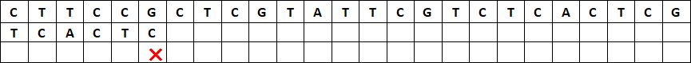

# Recherche textuelle

!!! abstract "Cours" 
    La recherche  textuelle consiste à trouver les occurrences d'une sous-chaîne, appelée **motif** ou **clé**, dans une **chaine** de caractères.  

C'est un problème très fréquent, par exemple quand on fait CTRL+F pour chercher un mot dans un fichier ou sur une page web.  En Python, la recherche textuelle est nativement présente avec les instructions `motif in chaine` ou `chaine.index(motif)` et `chaine.find(motif)`. 

Il existe de nombreux algorithmes de recherche textuelle, on étudie dans ce chapitre l'algorithme de Boyer-Moore et sa version simplifiée de Horpsool sur un exemple de bio-informatique: chercher la séquence `TCACTC` (le motif) dans un brin d'ADN `CTTCCGCTCGTATTCGTCTCACTCG` (la chaine).

##	 Recherche naïve par « force brute »

Il s'agit de faire « glisser » le motif de gauche à droite pour parcourir la chaîne caractère après caractère, et de vérifier pour chaque caractère du motif s'il correspond à celui de la chaine. Ce traitement est long mais on est certain d'avoir un bon résultat.

Commençons par aligner le motif à droite de la chaine et par comparer le premier caractère du motif à celui de la chaine :


Le `T` du motif ne correspond pas au `C` de la chaine. On décale le motif d'un caractère à droite et on essaie à nouveau :


Le `T` correspond à celui de la chaine, on compare les caractères suivants à droite : le `C` ne correspond pas au `T`. On décale d'un caractère à droite :


Le `T` et le `C` correspondent à la chaine, mais pas le `A`. On décale d'un caractère :


Le `T` ne  correspond pas au `C` de la chaine. On décale d'un caractère :

L'opération se répète jusqu'à trouver tous les caractères du motif qui correspondent. 


Le recherche naïve est très longue car il faut parcourir toute la chaîne, caractère par caractère, et à chaque fois comparer avec un ou plusieurs caractères du motif jusqu'à trouver un caractère qui ne coïncide pas.  Dans le pire des cas, le motif et la chaine contiennent tous les deux une seule et même lettre, le coût est donc en $O(n \times m)$, où $n$ est la longueur de la chaine et $m$ celle du motif. Et dans le meilleur des cas, le premier caractère du motif n'est pas présent dans la chaine, le coût est en $O(n)$.

Traduit en Python, on obtient le programme suivant :

``` py linenums="1"

chaine = 'CTTCCGCTCGTATTCGTCTCACTCG'
motif = 'TCACTC'


def naive(motif, chaine):
    """ str, str -> list
    Renvoie la liste des positions trouvées du motif dans la chaîne
    """
    positions = []
    n = len(chaine)
    m = len(motif)
    i = 0    # position du début du motif dans la chaine
    while i <= n - m  :
        j = 0       # position du caractère dans le motif
        while j < m and chaine[i + j] == motif[j]:
            j = j + 1
        if j == m:       # on a trouvé le motif
            positions.append(i)
        i = i + 1   # on décale d'un caractère à droite
    return positions

assert naive(motif, chaine) == [18]
assert naive('AAA', 'AAAAA') == [0, 1, 2]
assert naive('AT', 'ATATAT') == [0, 2, 4]
assert naive('AZ', chaine) == []

```

{width="25%" align=right}
{width="25%" align=right}

Attention à prendre soin de terminer la boucle sur le dernier caractère quand `i` vaut `n – m` **inclus**.

On constate que si l'algorithme fonctionne très bien, il est coûteux en temps machine et peut donc être optimisé. 

##	Recherche naïve à rebours

Une première modification consiste à inverser l'ordre des caractères à comparer : on part du dernier caractère du motif et s'il correspond à celui de la chaîne on passe au caractère précédent jusqu'à trouver une discordance ou avoir parcouru l'ensemble du motif (on a alors trouvé le motif).


Le `C` du motif  ne correspond pas au `G` de la chaine, on décale d'un caractère à droite. 


Le `C`  correspond, mais le `T` ne correspond pas au `G` de la chaine, on décale d'un caractère à droite.


Le `C`  ne correspond pas au `T`, on décale d'un caractère à droite.


Le `A`  puis le `T` correspondent à la chaine, mais pas le `C`, on décale d'un caractère à droite,  et ainsi de suite...

On modifie donc le code Python de la façon suivante :

``` py linenums="13"
    while i <= n - m  :
        j = m -  1       # position du caractère dans le motif
        while j >= 0 and chaine[i + j] == motif[j]:
            j = j - 1
        if j == -1:       # on a trouvé le motif
            positions.append(i)
        i = i + 1   # on décale d'un caractère à droite
    return positions
```

La modification n'a pas changé le cout de l'algorithme. Mais alors quel est l'intérêt ?

##	L'algorithme de Horspool

Horspool propose une version simplifiée de l'algorithme de Boyer-Moore.

Dans la recherche naïve, lorsque que le dernier caractère ne correspond pas à une lettre de la chaîne, on décale le motif d'un caractère, mais on peut faire mieux en regardant si ce caractère de la chaîne est présent autre part dans le motif :


Le `C` ne correspond pas au `G` de la chaine. Plutôt que de décaler le motif d'une seule position vers la droite, on voit qu'il y n'y a pas de  `G`  dans le motif, on peut donc « sauter »  de toute la longueur du motif, et gagner beaucoup de temps :


Le `C` ne correspond pas au `A` de la chaine, mais il y a un `A` dans la chaîne 3 caractères à gauche du dernier caractère du motif, on peut donc aligner immédiatement ce dernier `A` du motif en « sautant »  de 3 caractères :


Le `C` ne correspond pas au `T` de la chaine.  Il y a un `T`dans le motif 5 caractères à gauche du dernier caractère du motif et un autre 1 caractère à gauche. On peut aligner ce dernier  `T` du motif en « sautant » de 1 caractère. 


Le `C` ne correspond pas au `T` de la chaine, mais il y a un `T` dans la chaîne 1 caractère à droite du dernier caractère du motif. On aligne ce `T` du motif en décalant de 1 caractère :


Le `C` et le `T`  correspondent à la chaine, mais ensuite le  `C` ne correspond pas au `G`, on « saute » de 2 caractères pour aligner les `C` :


Le `C`, le `T` et le `C` correspondent, mais pas le `A` au `T` de la chaine, on « saute » de 2 caractères pour aligner les `C` :


Le `C` correspond, mais pas le `T` avec le `A` de la chaine , on « saute » de 2 caractères pour aligner les `C` :


Tous les caractères correspondent. On a trouvé le motif en 8 étapes, au lieu de 18 avec l'algorithme naïf !

On voit que le saut est déterminé par le caractère de la chaine qui est aligné sur le dernier caractère du motif. Ce saut est toujours le même pour un même caractère, quelle que soit la position où la différence est trouvée. Ici, dans notre exemple :

-   Quand cette lettre est un `A` on fait toujours un saut de 3 caractères.

{height="10%"}

-	Quand ce caractère est un `C` on fait toujours un saut de 2 caractères quelle que soit la position du caractère différent de la chaine.

{height="10%" }


On voit aussi que si un caractère apparaît plusieurs fois dans le motif, on ne garde que celui qui est le plus à droite.  Par exemple, ici `T` apparaît plusieurs fois dans le motif, on calcule le saut pour `T` en considérant celui qui est le plus à droite du motif, c'est-à-dire 1.

{height="10%"}

Enfin, on voit que le dernier caractère du motif  n'est pas pris en compte pour calculer le saut correspondant (puisqu'il aurait un saut de 0). Par exemple, ici le dernier `C` n'est pas pris en compte pour calculer le saut correspondant à `C`, on prend en compte celui qui est 2 caractères avant.

{height="10%" }

Plutôt que de recalculer ces sauts à chaque fois qu'une différence est trouvée, on peut donc faire un prétraitement de l'algorithme de Horspool en calculant au début une seule fois tous les sauts associés à chaque lettre du motif. 

!!! abstract "Cours" 
    Prétraitement :  Pour chaque lettre du motif (sauf la dernière), le saut à effectuer est égal à l'écart entre la dernière occurrence de cette lettre dans le motif et la fin du motif. On ne calcule pas de saut pour le dernier caractère.


Dans notre exemple, la table des sauts pour le motif  `'TCACTC'` est donc la suivante :

|A|C|T|autres|
|:-:|:-:|:-:|:-:|
|3|2|1|6|

Un dictionnaire Python permet d'enregistrer simplement les valeurs des sauts calculés pendant le prétraitement : `{'A': 3, 'C': 2, 'T': 1}`. Les autres caractères qui n'apparaissent pas dans le dictionnaire auront un saut maximum de la longueur du motif.

Ecrivons le prétraitement en Python :

``` py
def table_sauts(motif):
    d = {}
    m = len(motif)
    for i in range(m - 1):  # on exclut la derniere lettre du motif
        d[motif[i]] = m - i - 1
    return d

```

et le reste de l'algorithme de Horspool :

``` py linenums="1"
def horspool(motif, chaine):
    positions = []
    n = len(chaine)
    m = len(motif)
    sauts = table_sauts(motif) # on construit le dictionnaire « table de saut »
    print(chaine)
    i = 0
    while i <= n - m:
        print(' ' * i + motif)     # affiche le motif aligné avec la chaine
        j = m -  1       # position du caractère dans le motif
        dernier_car = chaine[j]
        while j >= 0 and chaine[i + j] == motif[j]:
            j = j - 1
        # si on a trouvé le motif
        if j == -1:
            positions.append(i)
            i = i + sauts[dernier_car] 
        # sinon si le dernier caractère est dans la table des sauts
        elif dernier_car in sauts:
            i = i + sauts[dernier_car]   # on saute de la table de sauts
        # sinon
        else:      # le caractère n'est pas dans le motif
            i = i + m    # on saute tout le motif
    return positions
```

L'algorithme de Horspool n'améliore pas le pire des cas de la recherche naïve, si le motif et la chaine contiennent tous les deux une seule et même lettre, le coût est toujours en $O(n \times m)$, où $n$ est la longueur de la chaine et $m$ celle du motif. Par contre dans le meilleur des cas, si le dernier caractère du motif n'est pas présent dans la chaine, les sauts permettent d'améliorer fortement le coût en $O(n/m)$.

