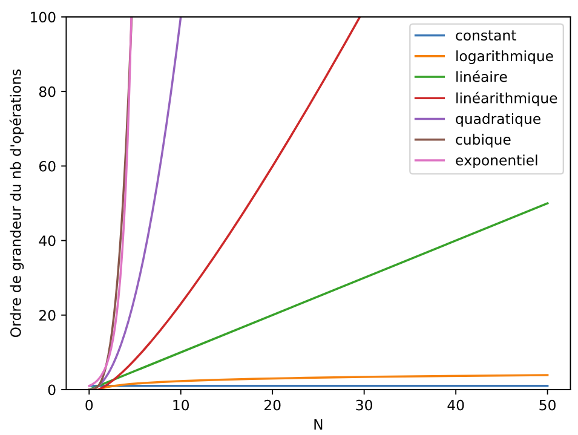

# Algorithmique

Un algorithme[^0.0]  est un énoncé d'une suite d'opérations élémentaire permettant de résoudre un problème. On a étudié en classe de première quelques algorithmes classiques :

[^0.0]: Le mot « algorithme » vient du nom du mathématicien Al Khwarizmi, qui écrivit au 9ème siècle le premier ouvrage systématique sur la solution d'équations linéaires et quadratiques.

-	Recherche et tri de tableau
-	Algorithme des k plus proches voisins (un exemple d'algorithme d'apprentissage)
-	Recherche dichotomique dans un tableau trié
-	Algorithmes gloutons [^0.1]

[^0.1]: Un algorithme glouton suit le principe de faire, étape par étape, un choix optimum local, dans l'espoir d'obtenir un résultat optimum global.

L'analyse de la **complexité**, ou **coût**, d'un algorithme consiste en l'étude de la quantité de ressources nécessaire à l'exécution de cet algorithme. On distingue principalement deux types de complexité :

-	La **complexité spatiale** qui mesure l'utilisation de l'espace **mémoire**.
-	La **complexité temporelle** qui ne mesure pas le temps de calcul (qui dépend de l'ordinateur, du langage de programmation, du compilateur ou de l'interpréteur, des performances de la machine, etc) mais plutôt l'ordre de grandeur du **nombre d'opérations élémentaires** (affectation, calcul, comparaison, etc.) dans le pire des cas, ou plus précisément la vitesse de croissance de ce nombre  (aux constantes près). 

Les principales complexités temporelles sont les suivantes :

|Notation               |Désigantion         |Exemples|
|:-:                    |:--                 |:--|
|$O(1)$                 |constante           |Accès à un élément d'un tableau|
|$O(log_2(n))$          |logarithmique[^0.2] |Recherche dichotomique (tableau trié)|
|$O(n)$                 |linéaire            |Recherche dans un tableau|
|$O(n \times log_2(n))$|linéarithmique[^0.3]      |Tri fusion|
|$O(n^2)$               |quadratique         |Tri à bulle, parcours de matrice|
|$O(a^n)$               |exponentielle[^0.4]:|Sac à dos|
|$O(n!)$                |factorielle         |Voyageur de commerce|

[^0.2]: Ou quasi linéaire, quand n vaut 1 milliard $log_2(10^9) = 30$.

[^0.3]: Le "logarithme base 2" noté $log_2$. Par définition $log_2(2^x) = x$.

[^0.4]: Considérés comme infaisables dès que $n$ n'est pas très petit. On peut comparer $2^{250} = 10^8$ avec $250^2=62500$.

{width=80%}

