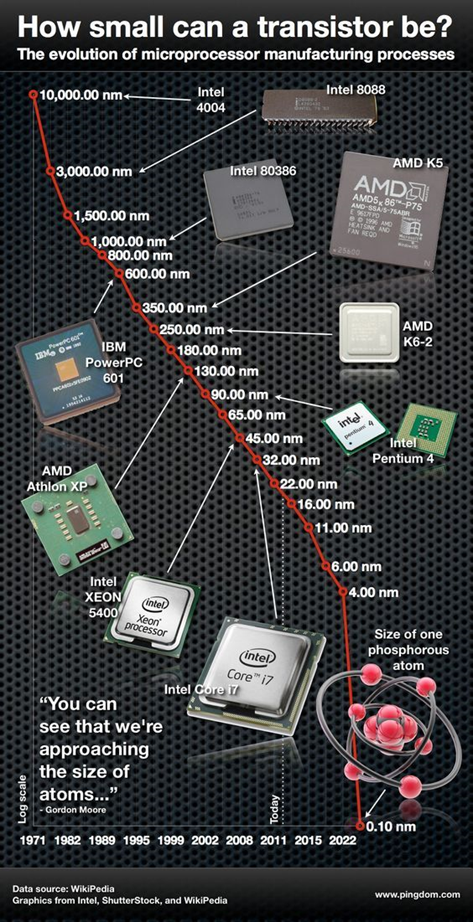
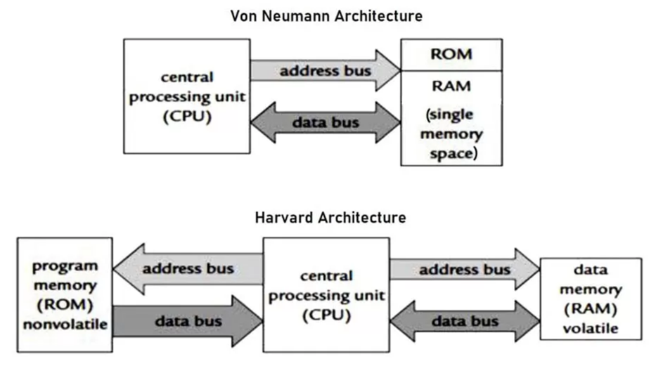
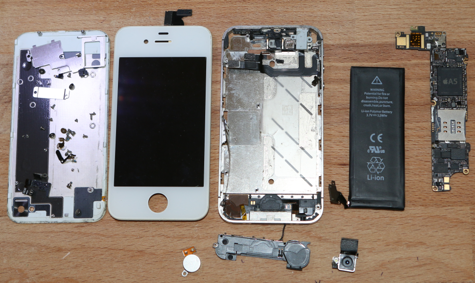
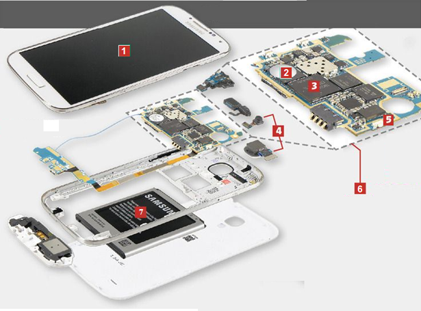
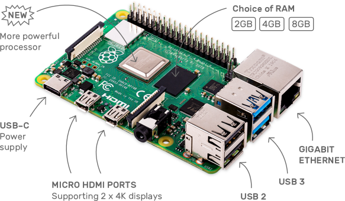
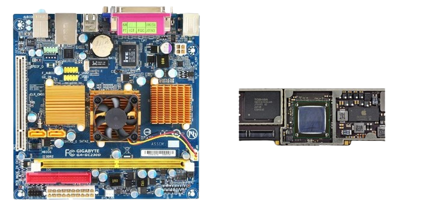

# Système sur puce ou SoC (*System on a Chip*)

## Vers une miniaturisation sans fin ?

### De l'ENIAC au premier microprocesseur
Construit en **1945**, le premier ordinateur entièrement électronique est l'**ENIAC** (*Electronic Numerical Integrator And Computer*). Il est composé de 42 armoires de 3 m de hauteur qui abritent 18 000 tubes électroniques (tubes à vide). 

 Par Auteur inconnu — Domaine public, <a href="https://commons.wikimedia.org/w/index.php?curid=55124">Lien</a>

Dans les années 1950, l'invention des transistors, souvent décrite comme l'invention du siècle, puis des circuits intégrés permet la miniaturisation des équipements informatiques.

Pour envoyer des hommes sur la lune dans les années 1960, les missions Apollo maximisent la puissance de calcul dans un espace restreint avec l'Apollo Guidance Computer (AGC), un ordinateur pesant seulement 32kg. L'AGC possède une mémoire de stockage de 72ko et une RAM de 2ko. 

!!! tip inline end "" 
    **Transistor** : circuit électronique fonctionnant comme un interrupteur pouvant prendre deux états auxquels sont associées les valeurs 0 et 1.

    **Circuit intégré ou puce électronique** : ensemble de transistors qui se présente sous la forme d'un boitier noir rectangulaire équipé de « pattes » (appelées aussi broches ou pins) pour établir des connexions électriques.

    **Microprocesseur ou CPU (*Central Processeur Unit*)** : processeur dont les composants miniaturisés sont regroupés dans un unique circuit intégré.

Jusqu'au début des années 1970, les différents composants électroniques, nécessaires au fonctionnement d'un processeur ne peuvent pas tenir sur un seul circuit intégré, ce qui nécessite d'interconnecter de nombreux composants dont plusieurs circuits intégrés.

En **1971**, la société américaine **Intel** réussit à placer tous les composants sur **un seul circuit intégré** donnant ainsi naissance au **microprocesseur** : c'est le **4004 d'Intel**. Il intègre dans une seule puce 2300 transistors ce qui lui donne une puissance de calcul comparable à l'ENIAC !

### Loi de Moore
En 1975, Gordon E. Moore (cofondateur d'Intel) énonce la conjecture suivante appelée loi de Moore : 

*Dans les microprocesseurs, le nombre de transistors va doubler tous les deux ans.*

 Par Max Roser, Hannah Ritchie — <a rel="nofollow" class="external free" href="https://ourworldindata.org/uploads/2020/11/Transistor-Count-over-time.png">https://ourworldindata.org/uploads/2020/11/Transistor-Count-over-time.png</a>, <a href="https://creativecommons.org/licenses/by/4.0" title="Creative Commons Attribution 4.0">CC BY 4.0</a>, <a href="https://commons.wikimedia.org/w/index.php?curid=98219918">Lien</a>

!!! question "Exercice corrigé" 
    Observer l'évolution du nombre de transistors d'un microprocesseur et conclure si la loi de Moore s'est réalisée au cours des années.
        

??? Success "Réponse"
    Selon la loi de Moore, tous les 20 ans, le nombre de transistors dans un microprocesseur est multiplié par environ un facteur de mille ( 2^10 = 1024) ce qui semble en effet correspondre à l'évolution qui apparaît sur ce graphe : 

    -   Entre 1971 et le début des années 1990, il passe de 2300 à environ  2 000 000.
    -   Entre le début des années 1990 et 2010, il passe de 1-5 million à 1-5 milliards.
    -   Entre les années 2000 et 2020, il passe de 50 millions à 50 milliards.

{width="35%" align="right"}

### La miniaturisation de la gravure mène au téléphone portable

A partir des années 1980, l'architecture des ordinateurs n'évolue plus beaucoup : La miniaturisation de la gravure de la puce permet d'intégrer de plus en plus de composants et d'augmenter la fréquence d'horloge : les ordinateurs vont de plus en plus vite et consomment de moins en moins d'énergie.

A partir des années 2000, l'augmentation des fréquences d'horloge atteint ses limites dues à la plus grande consommation électrique et les problèmes de refroidissement. Les constructeurs se tournent vers les microprocesseurs multi-cœur (*multi-core*) pour accroitre les performances.

L'aboutissement de cette miniaturisation est le téléphone portable qui intègre tout ce que la technologie peut nous apporter : un microprocesseur puissant, de la mémoire, des interfaces de communication rapides (4G, 5g, Wifi...), un contrôleur graphique digne d'une console de jeu, tout cela fonctionnant sur batterie avec une durée de fonctionnement de plusieurs heures.

Cette augmentation du nombre de transistors par puce ne sera pas possible indéfiniment Aujourd'hui la finesse de gravure descend en dessous de 10nm, soit quelques dizaines d'atomes. Un jour, il faudra utiliser une solution autre que celle des puces en silicium, pour continuer à augmenter la puissance des ordinateurs…

<iframe width="560" height="315" src="https://www.youtube.com/embed/K6Co__JWYJk?si=KfU9kEBjInptNWDC" title="YouTube video player" frameborder="0" allow="accelerometer; autoplay; clipboard-write; encrypted-media; gyroscope; picture-in-picture; web-share" referrerpolicy="strict-origin-when-cross-origin" allowfullscreen></iframe>

## Système sur puce

Dans un ordinateur de bureau le CPU effectue les différents calculs permettant par exemple de faire tourner le système d'exploitation. Les différentes cartes (graphique (GPU), son, réseau...) et les mémoires sont branchées sur la carte mère et interconnectées à l'aide de bus.

Dans une tablette, un smartphone, etc… tous ces éléments ne constituent plus qu'un seul élément, la puce. Tout ce que contient un ordinateur de bureau est concentré sur cette puce, c'est un ordinateur à elle toute seule.

!!! abstract "Cours" 
    Un « **système sur puce** », ou SoC (pour « *System on a Chip* »), est un système complet embarqué sur **un seul circuit intégré**, ou  "puce", regroupant le (ou plusieurs) **microprocesseur**, un **processeur graphique**, de la **mémoire**, des **modules de communication** sans fil (4G, 5G, puce radio pour le Bluetooth, Wi-Fi ), des **périphériques externes** (E/S, capteurs, caméra), etc. 

###	Architecture Harward

Les SoC utilisent généralement l'architecture d'Harvard, différente de Von Neumann : 
- Les mémoires des données et des programmes sont séparées.
- Deux bus distincts permettent de transférer simultanément les données et les instructions à exécuter → plus grande rapidité

###	A l'intérieur d'un téléphone portable

Le microprocesseur n'est qu'un composant du SoC qui est au cœur du téléphone. On peut voir un SoC comme un PC miniaturisé à l'extrême. Il comprend donc des composants et contrôleurs lui permettant de gérer tous les équipements de votre smartphone, qu'il s'agisse de l'appareil photo, de la mémoire interne, ou encore des modules radio.

Voici la photo d'un iPhone 4S démonté . Comme vous le voyez, le nombre de composants est très réduit au regard des fonctionnalités ! Le SoC de l'iPhone 4S, sur le circuit imprimé à droite, est une puce A5 qui combine principalement deux processeurs ARM Cortex-A9 et deux processeurs graphiques.

!!! question "Exercice corrigé" 
    Trouver le nom du SoC de votre tablette scolaire (ou smartphone personnel)) et ses caractéristiques techniques.
        

??? Success "Réponse"
    Informations trouvées dans le menu Paramètres/Système\À propos de la tablette :

    - CPU : Qualcomm Snapdragon 450
    - Stockage (ou ROM) : 32 GB
    - RAM : 3 GB

    Note : À la différence d'un ordinateur, la mémoire ROM (*Read-Only Memory*) correspond au disque dur qui accueille le système d'exploitation et les données : apps, fichiers, photos, vidéos, SMS, etc…. 

!!! question "Exercice corrigé" 
    Associer à chaque composant sur l'image à son nom et trouver la description correspondante :

    Batterie -  Circuit imprimé – Mémoire-  Ecran tactile  – Caméras – GSM / WiFi / Bluetooth – Système sur Puce  (SoC)         
    

??? Success "Réponse"
    |Numéro|Composant|Description|
    |:-:|:--|:--|
    |1|Ecran tactile|C'est le composant le plus connu, car le plus sujet à la casse. Il faut bien faire la distinction entre la vitre tactile et la dalle d'affichage, mais sur la grande majorité des modèles les plus récents la fonctionnalité tactile est désormais souvent intégrée à la dalle d'affichage et non la vitre.|
    |2|Mémoire|Elle correspond au disque dur de votre ordinateur. Vous y stockerez les applications que vous installerez, les photos et selfies que vous réaliserez et bien d'autres données encore (SMS, fichiers téléchargés…).|
    |3|SoC|Il regroupe presque tout le contenu d'un ordinateur sur un seul circuit intégré : CPU, mémoire et autres composants interconnectés.|
    |4|Caméras|	Il existe y en a souvent deux une à l'avant et une à l'arrière. Les derniers modèles sont mêmes équipés de double, triple voire quadruple capteur avec téléobjectif et grand angle.|
    |5|GSM / WiFi / Bluetooth|	Il intègre plusieurs types de connexions et réseaux pour offrir la 43G, 4G ainsi que les connexions habituelles Wi-Fi et Bluetooth.|
    |6|	Circuit imprimé|Appelé aussi PCB (printed circuit board) est un support, en général une plaque, permettant de maintenir et de relier électriquement un ensemble de composants électroniques entre eux.|
    |7|	Batterie|	La technologie lithium-ion (ou li-ion) lui donne une énergie massive. Ses inventeurs ont reçu le prix Nobel de chimie 2019.|

###	Ordinateur sur carte unique 

Les ordinateurs sur carte unique ou SBC (*Single Board Computers*) sont une autre utilisation des SoC. Le Raspberry Pi en est un exemple. 

Cette carte est assez puissante pour faire fonctionner le système d'exploitation Linux et être utilisé comme ordinateur de bureau, mini serveur ou pour des projets IoT.

###	Comparaison entre SoC et ordinateurs de bureau

!!! abstract "Cours" 

    Les SoC offrent de nombreux avantages par rapport aux ordinateurs de bureau:

    - 	son faible encombrement est particulièrement adapté pour  les smartphones et les tablettes tactiles ainsi que les systèmes embarqués de petite taille

    - 	sa consommation d'énergie réduite lui donne une grande autonomie sur batterie  et évite la présence d'un ventilateur (appareil silencieux). 

    -	Notons également que les données y circulent plus vite du fait de la distance réduite entre les composants.

    Mais aussi des inconvénients : 

    -	Le manque de flexibilité : l'extrême intégration du SoC n'autorise aucune mise à jour du matériel ou de remplacement en cas de panne d'un composant alors qu'on peut faire évoluer individuellement  les composants sur la carte mère d'un ordinateur.

    - 	Enfin, les SoC sont souvent plus lents que les PC.

    

###	Architectures des SoC

Suivant les fabricants et les besoins, il existe plusieurs architectures. Deux d'entre elles prennent place dans la grande majorité des produits électroniques conçus ces vingt dernières années.

- L'architecture **ARM** : Les SoC d'ARM se retrouvent ainsi dans la plupart des smartphones et des objets connectés.
Cette architecture est basée sur des jeux d'instructions **RISC** (*Reduced Instruction Set Computing*) qui sont plus petits, nécessitent moins d'énergie pour être traités et se terminent rapidement, libérant ainsi les ressources du système ou permettant à l'appareil de "rester en veille" pour économiser la batterie.

- L'architecture **X86** : Cette architecture a permis de développer les processeurs des ordinateurs, des serveurs ou encore de certaines tablettes mais elle est beaucoup moins utilisée pour développer les SoCs (seul Asus développe des produits conçus à partir des SoC X86).
Cette architecture est basée sur des jeux d'instructions complexes **CISC** (*Complex Instruction Set Computer*).

###	Microcontrôleur

Le microcontrôleur est la forme la plus simple d'un SoC qui a donné naissance aux cartes Arduino et micro:bit, mais il y a de nombreuses différences entre les SoC et les microcontroleurs.

||Soc|	Microcontrôleur|
|:--|:--|:--|
|applications|	Véritables ordinateurs : jeu, navigateur Web, création de document, etc.)| Souvent dédiés à une tache spécifique (appareil photo, machine à laver, etc.)|
|Structure interne|	Mémoire et périphériques E/S externes|CPU, mémoire et E/S internes|
|Cout|	Elevé|	Faible|
|Consommation électrique|	Elevée|	Faible|
|Fréquence|	1 à 4 GHz|	1 à 300 MHz|
|Mémoire (RAM)|	512 Mo à 32 Go|	2 Ko à 256 ko|
|Mémoire de masse (ROM)	|Disque dur (128 Go à 2To)|	Mémoire flash (32ko à 2MB)|
|Registers et bus|	32 ou  64 bits	|8, 16, 32 bits|

Par exemple, la carte BBC micro:bit embarque un microcontrôleur qui est un système complet comprenant de la mémoire RAM, de la mémoire FLASH, un microprocesseur, des périphériques d'interface et un circuit radio.

    

!!! question "Exercice corrigé" 
    Identifier le SoC présent sur  la carte micro:bit et rechercher ses caractéristiques (cœur, fréquence, ROM et RAM) sur internet.

??? Success "Réponse"
    nRF51822 est un SoC à cœur ARM Cortex-M0, une mémoire Flash et des périphériques analogiques/numériques sur un seul circuit.

### FPGA et ASIC
Les puces reprogrammables FPGA (*Field Programmable Gate Array*) sont des circuits logiques qui peuvent être reconfigurés en pour obtenir une puce aux fonctionnalités désirées. Elles utilisent des langages de programmation spécialisés (VHDL, Verilog, ABEL, etc.) et sont utilisés dans le prototypage de circuits intégrés

Les puces ASIC (*Application-specific integrated circuit*) sont des circuits intégrés spécialisés, conçu pour une tâche spécifique (stimulateurs cardiaques, minage de bitcoins, etc.).

