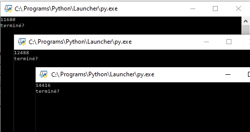

# Gestion des processus et des ressources par un système d'exploitation

## Rôles et fonctions des systèmes d'exploitation

!!! abstract "Cours"
    Un système d'exploitation (souvent appelé OS de l'anglais *Operating System*) est un ensemble de programmes qui réalise l'interface entre les utilisateurs et le matériel contenu dans une machine. Il a deux objectifs principaux :

    - transformer le matériel en une **machine utilisable** par les utilisateurs indépendamment des caractéristiques physiques,
    - optimiser l'utilisation et le **partage des ressources** (matérielles et logicielles).

Ces deux objectifs doivent être atteints en garantissant le niveau de :

-	la **sécurité** : intégrité, contrôle des accès, confidentialité, etc.
- 	la **fiabilité** : satisfaction des utilisateurs même dans des conditions hostiles et imprévues,
- 	la **performance** du système informatique.

Aujourd'hui, il existe **sur PC trois systèmes d'exploitation principaux : Mac OS, Linux et Windows**. Mac OS et Linux sont tous les deux basés sur Unix, l'ancêtre des systèmes d'exploitation, tandis que Windows est une branche à part issue de MS-DOS.


Pour permettre le fonctionnement d'un ordinateur, de nombreuses tâches ou applications doivent être exécutées simultanément, par le système d'exploitation et les différents utilisateurs) et plusieurs programmes doivent pouvoir accéder à un même périphérique sans conflit. Pour permettre cela, le système d'exploitation génère de nombreux processus, puis gère leur exécution : c'est l'ordonnancement.

## Les processus
Un programme est un fichier exécutable contenant une suite d'instruction en langage machine stockées en mémoire (par exemples sur le disque dur). Pour exécuter ce programme, le système d'exploitation créé un processus de la manière suivante:

1. Le fichier contenant le programme est copié dans la RAM à une certaine adresse
2. Cette adresse est donnée au processeur pour être exécutée à son prochain cycle d'horloge.

!!! abstract "Cours"
    Un processus est un programme en cours d'exécution. Le programme est statique et le processus est la représentation dynamique de son exécution.

Les notions de programme et de processus sont donc différentes : le **même programme exécuté plusieurs fois** (dans le temps ou par plusieurs utilisateurs simultanément) générera plusieurs processus. Chaque processus possède en mémoire des instructions à exécuter et des données qui lui sont propres.

Au sein du système d'exploitation, le processus est représenté par une structure de données appelée bloc de contrôle
de processus (PCB pour *Process Control Bloc*) qui contient notamment les informations suivantes :

- Un identifiant unique (un entier) appelé **PID**;
- Un processus parent dont il hérite la plupart des caractéristiques appelé **PPID**,
- Son état (élu, prêt, bloqué) ;
- Le contexte du processeur et de le mémoire liés à son exécution ;
-  Des informations sur les ressources qu'il utilise ; etc.

Le PCB permet la sauvegarde et la restauration du processus en cours d'exécution.

Observons le PID de processus générés par un programme Python :

``` py
from os import getpid
pid = str(getpid())
print(pid)
input('terminé?')
```

Quand on lance plusieurs fois le même programme on observe les PID différents.




### Création d'un processus

La **création d'un processus** peut intervenir :

- au **démarrage du système** : le tout premier processus est créé au moment du démarrage de l'ordinateur,
- par un **appel d'un autre processus** : un processus peut créer un ou plusieurs processus. Si un processus **P crée un processus F, on dira que P est le père de F et que F est le fils de P**. F peut, à son tour créé un processus, etc.
- par l'**action d'un utilisateur** (lancement d'application).


###	États d'un processus

Le système d'exploitation attribut des "états" au processus. Voici les différents états :

-	le processus est dans l'**état "élu"** lorsqu'il est en train de s'exécuter (il utilise le microprocesseur) ; un seul processus peut se trouver dans l'état "élu" : le microprocesseur ne peut "s'occuper" que d'un seul processus à la fois
-	le processus est dans l'**état "bloqué"** lorsque de l'état élu, il demande à accéder à une ressource qui n'est pas forcément disponible instantanément (par exemple lire une donnée sur le disque dur). Comme le processus ne peut pas poursuivre son exécution tant qu'il n'a pas obtenu cette ressource, il passe de l'état "élu" à l'état "bloqué".
-	le processus est dans l'**état "prêt"** lorsqu'il finit par obtenir la ressource attendue mais qu'il ne peut pas forcément reprendre son exécution immédiatement car un autre processus est passé dans l'état "élu" à "sa place" pendant qu'il était dans à état "bloqué". Cet état signifie : "j'ai obtenu ce que j'attendais, je suis prêt à reprendre mon exécution dès que la "place sera libérée".

Remarque : Un processus qui quitte l'état bloqué ne repasse pas à l'état "élu" immédiatement, il passe dans l'état "prêt" en attendant que "la place se libère". 

Le passage de l'état "prêt" vers l'état "élu" constitue l'opération "d'élection". Le passage de l'état "élu" vers l'état bloqué est l'opération de "blocage". Un processus est toujours créé dans l'état "prêt".


##	L'ordonnancement

A un instant donné, de nombreux processus peuvent être exécutés simultanément (processus du système d'exploitation, des applications utilisateurs, etc.). On dit que ces processus sont **concurrents**[^2.1]. 

[^2.1]: A ne pas confondre avec des processus parallèles qui s'exécutent au même instant donc sur une machine multiprocesseurs ou sur un processeur multi-cœur.

Une des tâches du système d'exploitation est d'allouer à chacun des processus concurrents les ressources dont il a besoin en termes de mémoire, entrées-sorties ou temps processeur, et de s'assurer que les processus ne se gênent pas les uns les autres. 

!!! abstract "Cours"
    Une ressource désigne tout ce dont un processus a besoin pour s'exécuter. Ce peut-être une ressource matérielle (processeur, périphérique) ou logicielle (fichier, variable)

Au sein du système d'exploitation, c'est l'**ordonnanceur** qui est responsable qui permet de choisir à un instant donné quel processus va s'exécuter.
Pour éviter qu'un processus  s'exécute jusqu'à sa dernière instruction et monopolise le processeur avant de se terminer, le système d'exploitation utilise un mécanisme d'**interruptions**.

!!! abstract "Cours"
    Une interruption est un signal envoyé au processeur pour interrompre son exécution à la fin de l'instruction courante.

Il existe plusieurs types d'interruptions, par exemple lorsqu'un processus attend une réponse de l'utilisateur, attend qu'une ressource se libère ou une carte réseau indique que des données arrivent et doivent être traitées, etc. il existe aussi des **interruptions d'horloge** générées à intervalles de temps fixe  pour permettre d'exécuter plusieurs programmes en même temps. 

!!! abstract "Cours"
    Comme une ressource ne peut pas être partagée, c'est son temps d'utilisation qui va l'être. C'est le rôle de l'ordonnanceur de partager le temps d'utilisation d'une ressource entre les processus.

Quand l'ordonnanceur interrompt un processus, il enregistre son état (PCB) dans un emplacement de la mémoire, choisit le processus suivant à exécuter et restaure  son dernier état enregistré.  C'est la **commutation de contexte**.

Plusieurs algorithmes d'ordonnancement sont possibles, voyons les plus répandus.

###	Le premier entré, premier sorti (FIFO : First In, First Out) 

L'exemple le plus évident de cet algorithme est la file d'impression des documents sur une imprimante.

Exemple : Soit trois processus P1, P2 et P3 soumis au même instant dans l'ordre 1, 2, 3

|Processus|Durée d'exécution|Ordre de soumission|
|:-:|:-:|:-:|
|P1|16|1|
|P2|4|2|
|P3|6|3|

On peut représenter l'exécution des trois processus sur le chronogramme suivant :


On obtient les temps d'attente et temps de réponse de chaque processus :
|Processus|Temps d'attente|Temps de réponse|
|:-:|:-:|:-:|
|P1|0|16|
|P2|16|20|
|P3|20|26|

###	Le « plus court d'abord » 
Très efficace pour satisfaire au mieux les utilisateurs, mais il n'est pas toujours simple d'évaluer le temps d'exécution d'une tâche avant son début.
Exemple : Soit trois processus P1, P2 et P3 soumis au même instant 

|Processus|Durée d'exécution|
|:-:|:-:|
|P1|16|
|P2|4|
|P3|6|


On obtient le chronogramme d'exécution suivant : 


|Processus|Temps d'attente|Temps de réponse|
|:-:|:-:|:-:|
|P1|0|4|
|P2|4|10|
|P3|14|26|


### Par priorité

L'ordre d'affectation de la ressource sera alors fonction de la priorité de la tâche, mais le niveau de priorité de chaque tâche n'est pas toujours simple à déterminer. 

Exemple : Soit trois processus P1, P2 et P3 soumis au même instant avec des priorités moyenne, haute, faible

|Processus|Durée d'exécution|Priorité|
|:-:|:-:|:-:|
|P1|16|Moyenne|
|P2|4|Haute|
|P3|16|Faible|


On obtient le chronogramme d'exécution suivant : 


|Processus|Temps d'attente|Temps de réponse|
|:-:|:-:|:-:|
|P1|0|4|
|P2|4|20|
|P3|20|26|

###	Le tourniquet

La ressource est affectée à chaque processus à tour de rôle. Pour l'exécution simultanée des processus, c'est la rapidité de ce tour de rôle qui va donner l'impression à chaque utilisateur que son processus est seul à utiliser le processeur. Cette méthode ancienne a les avantages de sa simplicité, de sa rapidité de gestion et de sa robustesse.

Exemple : Soit trois processus P1, P2 et P3 soumis au même instant dans l'ordre 1, 2, 3 et des interruptions toutes les 2 unités de temps

|Processus|Durée d'exécution|Ordre de soumission|
|:-:|:-:|:-:|
|P1|16|1|
|P2|4|2|
|P3|16|3|

On obtient le chronogramme d'exécution suivant : 


|Processus|Temps d'attente|Temps de réponse|
|:-:|:-:|:-:|
|P1|0|26|
|P2|1|10|
|P3|2|16|


Programmons un algorithme du tourniquet en Python :

``` py
# Processus à exécuter et suite d'instructions
liste_processus = [
        # Processus 1
        ["P1_instruction_1",
         "P1_instruction_2",
         "P1_instruction_3",
         "P1_instruction_4",
         "P1_instruction_5",
         "P1_instruction_6",
         "P1_instruction_7"],
        # Processus 2
        ["P2_instruction_1",
         "P2_instruction_2",
         "P2_instruction_3"],
        # Processus 3
        ["P3_instruction_1",
         "P3_instruction_2",
         "P3_instruction_3",
         "P3_instruction_4",
         "P3_instruction_5"]]

existe_instruction=1
indice_instruction=0

# Tant qu'il existe des instructions à exécuter
while (existe_instruction != 0) :
    indice_processus=0
    existe_instruction=0
    # Partage entre les processus
    while indice_processus != len(liste_processus):
        # si le processus a encore des instructions à executer
        if indice_instruction < len(liste_processus[indice_processus]):
            # l'instruction est executée
            print (liste_processus[indice_processus][indice_instruction])
            # il existe encore au moins une instruction à executer
            existe_instruction = 1
        indice_processus = indice_processus + 1

    indice_instruction = indice_instruction +1
```


##	Observer les processus

Chaque processus est identifié par un **identifiant unique** appelé **PID** (*Process Identifier*). Le premier processus créé au démarrage du système a pour PID 0, le second 1, le troisième 2... Le système d'exploitation utilise un compteur qui est incrémenté de 1 à chaque création de processus. 

Les processus comprennent de nombreuses autres informations sur leur état notamment  

-	le processus parent  dont il hérite la plupart des caractéristiques : `PPID`
-	le propriétaire (`User`, `UID`, etc..) déterminant les droits d'accès aux ressources
-	un terminal d'attache pour les entrées/sorties (`tty`)
-	son niveau de priorité, sa date de lancement,  les quantités de ressources consommées, etc… 

##	Sous Windows

On peut utiliser le gestionnaire de taches Windows (ALT+CTRL+DEL), la commande `tasklist` ou des logiciels équivalents par exemple Process Explorer.


## Sous linux

### Arborescence des processus

Sous Linux, le tout premier processus appelé processus 0 est créé à partir de "rien" (il n'est le fils d'aucun processus).
Ensuite, ce processus 0 crée un processus souvent appelé "init" ("init" est donc le fils du processus 0) ; "init" a donc un PID de 1 et un PPID de 0.

À partir de "init", les processus nécessaires au bon fonctionnement du système  sont créés (par exemple les processus "inetd",
"crond", …, "getty"). Puis d'autres processus  sont créés à partir des fils de "init"...


Deux types de processus existent:

-	Les processus utilisateurs, tous issus du shell de connexion;
-	Les processus « daemon »  (pour *deferred auxiliary executive monitor*) qui assurent un service et sont souvent lancés au démarrage de la machine. Les principaux services assurés par des processus daemon sont l'impression, les tâches périodiques, les communications, la comptabilité, le suivi de tâche.
 
### Voir et supprimer les processus 

#### Commande ps


!!! abstract "Cours"
    La commande ps affiche les caractéristiques des processus à un instant donné. Par défaut, `ps` affiche les processus de l'utilisateur.

 


Généralement un processus se termine à la fin de l'exécution de sa dernière instruction ; il est alors détruit par le système d'exploitation . 

!!! abstract "Cours"
    La commande `kill  PID_processus` permet également d'interrompre un processus.

Remarque : Le droit de détruire un processus est réservé à son propriétaire.

##	Ressources partagées

Certaines ressources ne peuvent être utilisées que par un seul processus à la fois. Le système d'exploitation doit fournir un  mécanisme pour en contrôler l'utilisation. Le plus courant est un système de verrou ou mutex (mutual exclusion).

Exemple :

-	Deux processus concurrents P1 et P2 ont tous les deux besoins de la même ressource D pour la modifier, c'est-à-dire de manière exclusive.
-	P1 est le premier à demander le mutex, il verrouille l'accès à D.
-	P2 demande le mutex, il n'est pas disponible, P2 passe à l'état bloqué jusqu'à ce que le mutex soit libéré.


 


## Interblocages 
Dans certains cas, plusieurs processus peuvent être en attente d’une ressource bloqués les uns par les autres. Rien ne pourra évoluer sans une intervention extérieure : cette situation porte le nom d'interblocage.

Exemple : 

-	P1 et P2 ont tous les deux besoins de deux données D1 et D2. P1 verrouille l’accès à D1 et est en attente de D2 et P2 verrouille D2 et est en attente de D1.

 
