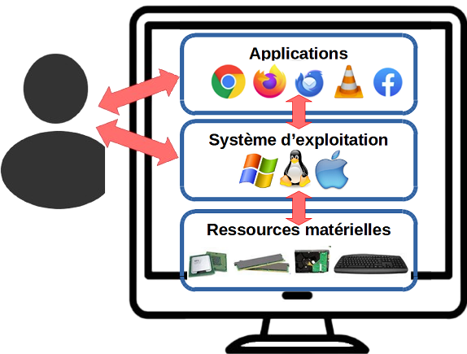
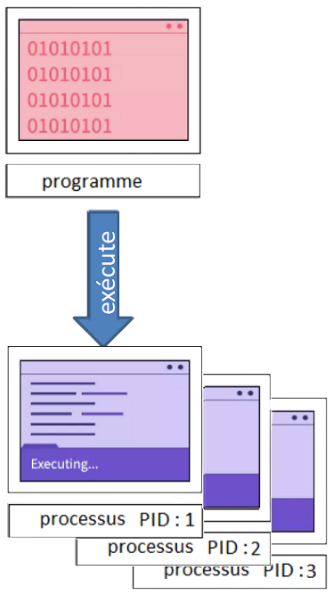
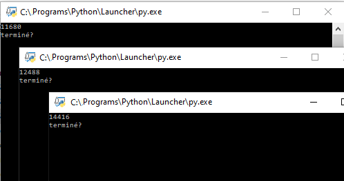
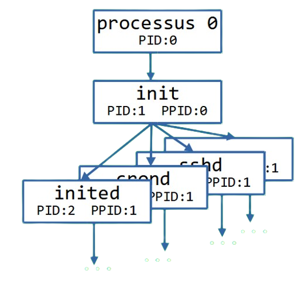
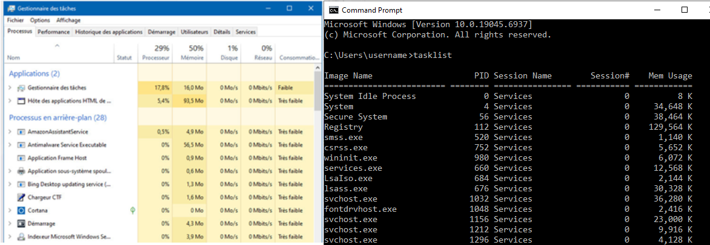
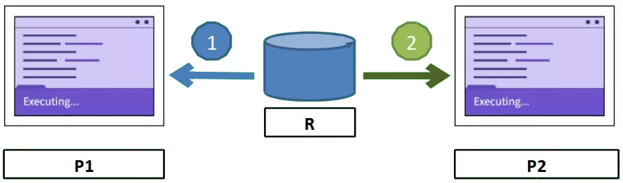
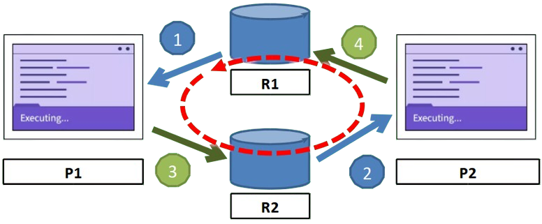
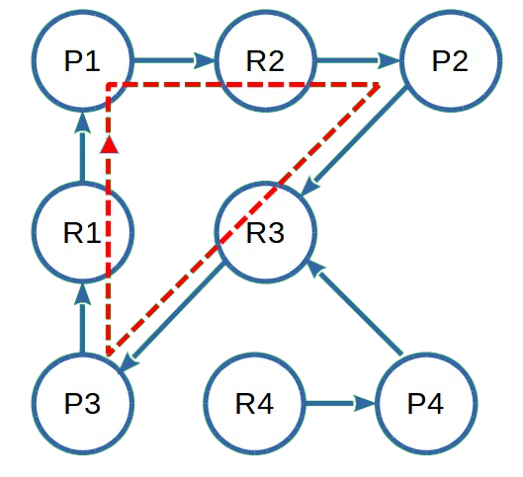

# Gestion des processus et des ressources par un système d'exploitation

{width=25% align=right }

Le système d’exploitation (*Operating System* ou OS en anglais) est le logiciel principal d'un ordinateur. Sans système d’exploitation, un ordinateur est inutilisable. On a vu en [classe de première](https://eipaca.github.io/NSI-1/architecture-materielles-et-systemes-d-exploitation/3-systemes-exploitation/) qu'il joue plusieurs rôles, notamment l'**exécution des programmes et leur utilisation du processeur** et la gestion des ressources partagées. 


## Programme vs Processus

Un programme est un fichier exécutable contenant une suite d'instructions stockées en mémoire. Pour exécuter ce programme, le système d'exploitation crée un processus dans la mémoire de l'ordinateur qui peut être traité par le processeur. Le même programme exécuté plusieurs fois (dans le temps ou simultanément) générera plusieurs processus. Le programme et les processus générés sont donc des entités bien différentes.

{width=20% align=right }


Le système d'exploitation maintient une table des processus en cours d'exécution, appelée PCB (*Process Control Block*), qui contient des informations propres à chaque processus, avec notamment :

- un identifiant unique (un entier) appelé **PID** (*Process Identifier*) ;
- un processus parent dont il hérite la plupart des caractéristiques appelé **PPID** ;
- son **état** (élu, prêt, bloqué) ;
- des informations sur les ressources qu'il utilise ; etc.


Observons le PID d'un processus généré par un programme Python en utilisant la fonction `getpid` du module `os` :

``` py
from os import getpid
pid = str(getpid())
print(pid)
input('terminé?')
```

Quand on lance plusieurs fois ce même programme, on observe que les processus générés ont des PID différents : 




!!! abstract "Cours"
    Un processus est un programme en cours d'exécution. Le **programme est statique** et le **processus est la représentation dynamique de son exécution**.


## Création d'un processus

{width="40%" align=right}
{width="40%" align=right}

La **création d'un processus** peut intervenir :

- Au **démarrage du système** : le tout premier processus est créé au moment du démarrage du système, il a pour PID 0.

- Par un **appel d'un autre processus** : un processus peut créer d'autres processus fils. Les processus ainsi créés reçoivent un nouveau PID unique qui les identifie et un PPID qui est le PID du processus parent.


- Par l'**action d'un utilisateur** (lancement d'application).


On distingue deux types de processus :

-	Les processus utilisateurs, tous issus du shell de connexion ;

-	Les processus « daemon »  (pour *deferred auxiliary executive monitor*) qui assurent un service et sont souvent lancés au démarrage de la machine. Les principaux services assurés par des processus daemon sont l'impression, les tâches périodiques, les communications, le suivi de tâche.


{width="30%" align=right}


Par exemple sous Linux, le tout premier processus, appelé processus 0, à un PID 0 et pas de PPID. Ensuite, ce processus 0 crée un processus souvent appelé "init"[^2.2] qui a un PID de 1 et un PPID de 0.


[^2.2]: "init" est remplacé par "systemd" sur les distributions modernes

À partir de "init", d'autres processus nécessaires au bon fonctionnement du système comme "inetd", "crond", "sshd", etc.sont créés. Ces autres processus vont à leur tour créer de nouveaux processus, etc.


##	États d'un processus

A un instant donné, de nombreux processus sont actifs simultanément (processus du système d'exploitation, des applications utilisateurs, etc.). On dit que ces processus sont **concurrents**[^2.1]. 

[^2.1]: A ne pas confondre avec des processus parallèles qui s'exécutent au même instant donc sur une machine multiprocesseurs ou sur un processeur multi-cœur.

Mais chacun de ces processus concurrents ne peut pas être toujours en cours d'exécution, car le processeur (mono-cœur) ne peut "traiter" qu'un seul processus à la fois, il faut donc attendre qu'il soit disponible. Parfois un processus ne peut pas s'exécuter car il est en attente qu'une ressource se libère. Par exemple l'accès à la mémoire ou à un périphérique d'entrées-sorties comme une carte réseau, l'écran, une carte son, etc. peut être bloqué par un autre processus qui est en train de l'utiliser. 


!!! abstract "Cours"
    Un processus passe donc par plusieurs états au cours de sa vie :


    |État|Description|	Transition vers|
    |:-:|:-|:-:|
    |**prêt**| En attente d'exécution par le processeur, toutes les autres ressources nécessaires à l'exécution sont disponibles. | élu|
    |**élu**| En cours d'exécution par le processeur, un seul processus peut se trouver dans l'état "élu".| bloqué (ou fin)|
    |**bloqué**| En attente de ressources nécessaires à l'exécution mais qui ne sont pas disponibles instantanément.| prêt|


    On peut représenter les transitions entre ces trois états d'un processus dans le schéma suivant : 

    
    


On remarque qu'un processus est toujours créé dans l'état "prêt" avant d'être "élu". De même, quand il quitte l'état "bloqué", il ne repasse pas dans l'état "élu" immédiatement, il passe à nouveau dans l'état "prêt" en attendant que le processeur soit disponible. 


##	L'ordonnancement

Pour éviter qu'un processus ne monopolise le CPU et les autres ressources trop longtemps et bloque les autres processus, le système d'exploitation utilise un **ordonnanceur** qui détermine lequel va être exécuté à un instant donné. Grâce à un mécanisme d'**interruptions**, l'ordonnanceur peut suspendre l'exécution d'un processus, par exemple lorsqu'un processus attend une réponse de l'utilisateur ou qu'une ressource se libère, où encore à intervalles de temps réguliers (**interruptions d'horloge**). 


!!! abstract "Cours"
    Au sein système d'exploitation, l'**ordonnanceur** (ou *scheduler*) détermine quel processus (ou *thread*) s'exécute sur le CPU, et à quel moment.
    
    Il existe plusieurs algorithmes d'ordonnancement pour sélectionner le prochain processus dans la file d'attente, par exemples :

    - FIFO  : premier entré, premier sorti
    - Le « plus court d'abord » 
    - Par priorité : les processus les plus prioritaires passent en premier
    - Le tourniquer (ou *Round Robin*) : chaque processus reçoit un quantum de temps fixe à tour de rôle


###	FIFO (*First In, First Out*) : premier entré, premier sorti 

L'exemple le plus évident de cet algorithme est la file d'impression des documents sur une imprimante.

Exemple : Soit trois processus P1, P2 et P3 soumis au même instant dans l'ordre 1, 2, 3

|Processus|Durée d'exécution|Ordre de soumission|
|:-:|:-:|:-:|
|P1|16|1|
|P2|4|2|
|P3|6|3|

On peut représenter l'exécution des trois processus sur le chronogramme suivant :


On obtient les temps d'attente et temps de réponse de chaque processus :

|Processus|Temps d'attente|Temps de réponse|
|:-:|:-:|:-:|
|P1|10|26|
|P2|0|4|
|P3|4|10|

###	Le « plus court d'abord » 
Très efficace pour satisfaire au mieux les utilisateurs, mais il n'est pas toujours simple d'évaluer le temps d'exécution d'une tâche avant son début.

Exemple : Soit trois processus P1, P2 et P3 soumis au même instant 

|Processus|Durée d'exécution|
|:-:|:-:|
|P1|16|
|P2|4|
|P3|6|


On obtient le chronogramme d'exécution suivant : 


|Processus|Temps d'attente|Temps de réponse|
|:-:|:-:|:-:|
|P1|0|4|
|P2|4|10|
|P3|14|26|


### Par priorité

L'ordre d'affectation des processus est fonction de la priorité de la tâche, mais le niveau de priorité de chaque tâche n'est pas toujours simple à déterminer. 

Exemple : Soit trois processus P1, P2 et P3 soumis au même instant avec des priorités moyenne, haute, faible

|Processus|Durée d'exécution|Priorité|
|:-:|:-:|:-:|
|P1|16|Moyenne|
|P2|4|Haute|
|P3|16|Faible|


On obtient le chronogramme d'exécution suivant : 


|Processus|Temps d'attente|Temps de réponse|
|:-:|:-:|:-:|
|P1|4|20|
|P2|0|4|
|P3|20|26|

###	Le tourniquet (ou *Round Robin*)

La ressource est affectée à chaque processus à tour de rôle. Pour l'exécution simultanée des processus, c'est la rapidité de ce tour de rôle qui va donner l'impression à chaque utilisateur que son processus est seul à utiliser le processeur. Cette méthode ancienne a les avantages de sa simplicité, de sa rapidité de gestion et de sa robustesse.

Exemple : Soit trois processus P1, P2 et P3 soumis au même instant dans l'ordre 1, 2, 3 et des interruptions toutes les 2 unités de temps

|Processus|Durée d'exécution|Ordre de soumission|
|:-:|:-:|:-:|
|P1|16|1|
|P2|4|2|
|P3|16|3|

On obtient le chronogramme d'exécution suivant : 


|Processus|Temps d'attente|Temps de réponse|
|:-:|:-:|:-:|
|P1|0|26|
|P2|2|10|
|P3|4|16|


Programmons un algorithme du tourniquet en Python :

``` py
# Processus à exécuter et suite d'instructions
liste_processus = [
        # Processus 1
        ["P1_instruction_1",
         "P1_instruction_2",
         "P1_instruction_3",
         "P1_instruction_4",
         "P1_instruction_5",
         "P1_instruction_6",
         "P1_instruction_7"],
        # Processus 2
        ["P2_instruction_1",
         "P2_instruction_2",
         "P2_instruction_3"],
        # Processus 3
        ["P3_instruction_1",
         "P3_instruction_2",
         "P3_instruction_3",
         "P3_instruction_4",
         "P3_instruction_5"]]

existe_instruction=1
indice_instruction=0

# Tant qu'il existe des instructions à exécuter
while (existe_instruction != 0) :
    indice_processus=0
    existe_instruction=0
    # Partage entre les processus
    while indice_processus != len(liste_processus):
        # si le processus a encore des instructions à executer
        if indice_instruction < len(liste_processus[indice_processus]):
            # l'instruction est exécutée
            print (liste_processus[indice_processus][indice_instruction])
            # il existe encore au moins une instruction à executer
            existe_instruction = 1
        indice_processus = indice_processus + 1

    indice_instruction = indice_instruction +1
```

 

## Observer les processus Linux


!!! abstract "Cours"
    La commande `ps` affiche les caractéristiques des processus à un instant donné :
    
    - le `PID` identifiant le processus,
    - le `PPID` identifiant le processus parent dont il hérite la plupart des caractéristiques,
    - un terminal d'attache pour les entrées/sorties (`tty`)
    - le propriétaire du processus (`User`, `UID`, etc..) déterminant les droits d'accès aux ressources
    - l'heure à laquelle il a été créé
    - le programme ou la commande qui a lancé le processus
        
    Par défaut, `ps` affiche uniquement les processus de l'utilisateur.


Généralement un processus se termine à la fin de l'exécution de sa dernière instruction ; il est alors détruit par le système d'exploitation, mais dans certains cas on peut vouloir terminer un processus manuellement. 

!!! abstract "Cours"
    La commande `kill  PID_processus` permet également d'interrompre un processus.

Remarque : Le droit de détruire un processus est réservé à son propriétaire.


## Observer les processus Windows

Windows permet aussi à l'utilisateur d’observer et de terminer les processus avec le gestionnaire de taches Windows (ALT+CTRL+DEL), la commande `tasklist` ou des logiciels équivalents par exemple Process Explorer.

{width="80%"}


##	Ressources partagées et interblocages (*deadlock*)

Certaines ressources ne peuvent être utilisées que par un seul processus à la fois. Le système d'exploitation doit fournir un  mécanisme pour en contrôler l'utilisation. Le plus courant est un système de verrou ou mutex (mutual exclusion).

Prenons un exemple :

-	Deux processus concurrents P1 et P2 ont tous les deux besoins de manière exclusive d'une même ressource R (par exemple pour la modifier).
-	P1 est le premier à demander le mutex, il verrouille l'accès à R.
-	P2 demande le mutex, il n'est pas disponible, P2 passe à l'état bloqué jusqu'à ce que le mutex soit libéré.


{width="75%"}


Prenons un deuxième exemple : Deux processus concurrents P1 et P2 ont tous les deux besoins de manière exclusive de deux ressources R1 et R2. 

- P1 verrouille l’accès à R1 et est en attente de R2 
- P2 verrouille R2 et est en attente de R1. 

Les deux processus sont dans l'état bloqué, on dit qu'il y **interblocage** (ou *deadlock* en anglais).

{width="75%"}

En construisant un graphe orienté où les sommets sont les processus et les ressources, et où :

-   Un arc R → P signifie que la ressource R est attribuée à P
-   Un arc P → R signifie que la ressource R est  demandée par P

la présence d'un cycle permet de montrer une situation d'interblocage.


!!! abstract "Cours"
	Dans certains cas, plusieurs processus peuvent être en attente des mêmes ressources se bloquant les uns par les autres. Rien ne pourra évoluer sans une intervention extérieure : cette situation porte le nom d'**interblocage** (ou *deadlock* en anglais).
    
    La détection d'un cycle dans un graphe d’allocation de ressources permet de déterminer une situation d'interblocage.


!!! question "Exercice corrigé" 
	On considère 4 processus P1, P2, P3, P4 et et 4 ressources R1, R2, R3, R4.
    
    La situation du système est la suivante :

    -      P1 a obtenu R1 et demande R2 ;
    -      P2 a obtenu R2 et demande R3 ;
    -      P3 a obtenu R3 et demande R1 ;
    -      P4 a obtenu R4 et demande R3.

    On voudrait savoir s’il y a interblocage.

    1/ Construire le graphe orienté où les sommets sont les processus et les ressources, et où :

    -   Un arc R → P signifie que la ressource R est attribuée à P
    -   Un arc P → R signifie que la ressource R est  demandée par P

    2/ Chercher un cycle dans le graphe afin de déterminer s’il y a une situation d'interblocage.

        

??? Success "Réponse"
    {width="50%"}

    La présence d'un cycle montre une situation d'interblocage.
