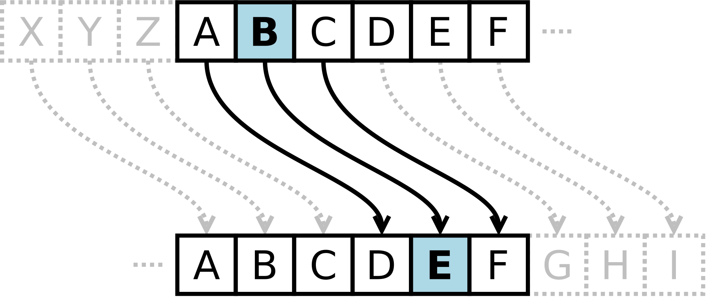
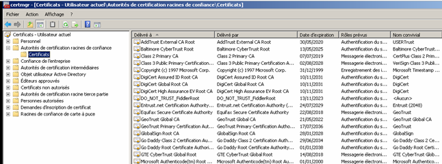
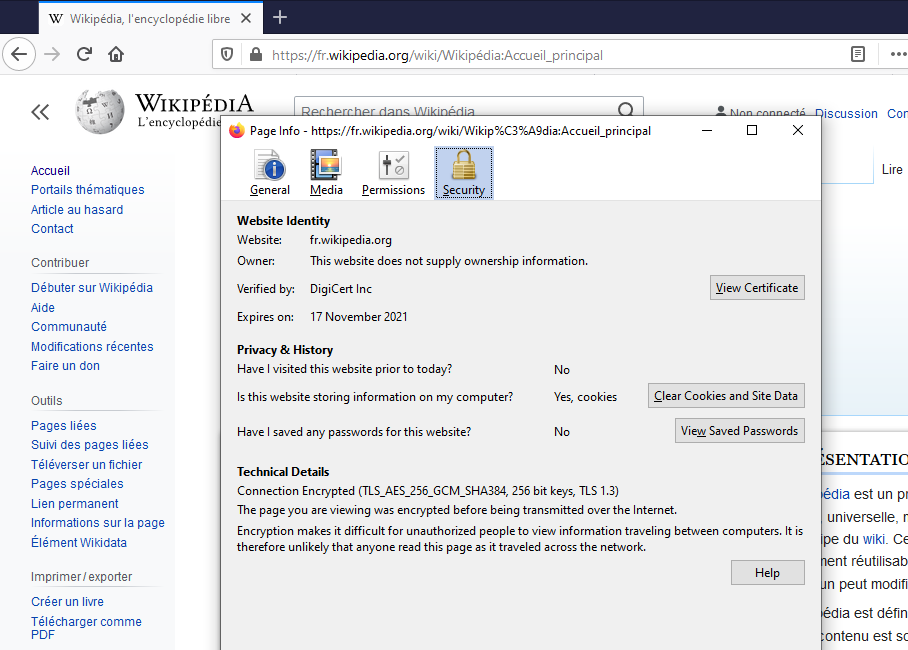
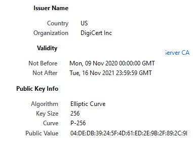

# Sécurisation des communications

##	Communications sur Internet 

On a vu que les données circulent sur internet découpées en petits paquets (par les protocoles TCP et UDP) qui sont relayés par des routeurs depuis leur émetteur jusqu'à leur destinataire (par le protocole IP).

<a title="Tomybrz, CC BY-SA 4.0 &lt;https://creativecommons.org/licenses/by-sa/4.0&gt;, via Wikimedia Commons" href="https://commons.wikimedia.org/wiki/File:Internet-transit-2.svg"></a>


Les paquets pourraient donc être interceptés en chemin pour en connaître le contenu ou les modifier. Cela pose un problème de sécurité des communications, en particulier quand des données sensibles sont échangées (données bancaires, médicales, militaires, etc.) :

-	Confidentialité : s'assurer que des données confidentielles ne soient pas divulguées ;
-	Authenticité : s'assurer que les données reçues proviennent de leur émetteur légitime ;
-	Intégrité : s'assurer que les données échangées ne sont pas modifiées de façon malveillante.


!!! abstract "Cours" 
    
    La **cryptographie** consiste à protéger les données (confidentialité, authenticité et intégrité) à l'aide de secrets appelés **clés de chiffrement**.

    Le **chiffrement** des communications consiste à rendre un message incompréhensible en utilisant une **clé de chiffrement**.
    
    Le **déchiffrement**  consiste à retrouver le message original en utilisant la clé de chiffrement. Lorsqu'on peut retrouver le message sans la clé, par exemple dans le cas de piratage informatique, on parle de **décryptage**.


:warning: Ne pas confondre les termes chiffrer/déchiffrer avec coder/décoder[^3.1] et éviter l'anglicisme *crypter* parfois utilisé au lieu de chiffrer. 

[^3.1]: coder désigne la représentation des données dans un certain format, par exemple coder un entier en binaire, ou décoder un code ASCII.


On peut visionner « [Comprendre le chiffrement SSL / TLS avec des emojis (et le HTTPS)](https://www.youtube.com/watch?v=7W7WPMX7arI) » pour découvrir ce chapitre.

##	Cryptographie symétrique ou « à clé secrète »

!!! abstract "Cours" 
    La **cryptographie symétrique**, également appelée « **à clé secrète** », est la plus ancienne forme de chiffrement. Elle permet à la fois de chiffrer et de déchiffrer des messages à l'aide d'une **même clé**.


Prenons un exemple : Alice (A) et Bob (B)[^3.3] connaissent tous les deux une même clé secrète qui leur permet de chiffrer et déchiffrer des messages qu'ils s'échangent.

[^3.3]: Alice et Bob forment le couple le plus connu du monde de la cryptographie

{width="100%"}
{width="100%"}

Avec cette clé, Alice peut chiffrer des messages et les envoyer à Bob, puis Bob peut les déchiffrer. Dans l'autre sens, Alice peut aussi déchiffrer des messages chiffrés en provenance de Bob. La communication est sécurisée dans les deux sens par une clé unique.

C'est un moyen simple et efficace de communiquer de manière sécurisée, mais qui a deux inconvénients :

  - Il faut que Alice et Bob trouvent un moyen sûr de se transmettre la clé au préalable et à l'abri des regards.

  - Si Alice veut communiquer de façon sécurisée avec plusieurs correspondants indépendamment, elle doit gérer autant de clés différentes qu'elle a de correspondants.

Voyons quelques exemples historiques de cryptographie symétrique : 


-	Le **chiffrement par décalage**, ou **code de César**, est une méthode de chiffrement basique utilisée par Jules César dans ses correspondances secrètes, qui consiste à décaler chaque lettre d'un message clair d'un nombre fixe de lettres dans l'alphabet, par exemple avec un décalage de 3, A devient D (la lettre D est 3 lettres après A dans l'alphabet) et R devient U (U est 3 lettres après R).

{width="40%"}


-   Le **chiffrement de Vigenère**, datant du 16e siècle, agit un peu comme un code de César, à la différence que tous les caractères ne sont pas décalés de la même valeur. Les décalages dépendent d'une clé, en général donnée par un mot ou une phrase. La clé est alignée avec le message à chiffrer et répétée jusqu'à la fin du message. 

    Par exemple, si la clé est "NSI", les lettres du message clair seront décalées dans l'ordre de :

    - 14 lettres (N est la 14e lettre de l'alphabet) ; puis de
    - 19 lettres (S est la 19e lettre de l'alphabet) ; puis de
    - 9 lettres (I est la 5e lettre de l'alphabet) ; 
    - puis on recommence avec 14 lettres, 19 lettres, etc. jusqu'à la fin du message.

    Pour chiffrer le message "BONJOUR", on aligne la clé avec le message et on la répète autant de fois que nécessaire pour appliquer le décalage correspondant à chaque lettre :

        message :   BONJOUR
        clé :       NSINSIN 
                    -------
        Vigenère :  PHWXHDF
   

-   Le **chiffrement XOR** consiste à appliquer l'opération logique XOR (OU exclusif, noté « ⊕ ») bit à bit entre le message clair et une clé secrète. Comme pour le chiffrement de Vigenère, la clé est alignée avec le message à chiffrer et répétée jusqu'à la fin du message. Beaucoup utilisé aux débuts de l'informatique, il apparaît encore aujourd'hui dans les algorithmes de chiffrement modernes comme RSA ou AES.

    Par exemple, pour chiffrer le mot "BONJOUR" avec la clé "NSI" :

        message :   B       O        N        J        O        U        R
                01000010 01001111 01001110 01001010 01001111 01010101 01010010
        clé :       N       S        I        N        S        I        N
                01001110 01010011 01001001 01001110 01010011 01001001 01001110
                -------- -------- -------- -------- -------- -------- -------- 
        XOR :   00001100 00011100 00000111 00000100 00011100 00011100 00011100
   

On peut observer dans les trois exemples précédents l'aspect symétrique de la clé permettant à la fois de chiffer et de déchiffrer un message. Pour le code de César ou de Vigenère, les mêmes décalages sont utilisés pour déchiffrer un message, mais dans l'autre sens, c'est-à-dire en calculant la lettre placée avant dans l'alphabet. Dans le cas du chiffrement XOR, on utilise la propriété (A ⊕ B) ⊕ B = A qui montre qu'il suffit d'appliquer une seconde fois un chiffrement XOR au message chiffré pour retrouver le message en clair.


!!! question "Exercice corrigé"
    Le codage de César transforme un message en changeant chaque lettre en la décalant dans l'alphabet. Par exemple, avec un décalage de 3, le A se transforme en D, le B en E, …, le X en A, le Y en B et le Z en C.  Pour simplifier, on suppose que la chaîne à chiffrer ne contient que des lettres ASCII en majuscule, les espaces et autres caractères ('!','?', etc.) ne sont pas chiffrés.

    
    La fonction `position_alphabet` ci-dessous prend en paramètre un caractère `lettre` et renvoie la position de `lettre` dans la chaîne de caractères `ALPHABET` s'il s'y trouve.

    La fonction `cesar` prend en paramètres une chaîne de caractères `message` et un nombre entier `decalage` et renvoie le nouveau message chiffré avec le codage de César utilisant le décalage `decalage`.

    ``` py
    ALPHABET = 'ABCDEFGHIJKLMNOPQRSTUVWXYZ'

    def position_alphabet(lettre):
        '''Renvoie la position de la lettre dans l'alphabet'''
        return ord(lettre) - ord('A')

    def cesar(message, decalage):
        '''Renvoie le message chiffré par la méthode de César
        pour le decalage donné'''
        resultat = ''
        for ... in message:
            if 'A' <= c and c <= 'Z':
                indice = (...) % 26
                resultat = resultat + ALPHABET[indice]
            else:
                resultat = ...
        return resultat
    ```

    Compléter la fonction `cesar`.

    Exemples :

    ``` py
    >>> cesar('BONJOUR A TOUS. VIVE LA MATIERE NSI !', 4)
    'UTQBTOK D YINX. ACOJ DF FFWAJLX QKN !'
    >>> cesar('UTQBTOK D YINX. ACOJ DF FFWAJLX QKN !', -5)
    'BONJOUR A TOUS. VIVE LA MATIERE NSI !'
    ```
    Source: Epreuve Pratique 24-NSI-46
    
   
 
??? Success "Réponse"

    ``` py
    def cesar(message, decalage):
        '''Renvoie le message chiffré par la méthode de César
        pour le decalage donné'''
        resultat = ''
        for c in message:
            if 'A' <= c and c <= 'Z':
                indice = (position_alphabet(c) + decalage) % 26
                resultat = resultat + ALPHABET[indice]
            else:
                resultat = resultat + c
        return resultat
    ```

!!! question "Exercice corrigé"
    Ecrire les fonctions `chiffre_vigenere(message:str, cle:str)` et `dechiffre_vigenere(message:str, cle:str)`  qui renvoient `message` chiffré ou déchiffré en utilisant le chiffrement de Vigenère avec la clé `cle`.

    Pour simplifier, on suppose que la chaîne à chiffrer et la clé ne contiennent que des lettres ASCII en majuscule, les espaces et autres caractères ('!','?', etc.) ne sont pas chiffrés.

    ``` py
    Exemples :
    >>> chiffre_vigenere('BONJOUR A TOUS. VIVE LA MATIERE NSI !', 'SECRET')
    'TSPASNJ C XHMW. ZBNI CE EEVZIKW PJM !'
    >>> dechiffre_vigenere('TSPASNJ C XHMW. ZBNI CE EEVZIKW PJM !', 'SECRET')
    'BONJOUR A TOUS. VIVE LA MATIERE NSI !'
    ```

   
 
??? Success "Réponse"

    ``` py
    def chiffre_vigenere(message:str, cle:str) -> str:
        '''Renvoie le message chiffré par chiffrement de Vigenère
        pour la clé donnée
        '''
        resultat = ''
        for i in range(len(message)):
            c = message[i]
            decalage = position_alphabet(cle[i%len(cle)])
            if 'A' <= c and c <= 'Z':
                indice = (position_alphabet(c) + decalage) % 26
                resultat = resultat + ALPHABET[indice]
            else:
                resultat = resultat + c
        return resultat


    def dechiffre_vigenere(message:str, cle:str) -> str:
            # remplacer par
            indice = (position_alphabet(c) - decalage) % 26

    ```

Ces algorithmes historiques sont plutôt faciles à "casser", en particulier en utilisant des analyses de fréquence de caractères. Des algorithmes de cryptographie symétrique plus récents sont plus efficaces, par exemple : 

-   RC4 est utilisé par les algorithmes WEP et WPA permettant la sécurisation de réseaux Wi-FI ainsi que par TLS permettant de sécuriser des échanges sur un réseau. Il repose sur une clé obtenue par des mélanges d'octets puis un chiffrement XOR.

- 	**AES (Advanced Encryption Standard)** est actuellement l'algorithme de cryptographie symétrique le plus utilisé. Il est considéré comme l'un des chiffrements les plus sûrs. Il est utilisé par exemple les algorithmes WPA2 pour sécuriser le Wi-Fi, Windows Bitlocker pour chiffrer un disque dur, LastPass ou Dahslane pour les gestionnaires de mots de passe, etc. 
    
    AES utilise une clé secrète de taille 128, 192 ou 256 bits, ce qui détermine la sécurité du chiffrement. Les données sont divisées en petits blocs de 128 bits, soit 16 octets, disposés dans un tableau 4x4. Les octets sont ensuite transformés en plusieurs étapes : un chiffrement XOR, une substitution des octets (*SubBytes*) selon un tableau prédéfini (*S-box*), un décalage des lignes du tableau (*ShiftRows*), un mélange des colonnes du tableau (*MixColumns*), et à nouveau un chiffrement XOR avec une autre clé. Ces étapes sont répétées plusieurs fois pour renforcer la sécurité (10, 12 ou 14 fois selon la longueur de la clé).


##	Cryptographie asymétrique ou « à clé publique »

La cryptographie symétrique souffre d'un inconvénient majeur : comment partager une clé, en particulier lors d'une communication sur un réseau publique ? Pour résoudre ce problème, des techniques de cryptographie asymétrique ont été inventées dans les années 1970.


!!! abstract "Cours" 

    La **cryptographie asymétrique**, également appelée « **à clé publique** », permet de sécuriser le transfert des données, et d'authentifier leur origine grâce à l'utilisation de deux clés :

    -	une **clé publique**, mise à la disposition de quiconque et permettant le chiffrement ;
    -	une **clé privée**, qui doit rester confidentielle et permettant le déchiffrement.
    
Ceci est une convention, le rôle des clés est **interchangeable** : un message chiffré avec une clé (publique ou privée) peut-être déchiffrée avec l'autre (respectivement la clé privée ou publique).

La cryptographie asymétrique a une double fonctionnalité, elle permet de :

-	**chiffrer** un message à envoyer : l'expéditeur utilise la clef publique du destinataire pour chiffrer son message. Le destinataire utilise sa clef privée pour déchiffrer le message de l'expéditeur. Il est le seul à connaître sa clé privée, donc le seul à pouvoir déchiffrer le message,  garantissant la **confidentialité**.

    {width="80%"}
    {width="80%"}

    Alice peut lire le message en provenance de Bob en le déchiffrant avec sa clé privée. Elle est la seule à pouvoir le faire, Ève[^3.4] ne peut pas.


[^3.4]: En cryptographie le nom de Ève, pour *eavedropper* (oreille indiscrète), est souvent choisi pour désigner l'homme du milieu.

-	s'assurer de l'**authenticité** de l'expéditeur : l'expéditeur utilise sa clef privée pour chiffrer un message que tout le monde peut déchiffrer avec la clef publique de l'expéditeur. L'expéditeur est le seul qui a pu chiffrer ce message, garantissant que c'est bien lui qui en est à l'origine, c'est un mécanisme de **signature** numérique.
 
    {width="80%"}
    {width="80%"}

    Alice peut signer ses messages. Bob, et Ève, sont certains que les messages reçus proviennent d'Alice et de personne d'autre.

Le chiffrement asymétrique repose sur des problèmes mathématiques très difficiles à résoudre dans un sens et faciles à résoudre dans l'autre sens. Voyons quelques exemples.


## Un exemple de cryptographie asymétrique : RSA

Le chiffrement RSA (décrit en 1977 et nommé par les initiales de ses trois inventeurs, Rivest, Shamir et  Adleman) est un algorithme de cryptographie asymétrique, très utilisé dans le commerce électronique, et plus généralement pour échanger des données confidentielles sur Internet. 

Le principe de RSA repose sur des calculs modulo un nombre entier n qui est le produit de deux nombres premiers. Le petit théorème de Fermat joue un rôle important dans la conception de ce chiffrement. Les opérations de chiffrement et de déchiffrement consistent à élever le message à certaines puissances modulo ce nombre n.

Sans décrire les principes mathématiques derrière la création des clés, prenons l'exemple suivant : n = 55, la clé publique d'Alice est le couple (55, 3) et sa clé privée est (55, 27). Bob veut transmettre le nombre 41 à Alice. 

{width="80%"}
{width="80%"}


1. Chiffrement de M = 41 par Bob avec la clé publique d'Alice, le couple (55, 3) : Bob calcule $M^3$ mod $55$, c'est-à-dire le reste de la division euclidienne de $M^3$ par $55$, qu'on peut écrire en Python `M**3 % 55`, ou encore `pow(M, 3, 55)` : 

    ``` py
    >>> M = 41
    >>> M**3
    68921
    >>> 68921 % 55
    6
    ```
    Il obtient le nombre $6$, c'est le chiffrement de M avec la clé publique d'Alice, qu'il transmet à Alice.

    Note : En mathématique, on dit que $41^3$ est congru à $6$ modulo $55$ et on écrit $41^3 ≡ 6$ mod $55$.

2. Déchiffrement de $C = 6$ par Alice avec sa clé privée, le couple (55, 27) : Alice calcule $C^{27}$ mod $55$, c'est-à-dire le reste de la division euclidienne de $C^{27}$ par $55$, qu'on peut écrire en Python `C**27 % 55`, ou encore `pow(C, 27, 55)` :

    ``` py
    >>> C = 6
    >>> C**27
    1023490369077469249536
    >>> 1023490369077469249536 % 55
    41
    ```
    Alice retrouve bien le message initial de Bob $M = 41$.

    Note : En mathématique, on dit que $6^{27}$ est congru à $41$ modulo $55$ et on écrit $6^{27} ≡ 41$ mod $55$.


On constate que pour chiffrer un message, il suffit de connaître la clé publique d'Alice. En revanche, il semble impossible de le déchiffrer sans connaître sa clé privée.

La sécurité de l'algorithme RSA contre les attaques par la force brute repose sur la difficulté de factoriser le nombre n en un produit de deux nombres premiers. Tous les algorithmes connus actuellement sont en temps exponentiel, mais cela pourrait ne plus être le cas dans le futur avec les développements de l'informatique quantique ! En pratique, il faut donc choisir de très grands nombres premiers pour calculer les clé RSA, habituellement des nombres codés sur 1 024 à 2 048 bits. 


## Un autre exemple de cryptographie asymétrique : Échange de clés Diffie-Hellman

L'algorithme de Diffie-Hellman est aussi basé sur des théories mathématiques avancées. Il est décrit ici en prenant un exemple numérique tout en faisant une analogie avec des couleurs inspirée de [Wikipedia](https://fr.wikipedia.org/wiki/%C3%89change_de_cl%C3%A9s_Diffie-Hellman). 

L'objectif est qu'Alice et Bob se mettent d'accord sur un nombre secret (ou une couleur secrète par analogie), sans qu'Ève ne puisse le connaître. Pour les couleurs, on suppose qu'on peut les mélanger, mais qu'il est impossible d'extraire les couleurs utilisées pour réaliser un mélange donné. Le principe est le suivant :

{width="80%"}
{width="80%"}

1.	Alice et Bob choisissent au préalable deux nombres $p = 23$ et $g = 5$ (les théories mathématiques qui permettent de choisir ces nombres ne sont pas expliquées ici). Ces deux nombres sont connus de tous, y compris de l'intrus Ève. On fait l'analogie avec une peinture commune, ici le jaune.

    En Python, on peut écrire : 
    ``` py
    >>> p, g = 23, 5
    ```

2.	Alice choisit un nombre secret, $a = 4$, assimilé à la couleur rouge. En utilisant $a$, $p$ et $g$, elle calcule $A = g^a$ mod $p$ = $5^4$ mod $23$ = $4$. En couleur, c'est comme si elle mélangeait la peinture commune jaune et sa couleur secrète rouge et obtenait de l'orange. Alice envoie le nombre $A$ (ou la couleur orange obtenue par ce mélange) à Bob. L'échange est public, $A$ (ou la couleur orange) peut être intercepté et connu par Ève.
    ``` py
    >>> a = 4
    >>> A = g**a % p
    ```


3.	Bob fait de même : il choisit un nombre secret, $b = 3$, assimilé à la couleur bleue.  En utilisant $b$, $p$  et $g$, il calcule $B = g^b$ mod $p$ = $5^3$ mod $23$ = $10$. En couleur, c'est comme s'il mélangeait la peinture commune jaune et sa couleur secrète bleue et obtenait du vert. Bob envoie le nombre $B$ (ou la couleur verte obtenue par ce mélange) à Alice. $B$ (ou la couleur verte) peut aussi être connu par Ève.
    ``` py
    >>> b = 3
    >>> B = g**b % p
    ```

4.	Alice calcule maintenant $B^a$ mod $p$ = $10^4$ mod $23$ et obtient un nouveau nombre secret $s= 18$. En couleur, c'est comme si elle prenait la couleur verte reçue de Bob et qu'elle la mélangeait avec sa couleur secrète rouge, elle obtiendrait une couleur marron.
    ``` py
    >>> B**a % p
    18
    ```

5.	De son côté, Bob calcule  $A^b$ mod $p$ = $4^3$ mod $23$ et obtient le même nombre secret $s= 18$. En couleur, c'est comme s'il prenait la couleur orange reçue d'Alice et qu'il la mélangeait avec sa couleur secrète bleue, il obtiendrait la même couleur marron.
    ``` py
    >>> A**b % p
    18
    ```


A la fin de l'algorithme, Alice et Bob partagent le même nombre secret $s= 18$, ou la même couleur marron. Ève ne connaissant pas les nombres secrets qu'ils ont choisis chacun de leur coté ($a = 4$ et $b = 3$), elle ne peut pas calculer $s$. Avec les couleurs, en supposant qu'il est difficile pour Ève d'extraire les couleurs qui ont été mélangées au jaune pour obtenir de l'orange et du vert, Ève ne pourra pas réaliser un mélange couleur marron identique à celui partagé par les deux autres.


##	Attaque de l'homme du milieu


!!! abstract "Cours" 
    L'**attaque de l'homme du milieu** ou ***man-in-the-middle*** (MITM) est une attaque qui a pour but d'intercepter les communications entre deux parties, sans que ni l'une ni l'autre ne puisse se douter que le canal de communication entre elles a été compromis

Alice et Bob veulent échanger des données confidentielles mais Ève veut les intercepter. 

Comme on l'a vu auparavant, dans une situation normale Alice et Bob échangent leur clé publique, chacun chiffre ses messages avec la clé publique de l'autre et ils sont donc les seuls à pouvoir les déchiffrer avec leur clé privée respective. Ève ne connaît pas les clés privées d'Alice et Bob, elle est incapable de déchiffrer les messages qu'ils s'échangent.


Admettons maintenant que Ève soit en mesure d'intercepter les échanges entre Alice et Bob.

-	Alice envoie sa clé publique à Bob. Ève l'intercepte et renvoie à Bob sa propre clé publique en se faisant passer pour Alice.
-	Lorsque Bob veut envoyer un message à Alice, il utilise donc, sans le savoir, la clé publique d'Ève. Bob chiffre le message avec la clé publique d'Ève et l'envoie à celle qu'elle croit être Alice.
-	Ève intercepte le message, le déchiffre avec sa clé privée et peut conc lire le message et même le modifier.
-	Puis elle chiffre à nouveau le message avec la clé publique d'Alice.
-	Alice déchiffre son message avec sa clé privée, et ne se doute de rien puisque tout fonctionne.
Ainsi, Alice et Bob sont chacun persuadés d'utiliser la clé publique de l'autre, alors qu'ils utilisent en réalité tous les deux la clé publique d'Ève.
 
{width="80%"}
{width="80%"}


## Certificats et Autorités de Certification

Afin de sécuriser entièrement les communications entre deux participants, il ne suffit pas seulement de les chiffrer, mais il faut aussi que chaque participant puisse s'assurer de l'identité de son correspondant : c'est le rôle des certificats d'authentification.

!!! abstract "Cours" 
    Un **certificat d'authentification** (ou certificat SSL ou TLS) délivré par une entité de confiance, une **autorité de certification**, permet d'établir avec certitude l'identité du détenteur de certificat (site Web, entreprise, individu) afin de sécuriser les communications avec cette entité.


Les **autorités de certification** sont des organismes enregistrés et certifiés par des états ou des autorités de contrôle de l'Internet. Il y a un peu plus d'une centaine : Amazon Trust Services, CertEurope, Cisco, DigiCert, Google Trust Services LLC, Gouvernement français (ANSSI, DCSSI), Microsoft, Symantec, Visa…


Ce certificat contient la **clé publique** de l'entité  certifiée et d'autres informations d'identification, par exemple l'URL d'un site web, le nom d'une société ou d'une personne, sa localisation, son adresse électronique. Toutes ces informations sont chiffrées par une autorité de certification, en utilisant sa clé privée, afin de garantir l'exactitude des informations. On dit alors que le certificat est **signé**.


{width="80%"}
{width="80%"}


Les navigateurs, les systèmes d'exploitation et les appareils mobiles tiennent à jour la liste de clés publiques d'un certain nombre d'autorités de certification. Ces clés sont appelées **clés publiques racines** ou **certificats racines**. Un certificat racine doit être présent sur la machine de l'utilisateur pour être considéré fiable, sinon le navigateur affiche des messages d'alerte indiquant qu'il ne faut pas lui faire confiance.  On peut consulter les clés publiques racines stockées sur un ordinateur : 

-   sous Windows avec la commande certmgr.msc ;
 


-	sous Linux avec ls /etc/ssl/certs ; 
-	avec Firefox : options → vie privée et sécurité → Afficher les certificats… ;
-	avec Edge : paramètres → confidentialité, recherche et services → Gérer les certificats.


 
##	HTTPS

!!! abstract "Cours" 
    HTTPS (HyperText Transfer Protocol Secure) est la combinaison du protocole de base du Web HTTP avec les protocoles de chiffrement SSL (Secure Socket Layer) ou de son successeur TLS (Transport Layer Security).

    Il permet :

    -	A un visiteur de vérifier l'identité du site web auquel il accède, grâce à un certificat d'authentification émis par une autorité de certification ;

    -	De garantir la confidentialité et l'intégrité des données envoyées par l'utilisateur (notamment des informations confidentielles ou sensibles) et reçues du serveur.

    - 	De valider l'identité du visiteur, si celui-ci utilise également un certificat d'authentification client.


Le principal inconvénient des algorithmes à clé publique est leur grande lenteur par rapport aux algorithmes à clé secrète. RSA est par exemple au moins 100 fois plus lent que AES. Pour sécuriser une communication, l'idée de TLS est donc d'utiliser un algorithme à clé publique pour échanger un nombre aléatoire qui sert ensuite de clé secrète pour un algorithme de chiffrement symétrique de la communication. 


{width="100%"}
{width="100%"}


1.	Le client — un navigateur Web — envoie un message initial (nommé «  hello ») à un serveur — par exemple Wikipédia — et demande une connexion sécurisée, précisant les méthodes de chiffrement qu'il accepte.
2.	Le serveur répond en communiquant : 

    −	une méthode de chiffrement choisie parmi la liste reçue,

    −	un certificat signé par une autorité de certification (AC) contenant sa clé publique.

3.	Le client vérifie que le certificat reçu a bien été signé par une autorité de certification en laquelle il fait confiance en le déchiffrant avec la clé publique de cette autorité de certification. Cette étape garantit qu'il a bien reçu la clé du serveur en question et qu'il n'est pas victime d'une attaque de l'homme du milieu.
4. Le client chiffre avec la clé publique reçue un message qu'il envoie au serveur pour communiquer une clé de chiffrement symétrique pour la session.
4.	A ce stade, le client et le serveur se sont reconnus, ont choisi une méthode de chiffrement puis se sont échangés de manière chiffrée une clé de chiffrement symétrique : ils peuvent communiquer de manière sécurisée.  


Sur Firefox par exemple on peut voir les détails d'un certificat et le chiffrement utilisé en cliquant sur le cadenas. 




On peut obtenir des informations similaires avec les autres navigateurs.

Le bouton "View Certificate" permet d'obtenir les détails sur l'Autorité de Certification et le certificat utilisé.
{width="40%" align="right"}

1.	L'autorité de certification, ici Digicert, qui atteste, au moyen d'un certificat numérique, que l'entité est bien qui elle prétend être.
 
2.	Les dates de validité du certificat. 


3.	La clé publique du site Web, c'est-à-dire celle qui sera utilisée par le navigateur pour chiffrer la communication initiale ainsi que l'algorithme de chiffrement, ici Elliptic Curve.

Le certificat est signé (chiffré) avec la clé privée de l'autorité de certification. Il suffira au navigateur de le déchiffrer avec la clé publique racine dont il dispose pour vérifier l'authenticité du site Web.  

