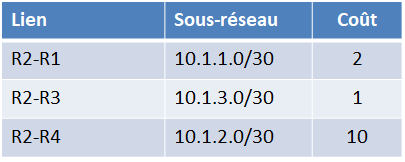
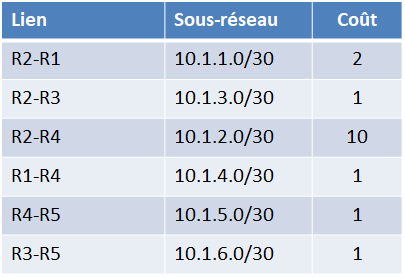
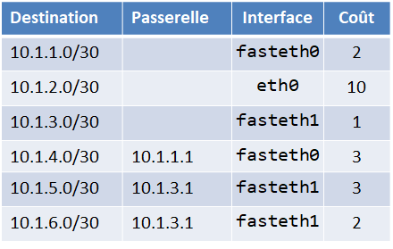
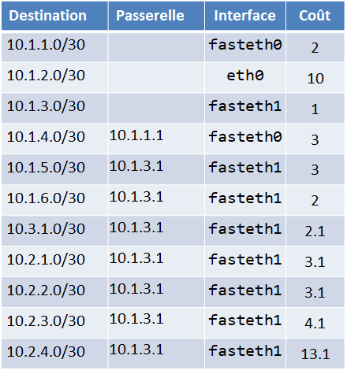

# Protocoles de routage

##	Couche Internet et adresses IP

###	Modèles OSI et TCP/IP

Communiquer consiste à transmettre des informations, mais tant que les interlocuteurs ne lui ont pas attribué un sens, il ne s'agit que de données et pas d'information. Les interlocuteurs doivent donc non seulement parler un langage commun mais aussi maîtriser des règles minimales d'émission et de réception des données. C'est le rôle d'un protocole.

!!! abstract "Cours" 
    L'ensemble des règles qui permettent à deux machines de communiquer ensemble via un réseau s'appelle un **protocole**.

Afin de s'y retrouver au milieu des protocoles réseaux, les modèles OSI et TCP/IP permettent de les classer selon leurs niveaux d'abstractions, dans ce qu'on appelle des couches. 

!!! abstract "Cours" 
    Une **couche réseau** regroupe un ensemble de protocoles ayant un même niveau d'abstraction ets des fonctionnalités similaires.

Le modèle OSI (*Open Systems Interconnection*) comporte sept couches. Le modèle TCP/IP est plus simple, il ne comporte que quatre couches : Accès au Réseau, Internet, Transport et Application.

###	Couche Accès au Réseau : les adresses MAC

{width="20%" align=right}

Une carte d'interface réseau -- ou carte réseau ou NIC (pour *Network Interface Controller*) -- par exemple une carte Ethernet ou WiFi, possède une adresse unique, appelée **adresse MAC** (*Media Access Control*) qui est donnée par le constructeur de la carte et qui permet de l'identifier de façon unique.

{width="20%" align=left}

L'adresse MAC est constituée de 6 octets écrits sous forme hexadécimale, chacun séparé par " : " (par exemple : `00:13:A9:58:32:EB`). Les 3 premiers octets définissent le constructeur de la carte réseau (ici Sony Corporation), les 3 derniers le numéro de fabrication.

Dans un réseau, un commutateur (ou *switch*) connaît les adresses MAC des machines qui lui sont branchées. 

Les paquets de données envoyés à l'adresse MAC `FF:FF:FF:FF:FF:FF` (adresse *broadcast*) sont envoyés à toutes les machines connectées au réseau. Le protocole ARP (*Address Resolution Protocol*) permet de lier les adresses MAC aux adresses IP correspondantes.

###	Couche Internet : les adresses IP

!!! abstract "Cours" 
    L'adresse IP permet d'identifier une machine sur un réseau. 
    
    Une machine qui possède plusieurs cartes d'interface réseau a plusieurs adresses IP, chaque adresse étant associée à une carte réseau.

Il existe actuellement deux versions du protocole IP: **IPv4 et IPv6** :

{width="25%" align=right}
{width="25%" align=right}

-   La version **IPv4 utilise des adresses 32 bit**s, généralement représentées en notation décimale par 4 octets (prenant les valeurs entre 0 et 255), séparés par des points.  
    
    Exemple d'adresse IPv4 :  `172.16.254.1`.
    
    Le nombre d'adresses IPv4 possibles est de $2^32 = 256^4 = 4{\space}294{\space}967{\space}296$. Ces adresses sont en cours « d'épuisement », c'est-à-dire qu'il n'y en a plus assez par rapport aux besoins du monde actuel.

{width="25%" align=right}
{width="25%" align=right}

-	La version **IPv6 utilise des adresses plus longues de 128 bits**, représentées par 8 champs de 16 bits, délimités par deux points (:). Chaque champ doit contenir un nombre hexadécimal, ou laissé vide quand il est égal à zéro.

    Exemple d'adress IPv6 : `3002:0bd6::::ee00:0033:6778`

    Le nombre d'adresses IPv6 disponibles est de $2^{128}$ c'est-à-dire $3,4 {\times} 10^{38}$  adresses, ce protocole semble donc inépuisable. 

!!! abstract "Cours" 
    L'adresse IP est inséparable de son masque de sous-réseau.  Dans le masque, les bits à 1 représentent la partie réseau de l'adresse IP, les bits à 0 représentent la partie machine. 

Comme le masque de sous-réseau est codé sur 32 bits, voici un exemple possible de masque:

|   |   |   |
|:--|:--|:--|
|   |   |`__________Réseau__________|_Machine`|
|IP|`192.168.1.45`|`11000000.10101000.00000001|00101101` |
|Masque|`255.255.255.0`|`11111111.11111111.11111111|00000000`|
|Réseau|`192.168.1.0`|`11000000.10101000.00000001|00000000`|

Prenons l'exemple d'une machine d'adresse IP `192.168.1.45` avec le masque `255.255.255.0`. Les bits des trois premiers octets du masque sont à `1`, ils donnent la partie « réseau », et les bits suivant à `0` donnent la partie « machine ». 

L'adresse dont tous les bits de la partie machine sont à `0` (`192.168.1.0`) est l'adresse du réseau entier, celle dont tous les bits de la partie machine sont à `1` (`192.168.1.255`) est l'adresse de diffusion broadcast qui permet d'envoyer un message sur tout le réseau (« *broadcast* »). Ces deux adresses sont réservées, elles ne peuvent pas être utilisées par une machine. Il reste donc  $2^8 - 2 = 254$ adresses disponibles pour les machines sur le réseau `192.168.1.0`, allant de `192.168.1.1` à `192.168.1.254`. 

- `192.168.1.0`    réservée pour l'adresse réseau

- `192.168.1.1` 

- ...

- `192.168.1.254`

- `192.168.1.255`  réservée pour l'adresse de diffusion (*broadcast*)

Pour des raisons de calcul binaire (les « `1` » du masque sont contigus), les masques de sous réseau ne peuvent prendre que les valeurs suivantes : `0` ; `128` ; `192` ; `224` ; `240` ; `248` ; `252` ; `254` ; `255`.

Une autre notation souvent utilisée, **notation CIDR**, consiste à noter directement le nombre de bits significatifs en décimal. Ainsi `192.168.25.0/255.255.255.0` peut aussi écrire `192.168.25.0/24`, car le masque réseau est sur 24 bits.
De même `10.0.0.0/255.0.0.0` peut aussi s'écrire `10.0.0.0/8` ou `192.168.1.192/255.255.255.240` peut s'écrire `192.168.1.192/28`.

Il est facile d'identifier les parties réseau et machine d'une adresse IPv4 quand le masque ne comporte que des 255 et des 0, ou un multiple de 8 en notation CIDR, mais ce n'est pas aussi simple pour les autres valeurs de masque -- `128` ; `192` ; `224` ; `240` ; `248` ; `252` ; `254` -- il faut alors "découper" un octet ! Prenons l'exemple de l'adresse `192.168.1.192/255.255.255.240` ou `192.168.1.192/28` en notation CIDR : 

- L'adresse IP `192.168.1.192` s'écrit en binaire `11000000.10101000.00000001.11000000`. 

- Le masque IP `255.255.255.240` s'écrit en binaire `11111111.11111111.11111111.11110000`. 

Dans ce cas, la partie réseau est déterminée par les 28 premiers bits de l'adresse (ceux qui sont à `1`). Elle est obtenue par un `ET` logique entre l'adresse IP et son masque. Tous les bits de l'adresse qui correspondent à un `1` du masque sont gardés, les autres sont remplacés par des `0` : 

|   |   |`___________Réseau_____________|Machine`|
|:--|:--|:--|
|IP|`192.168.1.45 `|`11000000.10101000.00000001.1100|0000` |
|Masque|`255.255.255.240`|`11111111.11111111.11111111.1111|0000`|
|Réseau|`192.168.1.192`|`11000000.10101000.00000001.1100|0000`|

La partie réseau de l'adresse est donc `11000000.10101000.00000001.11000000` autrement dit `192.168.1.192`. 
Les adresses disponibles sur ce réseau sont donc :

- `11000000.10101000.00000001.1100|0000` c'est-à-dire `192.168.1.192`    réservée pour l'adresse réseau

- `11000000.10101000.00000001.1100|0001` c'est-à-dire `192.168.1.193`
- `11000000.10101000.00000001.1100|0010` c'est-à-dire `192.168.1.194`

- ...
- `11000000.10101000.00000001.1100|1110` c'est-à-dire `192.168.1.206`
- `11000000.10101000.00000001.1100|1111` c'est-à-dire `192.168.1.207` réservée pour l'adresse de diffusion (*broadcast*)

Les adresses diponbibles pour les ordinateurs sur ce réseau vont de `192.168.1.193` à `192.168.1.206`, il y en a donc $2^4 - 2 = 14$.

!!! question "Exercice corrigé" 
	On donne l'adress IPv4 d'une machine `192.168.2.60/25`.
    Déterminer l'adresse de ce réseau et les adresses possibles des autres machines sur ce réseau.
        

??? Success "Réponse"
    Ecrivons l'adresse IP en binaire et séparons la partie réseau (les 25 premiers bits) de l apartie machine (les 7 bits suivants) : 

    |   |   |`___________Réseau____________|Machine`|
    |:--|:--|:--|
    |IP|`192.168.2.60 `|`11000000.10101000.00000010.0|0111100` |
    |Masque|25 bits|`11111111.11111111.11111111.1|0000000`|
    |Réseau|`192.168.1.192`|`11000000.10101000.00000010.0|0000000`|
    
    Les adresses disponibles sur ce réseau sont donc :

    - `11000000.10101000.00000010.0|0000000` c'est-à-dire `192.168.2.0` (adresse réseau)
    - `11000000.10101000.00000010.0|0000001` c'est-à-dire `192.168.2.1`
    - `11000000.10101000.00000010.0|0000010` c'est-à-dire `192.168.2.2`
        - ...
    - `11000000.10101000.00000010.0|1111110` c'est-à-dire `192.168.2.126`
    - `11000000.10101000.00000010.0|1111111` c'est-à-dire `192.168.2.127` (adresse de diffusion (*broadcast*)) 

    L'adresse du réseau est `192.168.2.0/25`.

    Il y a $2^7 - 2 = 126$ adresses machine disponibles, allant de `192.168.2.1` à `192.168.2.126`.

## Routage

Pour que deux machines (ordinateurs, imprimantes, etc.) puissent communiquer entre elles, il faut qu'elles soient sur le même réseau, c'est-à-dire :

- 	physiquement connectées (reliées pas un câble, sur le même bus, reliés au même commutateur ou *switch*, etc.) ; et
-	logiquement sur le même réseau (avec la  même adresse de réseau).

Mais comment faire pour communiquer entre machines qui sont sur des réseaux différents ?

### Routeurs

!!! abstract "Cours" 
    Des machines qui ne sont pas sur un même réseau peuvent communiquer par le biais d'un ou plusieurs routeurs qui relayent (ou « commutent ») les **paquets de données** vers les adresses IP d'un réseau à l'autre[^4.1] . 
    
    Chaque routeur dispose de **plusieurs interfaces de cartes réseaux** permettant de communiquer sur **plusieurs réseaux**[^4.2]. 

[^4.1]: Contrairement aux  commutateurs (ou **switch**)) qui se basent sur les adresses MAC et  sont limités à un réseau local.

[^4.2]: Une box de Fournisseur d'Accès à Internet (FAI) est un routeurs qui a souvent 3  interfaces : 

    - une interface connectée au réseau de l'opérateur (FAI). 
    - une interface filaire (Ethernet) connectée au réseau local. 
    - une interface Wifi.

Voici un exemple de plusieurs routeurs relayant des paquets de données depuis un poste client  vers un serveur dans deux réseaux locaux séparés.

{width="100%"}
{width="100%"}

### Tables de routage

Quand un routeur reçoit un paquet de données venant du client et destiné au serveur, comment sait-il à quel autre routeur faire suivre le paquet ? 

!!! abstract "Cours" 
    Les  **tables de routage**  permettent d'acheminer les paquets de données à travers un réseau vers leur destination finale.

La table de routage d'un routeur, ou de n'importe quelle machine présente sur un réseau[^4.3], décrit où envoyer les paquets de données afin de les rapprocher de leur destination finale. Elle contient plusieurs lignes avec les informations suivantes :

[^4.3]: Toute machine connectée à un réseau possède une table de routage, une imprimante, un téléphone, etc.

-   **Destination** : l'adresse IP d'un réseau ou le nom d'un routeur auquel se rapportent les informations de routage. 

    Les paquets dont la destination n'est pas connue par le routeur suivent un chemin « par défaut », identfié dans la table par la destination **Défaut** ou **`0.0.0.0`**. 

    <figure markdown>
    {height="70%"}
    {height="70%"}
    <figcaption >Extrait de la table de routage de R1 avec la destination par défaut</figcaption>
    </figure>

    

-	**Passerelle** (ou *gateway*) :  le routeur voisin vers lequel transmettre les paquets pour les rapprocher de leur destination.

    -   Une passerelle appartiennent toujours à l'un des réseaux connectés au routeur.

    -   Il n'y a pas de passerelle quand l'adresse de destination est celle d'un routeur voisin ou d'un réseau directement connecté.

    <figure markdown>
    {height="70%"}
    {height="70%"}
    <figcaption >Extrait de la table de routage de R1 avec les passerelles</figcaption>
    </figure>

-   **Interface** : la carte d'interface réseau utilisée pour transmettre les paquets vers leur destination. 

    Elle est souvent identifiée par un **nom d'interface**, par exemple `eth0`, `eth1`, `wlan0`, etc., pour désigner s'il s'agit de la première ou de la seconde carte Ethernet, de la carte Wi-Fi,etc. 

    <figure markdown>
    {height="80%"}
    {height="90%"}
    <figcaption >Extrait de la table de routage de R1 avec les noms des interfaces</figcaption>
    </figure>

    Dans certains cas, c'est l'**adresse IP** du routeur sur le réseau qui sert d'identifiant à l'interface.

      <figure markdown>
    {height="80%"}
    {height="90%"}
    <figcaption >Extrait de la table de routage de R1 avec les adresses IP des interfaces</figcaption>
    </figure>  

-    **Métrique** :  mesure « l'éloignement » qui sépare un routeur d'un réseau de destination. Plus la valeur est faible, meilleure est le chemin. 

    Les différents protocoles de routages (RIP, OSPF, etc.) utilisent des métriques différentes que l'on étudie dans la suite de ce chapitre.

Voici un exemple de la table de routage de R1 (en utilisant le protocole RIP) :

{width="90%"}
{width="90%"}

Toutes les machines sur un réseau ont une table de routage.  On peut  observer la table de routage de son ordinateur avec : 

-	`route print` (windows et cygwin) 
-	`ip route` (linux)

### Routage

!!! abstract "Cours" 
    Le **routage** est le mécanisme par lequel des chemins sont sélectionnés dans un réseau pour acheminer les données de routeurs en routeurs jusqu'à leur destination finale.

Observons le trajet d'un paquet allant de l'ordinateur client `192.168.1.15` au serveur `192.168.5.100` dans le réseau précédent.

{width="100%"}
{width="100%"}

Au départ, le paquet est envoyé par l'ordinateur client `198.168.1.15`, sa table de routage ne connait pas l'adresse du serveur `192.168.5.100`, le paquet suit donc le chemin par défaut, il est envoyé par l'interface `198.168.1.15` de l'ordinateur à la passerelle `192.168.1.1`, c'est-à-dire à R1.

{width="100%"}
{width="100%"}

Le paquet arrive sur le routeur R1. L'adresse du serveur n'est toujours pas connue de la table de routage de R1, le paquet suit à nouveau le chemin par défaut, il est envoyé par l'interface `10.1.3.1` de R1 à la passerelle `10.1.3.2`, c'est-à-dire à R3. 

{width="100%"}
{width="100%"}

Le paquet arrive sur le routeur R3. Cette fois, l'adresse du réseau `192.168.5.0/24` auquel appartient serveur est connue de la table de routage de R3, le paquet suit le chemin indiqué dans la table de routage, il est envoyé par l'interface `10.1.5.1` de R3 à la passerelle `10.1.5.2`, c'est-à-dire à R5. 

{width="100%"}
{width="100%"}

Le paquet arrive sur le routeur R5, l'adresse du serveur de destination  `192.168.5.100` est directement accessible depuis R5 par son interface `192.168.5.1`, le paquet est envoyé au serveur, il a atteint sa destination finale.

{width="100%"}
{width="100%"}

###	Rôle des protocoles de routage

Le nombre de routeurs dans un réseau est généralement trop grand pour configurer les tables de routage à la main[^4.4] et chaque fois qu'un routeur tombe en panne ou qu'une modification arrive (ajout d'une nouvelle liaison ou d'un nouveau routeur), il faudrait recalculer toutes les chemins et de mettre à jour les tables de routage de chaque routeur.

[^4.4]: Ce type de routage, dit "routage statique", qui consite à configurer les tables de routage manuellement est encore utilisé dans certains cas, par exemple dans de très petits réseaux. 

Alors comment être sûr que les tables de routages seront toujours à jour pour donner le meilleur chemin (le plus court, le plus pertinent, etc...) entre routeurs et pour que le paquet arrive à destination sans se perdre et être détruit[^4.5]  ? 

[^4.5]: Le TTL (*Time To Live*)  indique le nombre de saut qu'il reste à un paquet avant d'être détruit. A chaque fois qu'un router transmet un paquet, il réduit son TTL jusqu'à ce qu'il atteigne zéro et soit détruit

!!! abstract "Cours" 
    Un  **protocole de routage** permet aux **routeurs d'échanger les informations sur le réseau** afin de mettre à jour automatiquement leur **table de routage** pour déterminer les meilleurs chemins possibles.
    
    Un algorithme permet de comparer les différents chemins en utilisant une **métrique**. Plus sa valeur est faible, plus le chemin jusqu'à la destination finale sera jugé rapide.

Différents protocoles de routage existent :
    
    - des protocoles à **vecteur de distances**, tels que RIP, IGRP, utilisent la distance en nombre de routeurs ;

    - des protocoles à **état de liens**, tels qu'OSPF et IS-IS, utilisent le débit des connexions entre routeurs au sein d'un système autonome ;

##	RIP : protocole à vecteurs de distance

!!! abstract "Cours" 

    Le **protocole RIP** (*Routing Information Protocol*) est un protocole à **vecteur de distance** qui **minimise le nombre de routeurs utilisés** pour atteindre une destination finale.
    
    - La métrique utilisée est la distance calculée en **nombre de sauts entre routeurs** (*hops*) ou en **nombre de routeurs traversés**[^4.6].

    - Le nombre de sauts est limité à 15, les distances supérieures sont ignorées.

    - La bande passante (ou débit) de la liaison entre routeurs n'est pas prise en compte.

[^4.6]: "*it is common to use a metric that simply counts how many routers a message must go through*". Source [https://www.rfc-editor.org/rfc/rfc2453.html](https://www.rfc-editor.org/rfc/rfc2453.html).

Par exemple, considérons la table de routage de R1 dans l'exemple précédent. Il faut 2 sauts pour aller de R1 à R4 en passant par R2, mais 3 sauts en passant par R3 et R5. 

La ligne correspondant à la destination R4 dans la table de routage de R1 sera donc le chemin passant par R2, celui passant par R3 et R5 n'est pas utilisé :

{width="100%"}
{width="100%"}

En calculant le nombre de sauts minimum pour atteindre tous les routeurs du réseau depuis R1, on obtient la table de routage de R1 suivante :

{width="100%"}
{width="100%"}

Noter que R2 et R3 sont directement connectés à R1, ils n'ont pas de passerelle. 

Jusqu'ici, seuls les routeurs ont été pris en compte dans le calcul des nombres de sauts. Lorsque la table de routage comprend non seulement des routeurs, mais aussi des réseaux, le calcul de la distance est un peu différent. 

Une fois qu'un paquet arrive sur un routeur qui est sur le même réseau que la destination, c'est la technologie de ce réseau (Ethernet ou autre) qui achemine le paquet à sa destination finale[^4.7], **ce n'est pas compté comme un saut** de routage. Les informations de routage pour toutes les machines d'un réseau sont donc les mêmes, c'est-à-dire ce sont celles du routeur sur lequel ce réseau est connécté[^4.8]. 

[^4.7]:*Once the message gets to a router that is on the same network as the destination, that network's own technology is used to get to the destination.* Source [https://www.rfc-editor.org/rfc/rfc2453.html](https://www.rfc-editor.org/rfc/rfc2453.html).

[^4.8]:*it is best to think of a routing entry for a network as an abbreviation for routing entries for all of the entities connected to that network.  This sort of abbreviation makes sense only because we think of networks as having no internal structure that is visible at the IP level.  Thus, we will generally assign the same distance to every entity in a given network.* Source [https://www.rfc-editor.org/rfc/rfc2453.html](https://www.rfc-editor.org/rfc/rfc2453.html).

Pour simplifier les calculs de distances vers des adresses de sous-réseaux (autres que des routeurs), la métrique peut aussi être mesurée en **nombre de de routeurs traversés**. 

{width="100%"}
{width="100%"}

À noter :

- La distance depuis R1 aux réseaux qui lui sont directement connectés, `192.168.1.0/24` et `10.1.3.0/30`, ainsi que toutes les machines sur ces réseaux (sauf R3 même s'il appartient à ce dernier réseau !) est de 0 ! Il n'y a aucun routeur à traverser pour les atteindre. 

- La distance depuis R1 au réseau `192.168.5.0/24` qui est connecté sur une carte d'interface de R5 est la même que celle entre R1 et R5, c'est-à-dire 2. Il y a 2 routeurs à traverser pour atteindre les machines sur ce réseau.

La table de routage de R1 avec les sous-réseaux de destination se présente alors de la façon suivante :

{width="40%"}
{width="40%"}

:warning:Attention à la confusion, **la distance des réseaux (et machines sur ces réseaux autres que des routeurs) directement connectés à R1 est 0, mais la distance d'un routeur voisin de R1 est 1**, même si ce routeur est sur un réseau connecté à R1 ![^4.9]

[^4.9]: La plupart des exercices de baccalauréat utilisent des tables de routage avec des distances entre routeurs mesurées en nombre de sauts (distances égales à 1 ou plus), mais quelques-uns prennent en compte des distances de routeurs à des réseaux directement connectés (égales à 0) : 21-NSIJ2ME3, 22-NSIJ2NC1, 23-NSIJ1ME1, 24-sujet-0-a.

###	Mise en place des tables de routages RIP

!!! abstract "Cours" 
    Avec le protocole RIP, chaque routeur recoit régulièrement (toutes les 30 secondes) de ses voisins des informations de routage sous la forme de **couples (destination, distance), appelés vecteurs de distance**.

    Chaque routeur met à jour sa propre table routage avec les informations qu'il reçoit de ses voisins en ne gardant que les chemins les plus avantageux (les autres chemins, plus longs, sont ignorés)[^4.10].

[^4.10]: Le chemin qui traverse le moins de routeurs est calculé par l'algorithme de Bellman-Ford.

Remarques :

- Lorsqu'un routeur reçoit un couple (destination, distance), il augmente la distance de 1.
- La **distance maximale est de 15**, la table de routage indique une distance vide ou égale à 16 pour les destinations inconnues ou plus lointaines.

- Si les informations concernant une destination ne sont plus reçues par un routeur pendant trois minutes, la destination est supprimée de sa  table de routage (panne ou modification du réseau).

Pour illustrer le fonctionnement du protocole RIP, voyons comment évoluent les tables de routage des routeurs R1, R2, R3 et R5  sur l'exemple précédent (les interfaces et les destinations par défaut sont ignorées par soucis de simplicité): 

1.  _Initialisation_ : Au début du protocole, les tables des routeurs sont initialisées avec les informations concernant leurs voisins immédiats, à savoir les routeurs auxquels ils sont directement connectés.

    {width="100%"}
    {width="100%"}
    
    La colonne "passerelle" est vide, chaque routeur peut atteindre ses voisins immédiats directement. Toutes les distances sont de 1 puisque les voisins sont atteints par 1 saut.

2.  _Première mise à jour_ : Chaque routeur envoie les informations de routage dont il dispose à ses voisins et met à jour sa propre table de routage avec les informations qu'il reçoit en ne gardant que les chemins les plus avantageux :

    {width="100%"}
    {width="100%"}
  
    R1 met à jour sa table de routage avec les informations reçues de R2 et R3 :

    - Il reçoit de R2 un nouveau chemin vers R4 qui n'était pas connu, il ajoute R4 à sa table de routage avec une passerelle R2 et une distance qui augmente de 1 puisqu'il faut un saut supplémentaire pour atteindre R4 depuis R1.
    - Il reçoit de R3 deux nouveaux chemins vers R5 et R6 qui n'étaient pas connus, il les ajoute à sa table de routage avec une passerelle  R3 et des distances aussi augmentées de 1.
    - Il recoit des informations sur R2 et R3 qui sont déjà connus, il les ignore.

    De la même façon, R2 ajoute à sa table de routage de nouveaux chemins vers R5 et R6 qu'il recoit de R3, en indiquant une passerelle par R3 et un distance augementée de 1. R3 ajoute à sa table de routage les chemins vers R4 qu'il recoit de R2 (il aurait pu aussi prendre le chemin passant par R5, quand un routeur a le choix entre plusieurs chemins qui ont la même distance, il en choisit un au hasard) et vers R7 qu'il recoit de R5. Réciproquement, R5 ajoute les chemins vers R1 et R2 qu'il reçoit de R5.

3.  _Seconde mise à jour_ :  30 secondes après la première mise à jour, le même processus se répète, toutes les informations de routage sont echangées entre tous les routeurs voisins.
    
    {width="100%"}
    {width="100%"}

    Seuls R1 et R2 découvrent un nouveau chemin vers R7 qu'ils ne connaissaient pas, ils mettent à jour leur table de routage avec cette nouvelle desitation, une passerelle par R5 et un distance augmentée de 1, c'est-à-dire 3.

    A ce stade, tous les routeurs ont une "vision" complète de ce réseau avec les meilleurs chemins à suivre pour acheminer les paquets. Les échanges suivants (toutes les 30 secondes) ne modifient pas les tables de routage jusqu'à ce qu'un changement intervienne dans le réseau (routeur ou liaison en panne, nouveau réseau connecté, etc.).

4. _panne entre R1 et R3_ : Quand une panne apparaît sur le réseau, par exemple si la liaison entre R1 et R3 est coupée, les deux routeurs ne recoivent plus aucune information de l'un et l'autre, ils suppriment les chemins correspondant au bout de 3 minutes.

    La destination R3 est supprimée de la table de routage de R1, ainsi les destinations R5, R6 et R7 dont la passerelle était R3, elles ne sont plus accessibles en passant par R3. Réciproquement la destination R1 est supprimée de la table de routage de R3.

    {width="100%"}
    {width="100%"}

    À la mise à jour suivante, les tables de routage de R1 et R3 sont mises à jour avec les informations reçues de R2. Les destinations R3, R5, R6 et R7 apparaîssent à nouveau dans la table de routage de R1, cette fois à travers la passerelle R2, avec une distance augmentée de 1. Et R1 est à nouveau dans la table de routage de R3, mais aussi en passant par la passerelle R2. Le traffic entre R1 et R3 est maintenant détourné par R2.

    {width="100%"}
    {width="100%"}

Si le protocole RIP est simple et efficace pour les petits réseaux, il montre ses limites pour de plus grands réseaux avec des temps de mise à jour longs (15 x 30 = 450 secondes pour recevoir les informations des routeurs les plus éloignés) et parce que les liaisons avec un débit beaucoup plus rapide que d'autres ne sont pas favorisées. 

## OSPF: protocole à état de liens

!!! abstract "Cours" 
    Le **protocole OSPF** (*Open Shortest Path First*) est un protocole à **états de liens** qui **favorise les liaisons les plus rapides** entre routeurs pour atteindre une destination. La métrique est inversement proportionnelle à la bande passante (ou débit)[^4.11] d'une liaison, une bande passante plus élevée indique un coût plus faible.

    - La métrique correspond à la somme des coûts :    $coût = \dfrac{10^8}{d}$     où $d$ est la bande passante est exprimée en $bit/s$. Cela correspond à un coût de 1 pour une bande passante de 100 Mbits/s.

    - Le numérateur est parfois différent pour prendre en compte des bandes passantes plus ou moins élévées, par exemple pour des réseaux à bandes passantes élevées on trouvera $10^9$ (c'est-à-dire un cout de 1 pour 1 Gbit/s).

    - Le nombre de routeurs traversés n'a pas d'importance.

[^4.11]: Les termes "bande passante" et "débit" sont différents même s'ils sont souvent confondus par abus de langage. La bande passante réfère à la « capacité de transmission de données, alors que le débit est la « quantité de données effectivement transférées. Pour illustrer la différence dans un réseau routier, la bande passante serait le nombre de voies d'une autoroute, alors que le débit serait la quantité de voitures qui y circulent. 

!!! notetip inline end "bit par seconde" 
    « bit/s » sécrit aussi « b/s » ou « bps ».

Principales unités de bandes passantes utilisées :

|Unité|Notation|Valeur|
|:--|:-:|--:|
|1 kilobit par seconde|1 kbit/s|1 000 bit/s = $10^3$ bit/s|
|1 mégabit par seconde|1 Mbit/s|1 000 000 bit/s = $10^6$ bit/s|
|1 gigabit par seconde|1 Gbit/s|1 000 000 000 bit/s = $10^9$ bit/s|
|1 terabit par seconde|1 Tbit/s|1 000 000 000 000 bit/s = $10^{12}$ bit/s|

Quelques exemples de calculs de coûts pour différentes bandes passantes :

|Technologie|Bande passante|Bande passante (bit/s)|Coût|
|:--|:--|:-:|:--|
|Ethernet|10 Mbit/s|$10 \times 10^6 = 10^7$|$\dfrac{10^8}{10^7}=10$|
|Fast Ethernet|100 Mbit/s|$100 \times 10^6 = 10^8$|$\dfrac{10^8}{10^8}=1$|
|Fibre optique (FFTH))|1 Gbit/s|$10^9$|$\dfrac{10^8}{10^9}=0,1$|

Quand la bande passante n'est pas un multiple de 10, le calcul (sans calculatrice) est un peu plus compliqué, par exemple pour une liaison satellite à 50 Mbits/s : $\dfrac{10^8}{50 \times 10^6}= \dfrac{100 \times 10^6}{50 \times 10^6}= \dfrac{100 }{50}=2$

:warning: Le protocole OSPF arrondit en principe les coûts à l'entier supérieur, par exemple ici le coût de la fibre optique serait arrondi 1, mais ils ne sont pas toujours arrondis dans les exercices de baccalauréat[^4.12] !

[^4.12]: On trouve des coûts OSPF qui ne sont pas arrondis dans les exercices de baccalauréat 23-NSIJ1LR1, 23-NSIJ2G11, 24-sujet_0-a.

### Zones

Les grands réseaux, comme internet,
 sont segmentés en plusieurs zones autonomes (ou *areas*), reliées entre elles par une zone principale (appelée *backbone*). Les routeurs sont de deux types: 

-	Des routeurs internes à une zone ou routeurs IR (*Internal Routers*) à l'intérieur d'une même zone connaissent tous les mêmes informations sur l'état des liens de leur zone uniquement. 

-	Des routeurs de frontière de zone ou routeurs ABR (*Area Border Router*) connectent une zone à la *backbone*. Ils connaissent les états de liens de toutes les zones différentes qui leur sont connectées. 

Exemple : R3 et R6 sont des ABR

{width="80%"}
{width="80%"}

La communication entre zones est limitée à des échanges d'information de routage pour connecter les zones entre elles uniquement, **les calculs de chemins ne s'opèrent qu'au sein d'une même zone**. Les routeurs d'une zone ne sont pas affectés par les changements intervenus dans une autre zone.

###	Mise en place des tables de routages OSPF

!!! abstract "Cours" 
    Avec le protocole OSPF, tous les routeurs reçoivent les **états de liens** de toutes les liaisons de leur zone et calculent les meilleurs chemins (***shortest path first***) pour l'ensemble de la zone[^4.10].
    
    Les échanges entre routeurs et les calculs des meilleurs chemins ne sont fait que lors de l'initialisation ou en raison d'un changement des informations de routage.
    

[^4.13]: Les chemins les plus courts sont calculés par l'algorithme de Dijkstra.

{width="30%" align=right}
{width="30%" align=right}

Pour mettre à jour les tables de routage des routeurs IR à l'intérieur d'une zone, le protocole OSPF se décompose en quatre étapes. Prenons l'exemple de la zone 1 dans le réseau précédent.

1. _Découverte des voisins_ : Lors de l'intialisation (ou suite à un changement), chaque routeur produit un état des liens qui le relient à ses voisins direct.

    Par exemple, les états de liens pour le routeur R2 avec ses voisins sont :

    {width="50%"}

2. _Inondation et mise à jour_ : Tous les routeurs de la zone s'échangent leurs états de liens par inondation (*flooding*). A la fin de ces échanges, ils connaissent tous la topologie complète de la zone.

    Exemple : R2 met à jour les états des liens avec les messages reçus des autres routeurs de sa zone.

    {width="50%"}

3. _Calcul des routes_ : Une fois les états de liens de tous les routeurs connus par tous, chaque routeur calcule les chemins les plus courts vers toutes les destinations de la zone et construit sa table de routage.

    {width="30%" align=right}
    {width="30%" align=right}

    Exemple : table de routage de R2

    {width="50%"}

    Il est plus rapide de passer par R1 que par R4 pour atteindre `10.1.4.0/30` et par R3 pour atteindre `10.1.5.0/30`.

4. _Maintenance des routes_  : OSPF reste très discret, il y a échange des nouveaux états de lien et calcul des chemins les plus courts seulement en cas de changement. 

Une fois les tables de routage construites à l'intérieur d'une zone, les routeurs ABR communiquent les plus courts chemins entre zones pour les compléter. 

Exemple : table de routage de R2 après les chemins reçus de R3

{width="30%"}

A noter : les routeurs ABR ne communiquent que les plus courts chemins, pas les états des liens, ils utilisent un protocole différent (*Border Gateway Protocol*).

OSPF présente plusieurs avantages comparé à RIP: il est mieux adapté pour des réseaux de plus grandes tailles, il favorise les liaisons les plus rapides pour acheminer les paquets le plus rapidement possible vers leur destination, les tables sont mises à jour immédiatement suite à une panne, mais necessite des routeurs plus puissants capables de calculer les chemins les plus courts en utilisant l'algorithme de Dijkstra.

