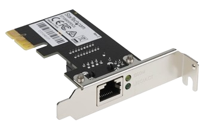
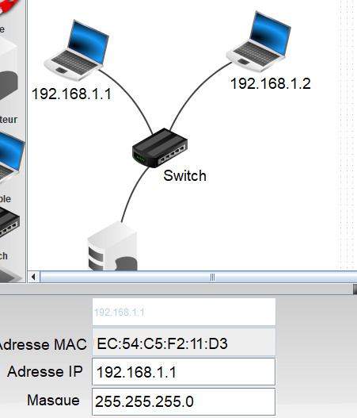

# Protocoles de routage

##	Couche Internet et adresses IP

###	Modèles OSI et TCP/IP

Communiquer consiste à transmettre des informations, mais tant que les interlocuteurs ne lui ont pas attribué un sens, il ne s'agit que de données et pas d'information. Les interlocuteurs doivent donc non seulement parler un langage commun mais aussi maîtriser des règles minimales d'émission et de réception des données. C'est le rôle d'un protocole.

!!! abstract "Cours" 
    L'ensemble des règles qui permettent à 2 ordinateurs de communiquer ensemble via un réseau s'appelle un **protocole**.

Afin de s'y retrouver au milieu des protocoles réseaux, les modèles OSI et TCP/IP permettent de les classer selon leurs niveaux d'abstractions, dans ce qu'on appelle des couches. 

!!! abstract "Cours" 
    La définition d'une **couche réseau** est assez abstraite, mais on peut dire qu'il s'agit d'un ensemble de protocoles, qui sont au même niveau d'abstraction, qui ont des fonctions similaires.

Le modèle OSI (de l'anglais Open Systems Interconnection) comporte sept couches. Le modèle TCP/IP est plus simple, il ne comporte que quatre couches : Accès au Réseau, Internet, Transport et Application.

###	Couche Accès au Réseau : les adresses MAC

{width="20%" align=right}

Une carte d'interface réseau -- appelée aussi carte réseau ou NIC (pour *Network Interface Controller*) -- par exemple une carte Ethernet ou WiFi, possède une adresse unique, appelée **adresse MAC** (*Media Access Control*) qui est donnée par le constructeur de la carte et qui permet de l'identifier de façon unique.

{width="20%" align=left}

L'adresse MAC est constituée de 6 octets écrits sous forme hexadécimale, chacun séparé par " : " (par exemple : `00:13:A9:58:32:EB`). Les 3 premiers octets définissent le constructeur de la carte réseau (ici Sony Corporation), les 3 derniers le numéro de fabrication.

Dans un réseau, un commutateur (ou *switch*) connaît les adresses MAC des machines qui lui sont branchées. 

Les paquets envoyées à l'adresse MAC `FF:FF:FF:FF:FF:FF` (adresse *broadcast*) sont envoyés à toutes les machines connectées au réseau. Le protocole ARP (*Address Resolution Protocol*) permet de lier les adresses MAC aux adresses IP correspondantes.

###	Couche Internet : les adresses IP

!!! abstract "Cours" 
    L'adresse IP permet d'identifier une machine sur un réseau. 
    
    Une machine qui possède plusieurs cartes d'interface réseau a plusieurs adresses IP, chaque adresse étant associée à une carte réseau.

Il existe actuellement deux versions du protocole IP: **IPv4 et IPv6** :

{width="25%" align=right}
{width="25%" align=right}

-   La version **IPv4 utilise des adresses 32 bit**s, généralement représentées en notation décimale par 4 octets (prenant les valeurs entre 0 et 255), séparés par des points.  
    
    Exemple d'adresse IPv4 :  `172.16.254.1`.
    
    Le nombre d'adresses IPv4 possibles est de $256^4 = 4{\space}294{\space}967{\space}296$. Ces adresses sont en cours « d'épuisement », c'est-à-dire qu'il n'y en a plus assez par rapport aux besoins du monde actuel.

{width="25%" align=right}
{width="25%" align=right}

-	La version **IPv6 utilise des adresses plus longues de 128 bits**, représentées par 8 champs de 16 bits, délimités par deux points (:). Chaque champ doit contenir un nombre hexadécimal, ou laissé vide quand il est égal à zéro.

    Exemple d'adress IPv6 : `3002:0bd6::::ee00:0033:6778`

    Le nombre d'adresses IPv6 disponibles est de $2^{128}$ c'est-à-dire $3,4 {\times} 10^{38}$  adresses, ce protocole semble donc inépuisable. 

!!! abstract "Cours" 
    L'adresse IP est inséparable de son masque de sous-réseau.  Dans le masque, les bits à 1 représentent la partie réseau de l'adresse IP, les bits à 0 représentent la partie machine. 

Comme le masque de sous-réseau est codé sur 32 bits, voici un exemple possible de masque:

|   |   |   |
|:--|:--|:--|
|   |   |`__________Réseau__________|_Machine`|
|IP|`192.168.1.45`|`11000000.10101000.00000001|00101101` |
|Masque|`255.255.255.0`|`11111111.11111111.11111111|00000000`|
|Réseau|`192.168.1.0`|`11000000.10101000.00000001|00000000`|

Prenons l'exemple d'une machine d'adresse IP `192.168.1.45` avec le masque `255.255.255.0`. Les bits des trois premiers octets du masque sont à `1`, ils donnent la partie « réseau », et les bits suivant à `0` donnent la partie « machine ». 

L'adresse dont tous les bits de la partie machine sont à `0` (`192.168.1.0`) est l'adresse du réseau entier, celle dont tous les bits de la partie machine sont à `1` (`192.168.1.255`) est l'adresse de diffusion broadcast qui permet d'envoyer un message sur tout le réseau (« *broadcast* »). Ces deux adresses sont réservées, elles ne peuvent pas être utilisées par une machine. Il reste donc  $2^8 - 2 = 254$ adresses disponibles pour les machines sur le réseau `192.168.1.0`, allant de `192.168.1.1` à `192.168.1.254`. 

- `192.168.1.0`    réservée pour l'adresse réseau

- `192.168.1.1` 

- ...

- `192.168.1.254`

- `192.168.1.255`  réservée pour l'adresse de diffusion (*broadcast*)

Pour des raisons de calcul binaire (les « `1` » du masque sont contigus), les masques de sous réseau ne peuvent prendre que les valeurs suivantes : `0` ; `128` ; `192` ; `224` ; `240` ; `248` ; `252` ; `254` ; `255`.

Une autre notation souvent utilisée, **notation CIDR**, consiste à noter directement le nombre de bits significatifs en décimal. Ainsi `192.168.25.0/255.255.255.0` peut aussi écrire `192.168.25.0/24`, car le masque réseau est sur 24 bits.
De même `10.0.0.0/255.0.0.0` peut aussi s'écrire `10.0.0.0/8` ou `192.168.1.192/255.255.255.240` peut s'écrire `192.168.1.192/28`.

Il est facile d'identifier les parties réseau et machine d'une adresse IPv4 quand le masque ne comporte que des 255 et des 0, ou un multiple de 8 en notation CIDR, mais ce n'est pas aussi simple pour les autres valeurs de masque -- `128` ; `192` ; `224` ; `240` ; `248` ; `252` ; `254` -- il faut alors "découper" un octet ! Prenons l'exemple de l'adresse `192.168.1.192/255.255.255.240` ou `192.168.1.192/28` en notation CIDR : 

- L'adresse IP `192.168.1.192` s'écrit en binaire `11000000.10101000.00000001.11000000`. 

- Le masque IP `255.255.255.240` s'écrit en binaire `11111111.11111111.11111111.11110000`. 

Dans ce cas, la partie réseau est déterminée par les 28 premiers bits de l'adresse (ceux qui sont à `1`). Elle est obtenue par un `ET` logique entre l'adresse IP et son masque. Tous les bits de l'adresse qui correspondent à un `1` du masque sont gardés, les autres sont remplacés par des `0` : 

|   |   |`___________Réseau_____________|Machine`|
|:--|:--|:--|
|IP|`192.168.1.45 `|`11000000.10101000.00000001.1100|0000` |
|Masque|`255.255.255.240`|`11111111.11111111.11111111.1111|0000`|
|Réseau|`192.168.1.192`|`11000000.10101000.00000001.1100|0000`|

La partie réseau de l'adresse est donc `11000000.10101000.00000001.11000000` autrement dit `192.168.1.192`. 
Les adresses disponibles sur ce réseau sont donc :

- `11000000.10101000.00000001.1100|0000` c'est-à-dire `192.168.1.192`    réservée pour l'adresse réseau

- `11000000.10101000.00000001.1100|0001` c'est-à-dire `192.168.1.193`
- `11000000.10101000.00000001.1100|0010` c'est-à-dire `192.168.1.194`

- ...
- `11000000.10101000.00000001.1100|1110` c'est-à-dire `192.168.1.206`
- `11000000.10101000.00000001.1100|1111` c'est-à-dire `192.168.1.207` réservée pour l'adresse de diffusion (*broadcast*)

Les adresses diponbibles pour les ordinateurs sur ce réseau vont de `192.168.1.193` à `192.168.1.206`, il y en a donc $2^4 - 2 = 14$.

!!! question "Exercice corrigé" 
	On donne l'adress IPv4 d'une machine `192.168.2.60/25`.
    Déterminer l'adresse de ce réseau et les adresses possibles des autres machines sur ce réseau.
        

??? Success "Réponse"
    Ecrivons l'adresse IP en binaire et séparons la partie réseau (les 25 premiers bits) de l apartie machine (les 7 bits suivants) : 

    |   |   |`___________Réseau____________|Machine`|
    |:--|:--|:--|
    |IP|`192.168.2.60 `|`11000000.10101000.00000010.0|0111100` |
    |Masque|25 bits|`11111111.11111111.11111111.1|0000000`|
    |Réseau|`192.168.1.192`|`11000000.10101000.00000010.0|0000000`|
    
    Les adresses disponibles sur ce réseau sont donc :

    - `11000000.10101000.00000010.0|0000000` c'est-à-dire `192.168.2.0` (adresse réseau)
    - `11000000.10101000.00000010.0|0000001` c'est-à-dire `192.168.2.1`
    - `11000000.10101000.00000010.0|0000010` c'est-à-dire `192.168.2.2`
        - ...
    - `11000000.10101000.00000010.0|1111110` c'est-à-dire `192.168.2.126`
    - `11000000.10101000.00000010.0|1111111` c'est-à-dire `192.168.2.127` (adresse de diffusion (*broadcast*)) 

    L'adresse du réseau est `192.168.2.0/25`.

    Il y a $2^7 - 2 = 126$ adresses machine disponibles, allant de `192.168.2.1` à `192.168.2.126`.

## Routage

Pour que deux machines (ordinateurs, imprimantes, etc.) puissent communiquer entre elles, il faut qu'elles soient sur le même réseau, c'est-à-dire :

- 	physiquement connectées (reliées pas un câble, sur le même bus, reliés au même commutateur/switch,…) ; et
-	logiquement sur le même réseau (avec la  même adresse de réseau).

Mais comment faire pour communiquer entre machines qui sont sur des réseaux différents ?

### Routeurs

!!! abstract "Cours" 
    Des machines qui ne sont pas sur un même réseau peuvent communiquer par le biais d'un ou plusieurs routeurs qui relayent (ou « commutent ») les **paquets d'information** vers  les adresses IP d'un réseau à l'autre[^4.1] . 
    
    Chaque routeur dispose de **plusieurs interfaces de cartes réseaux** permettant de communiquer sur **plusieurs réseaux**[^4.2]. 

[^4.1]: Contrairement aux  commutateurs (ou **swithc**)) qui se basent sur les adresses MAC et  sont limités à un réseau local.

[^4.2]: Une box de Fournisseur d'Accès à Internet (FAI) est un routeurs qui a souvent 3  interfaces : 

    - une interface connectée au réseau de l'opérateur (FAI). 
    - une interface filaire (Ethernet) connectée au réseau local. 
    - une interface Wifi.

Voici un exemple de plusieurs routeurs relayant les informations entre deux réseaux locaux séparés.

{width="80%"}
{width="80%"}

### Tables de routage

Dans l'exemple précédent, quand un routeur reçoit un paquet du Client destiné au Serveur, comment sait-il à quel autre routeur faire suivre le paquet ? 

!!! abstract "Cours" 
    La **table de routage** de chaque routeur associe les adresses de destination finales aux adresses de ses routeurs voisins pour déterminer vers lequel transmettre les paquets.

Les tables de routage des routeurs, ou de n'importe quelle machine présente sur le réseau[^4.3],  contiennent des informations de routage sur **quatre colonnes** :

-   la première contient un "**Réseau de destination**" sous la forme d'une adresse IP sous-réseau/masque.

-	la deuxième, nommée "**Passerelle**" (ou *gateway*), donne l'adresse IP du prochain routeur voisin par lequel passer pour atteindre cette destination.

    -   Les passerelles indiquées dans les tables de routage appartiennent toujours à l'un des réseaux du routeur.
    -   La passerelle est vide quand l'adresse de destination est celle d'un routeur voisin

{width="30%" align=right}
{width="30%" align=right}

-   Une colonne "**Interface**" indique la carte d'interface réseau à utiliser pour atteindre la passerelle ou la destination finale. Elle est souvent identifiée par un nom, par exemple `eth0`, `eth1` ou `wlan0`, pour désigner s'il s'agit d'une carte Ethernet ou Wi-Fi. Sinon dans certains cas la carte d'interface est identifiée pas son adresse IP.

-   Enfin, la dernière colonne contient une **Métrique** qui mesure de la « distance » qui sépare un routeur d'un réseau de destination. Plus sa valeur est faible, meilleure est la route. Chaque protocole dispose de sa méthode de valorisation (en nombre de saut ou bande passante, etc.).

[^4.3]: Toute machine connectée à un réseau possède une table de routage, une imprimante, un téléphone, etc.

Voici un exemple de table de routage de R1 dans le réseau précédent :

{width="80%"}
{width="80%"}

{width="30%" align=right}
{width="30%" align=right}

Quand l'interface n'est pas iddentifiée par un nom mais par son adresse IP, la table de routage se présente alors sous la forme : 

{width="50%"}
{width="50%"}

Toutes les machines sur un réseau ont une table de routage.  On peut  observer la table de routage de son ordinateur avec : 
-	route print (windows et cygwin) 
-	ip route (linux)

### Routage

Observons le trajet d'un paquet allant de l'ordinateur 198.168.1.101 au serveur `192.168.4.101` dans le réseau suivant (tous les masques réseaux sont `255.255.255.0`).

{width="80%"}
{width="80%"}

{width="60%"}
{width="60%"}

① Le paquet est envoyé par l'ordinateur `198.168.1.101`, sa table de routage  ne connait pas l'adresse du réseau de destination (`192.168.4.0`), le paquet suit donc la route par défaut il est envoyé au routeur R1 à l'adresse `192.168.1.100` par l'interface eth0 de l'ordinateur.

② Le paquet arrive sur le routeur R1, l'adresse du réseau de destination  (`192.168.4.0`) est connue de la table de routage de R1, le paquet est envoyé au routeur R2 à l'adresse `192.168.3.102` par l'interface `eth1` de R1.

③ Le paquet arrive sur le routeur R2, l'adresse du serveur de destination  (`192.168.4.101`) est directement accessible par l'interface `eth1` de R2, le routeur lui fait suivre le paquet qui arrive à destination.

!!! abstract "Cours" 
    Le **routage** est le mécanisme par lequel les paquets sont acheminés par les routeurs depuis un expéditeur jusqu'au destinataire.

##	Rôle des protocoles de routage

Le nombre de routeurs dans un réseau est généralement trop grand pour configurer les tables de routage à la main[^4.1] et chaque fois qu'un routeur tombe en panne ou qu'une modification arrive (ajout d'une nouvelle liaison ou d'un nouveau routeur), il faudrait recalculer toutes les routes et de mettre à jour les tables de routage de chaque routeur.

[^4.1]: Ce type de routage, dit "routage statique", qui consite à configurer les tables de routage manuellement est encore utilisé dans certains cas, par exemple dans de très petits réseaux. 

Alors comment être sûr que les tables de routages seront toujours à jour pour donner le meilleur chemin (le plus court, le plus pertinent, etc...) entre routeurs et pour que le paquet arrive à destination sans se perdre et être détruit[^4.2]  ? 

[^4.2]: Le TTL (*Time To Live*)  indique le nombre de saut qu'il reste à un paquet avant d'être détruit. A chaque fois qu'un router transmet un paquet, il réduit son TTL jusqu'à ce qu'il atteigne zéro et soit détruit

!!! abstract "Cours" 
    Les  **protocoles de routage** permettant aux **routeurs d'échanger les informations sur le réseau** afin de mettre à jour automatiquement leur **table de routage** avec les meilleures routes possibles.

Un algorithme permet de comparer les routes en utilisant une **métrique**. Plus sa valeur est faible, meilleure est la route. Les protocoles à **vecteurs de distance** (RIP, IGRP, etc.) utilisent la distance en nombre de routeurs, alors que ceux à **états de lien** (OSPF, IS-IS, etc.) utilisent le débit des connexions entre routeurs

###	RIP : protocole à vecteurs de distance

!!! abstract "Cours" 
    Le **protocole RIP** (*Routing Information Protocol*) cherche à **minimiser la distance** qui sépare un routeur d'un réseau de destination. La distance (ou métrique) est déterminé par le **nombre de sauts** ou **routeurs traversés**[^4.3].
    
    La bande passante (ou débit) entre routeurs n'a pas d'importance.

[^4.3]: "*it is common to use a metric that simply counts how many routers a message must go through*". Source [https://www.rfc-editor.org/rfc/rfc2453.html](https://www.rfc-editor.org/rfc/rfc2453.html).

Par exemple, considérons la table de routage de R1 dans l’exemple précédent. Il faut 1 saut pour aller de R1 à R2, 2 sauts pour aller à R5, 3 sauts pour aller à R6, etc.

{width="80%"}
{width="80%"}

La table de routage de R1 est donc :

|Destination|Passerelle|Interface|Métrique|
|:-:|:-:|:-:|:-:|
|R2||eth0|1|
|R3|R2|eth0|2|
|R4|R2|eth0|2|
|R5|R2|eth0|2|
|R6|R2|eth0|3|
|défaut|R2|eth0||

Noter que R2 est directement connecté à R1, il n’a pas de passerelle. 

Seuls les routeurs sont comptés. Pour un réseau directement connecté sur la carte d'interface d'un routeur et les machines connectées sur ce réseau (autres que d'autres routeurs) il n’y a aucun routeur traversé, ils ont donc une métrique de 0[^4.4] !

[^4.4]: "*hosts that don't function as routers (i.e., hosts that are connected to only one network) can have no useful information to contribute other than their own entry D(i,i) = 0*". Source [https://www.rfc-editor.org/rfc/rfc2453.html](https://www.rfc-editor.org/rfc/rfc2453.html).

:warning:Attention à la confusion, la **distance d'un routeur directement connecté à R1 est 1** mais la distance des **réseaux (et machines autres que des routeurs) connectés à R1 est 0**[^4.5] !

[^4.5]: La plupart des exercices de baccalauréat utilisent des tables de routage avec une distance entre routeurs mesurée en nombre de sauts, mais quelques-uns prennent en compte une distance d'un routeur à des réseaux directement connectés qu est égale à 0 (21-NSIJ2ME3, 22-NSIJ2NC1, 23-NSIJIME1, 24-sujet-0-a).

Mesurons la distance de R1 avec les sous-réseaux de destination en nombre de routeurs traversés.

{width="80%"}
{width="80%"}

La table de routage de R1 se présente alors <de la façon suivante :

|Destination|Passerelle|Interface|Métrique|
|:-|:-:|:-:|:-:|
|192.168.1.0/24| |wlan0|0|
|10.1.1.0/30| |eth0|0|
|10.1.2.0/30|R2|eth0|1|
|10.1.3.0/30|R2|eth0|1|
|10.1.4.0/30|R2|eth0|1|
|10.1.5.0/30|R2|eth0|2|
|10.1.6.0/30|R2|eth0|2|
|10.1.7.0/30|R2|eth0|2|
|192.168.6.0/24|R2|eth0|3|
|défaut|R2|eth0||

###	Mise en place des tables de routages

!!! abstract "Cours" 
    Dans le protocole RIP chaque routeur transmet à ses voisins des **couples (adresse, distance), appelés vecteurs de distance**, indiquant :
    
    - les **adresses** de ses propres voisins et celles qu'il a reçues par d’autres routeurs ;
    - la **distance**, exprimée en nombre de sauts, qui le sépare d’un réseau donné.

Chaque routeur reçoit en permanence (toutes les 30 secondes) de ses voisins les informations de routage qu'ils possèdent. Lorsque le routeur reçoit la réponse de son voisin, il met à jour sa table de routage en ne gardant que les chemins les plus avantageux :

1.	Il reçoit une nouvelle route vers un sous-réseau inconnu : il l’ajoute dans sa table.
2.	Il reçoit une nouvelle route plus courte vers un sous-réseau connu en passant par un autre routeur : il remplace l’ancienne route de sa table par la nouvelle.
3.	Il reçoit une nouvelle route plus longue vers un sous-réseau connu: il l’ignore.
4.	Il reçoit une route existante, mais plus longue, vers un routeur passant par le même voisin. Cela veut dire qu’un problème est apparu sur son ancienne route. Il met donc à jour sa table avec cette nouvelle route.

Remarques :

- Lorsqu’un routeur reçoit une route, il doit augmenter la distance associée de 1 ;
- Dans tous les cas, le **nombre maximal de sauts autorisés est de 15** (la distance indiquée pour les destinations inconnues est vide ou 16) ;
- Si une adresse de réseau n’apparaît pas pendant trois minutes, elle est supprimée ;
- La route qui traverse le moins de routeurs est calculée par l’algorithme de Bellman-Ford.

Pour illustrer le fonctionnement du protocole RIP, voyons comment évoluent les tables de routage des routeurs R1 et R2 en utilisant ce protocole sur l’exemple précédent : 

=== "1.Initialisation"

    Au début du protocole, les tables des routeurs R1 et R2 sont initialisées avec les informations concernant leurs voisins immédiats, à savoir les adresses des sous-réseaux sur lesquels ils sont directement connectés.

    Table de routage de R1

    |Destination|Passerelle|Interface|Métrique|
    |:-|:-:|:-:|:-:|
    |192.168.1.0/24| |wlan0|0|
    |10.1.1.0/30| |eth0|0|
    
    Table de routage de R2

    |Destination|Passerelle|Interface|Métrique|
    |:-|:-:|:-:|:-:|
    |10.1.1.0/30| |eth0|0|
    |10.1.2.0/30| |eth1|0|
    |10.1.3.0/30| |eth3|0|
    |10.1.4.0/30| |eth2|0|
    
    La colonne "passerelle" est vide puisque R1 et R2 peuvent atteindre ces destinations directement. L'interface `eth0` signifie que R1 est directement relié au sous-réseau `10.1.1.0/30` par une carte Ethernet ; le numéro associé au nom de l'interface permet de savoir quelle carte utiliser parmi toutes celles disponibles sur le routeur. De même, `wlan0` indique que R1 est connecté au sous-réseau 192.168.1.0/24 via une interface sans fil.
    
    La distance est de 0 puisqu'il s'agit d'information sur des réseaux directement connectés.

=== "2.Echanges RIP"

    Toutes les 30 secondes les routeurs échangent les informations dont ils disposent avec leurs voisins.

=== "2.Mise à jour de tables"

    Ainsi, après avoir échangé une demande RIP avec R2, la table du routeur R1 devient :

    |Destination|Passerelle|Interface|Métrique|
    |:-|:-:|:-:|:-:|
    |192.168.1.0/24| |wlan0|0|
    |10.1.1.0/30| |eth0|0|
    |10.1.2.0/30|R2|eth0|1|
    |10.1.3.0/30|R2|eth0|1|
    |10.1.4.0/30|R1|eth0|1|

 	De la même manière, la table du routeur R2 contient les informations suivantes après son échange avec R1.

    |Destination|Passerelle|Interface|Métrique|
    |:-|:-:|:-:|:-:|
    |10.1.1.0/30| |eth0|0|
    |10.1.2.0/30| |eth1|0|
    |10.1.3.0/30| |eth2|0|
    |10.1.4.0/30| |eth3|0|
    |192.168.1.0/24|R1|eth0|1|

En répétant ces demandes RIP et en mettant à jour leurs tables de routages selon l’algorithme décrit ci-dessus, les routeurs vont finir au bout d'un certain temps par avoir la même "vision" du réseau et des meilleures routes à suivre pour acheminer un paquet. Par exemple, la table de routage finale pour le routeur R1 est la suivante :

|Destination|Passerelle|Interface|Métrique|
|:-|:-:|:-:|:-:|
|192.168.1.0/24| |wlan0|0|
|10.1.1.0/30| |eth0|0|
|10.1.2.0/30|R2|eth0|1|
|10.1.3.0/30|R2|eth0|1|
|10.1.4.0/30|R1|eth0|1|
|10.1.5.0/30|R1|eth0|2|
|10.1.6.0/30|R1|eth0|2|
|10.1.7.0/30|R1|eth0|2|
|192.168.6.0/24|R1|eth0|3|
|0.0.0.0|R1|eth0|16|

Noter l'adresse de destination par défaut `0.0.0.0` avec une métrique de 16.

Si le protocole RIP est simple et efficace pour les petits réseaux, il montre ses limites pour de plus grands réseaux avec des temps de mise à jour longs (15 x 30 = 450 secondes pour recevoir les informations des routeurs les plus éloignés) et où certaines connexions beaucoup plus rapides que d'autres ne sont pas prises en compte. 

### OSPF: protocole à état de liens
