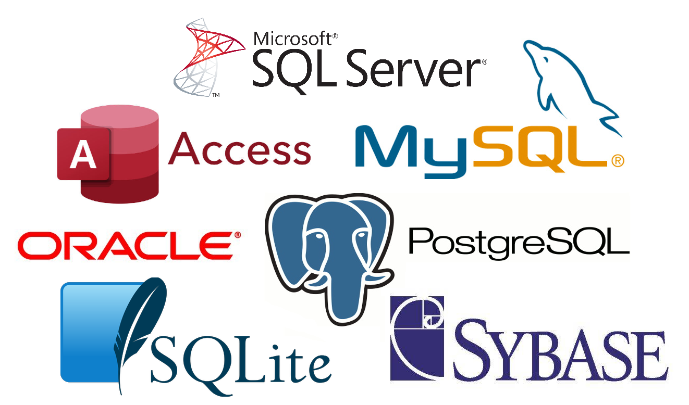

#	Conception physique : SGBD relationnel

L’implémentation physique d'une base de données se fait dans un logiciel informatique appelé un Système de Gestion de Bases de Données (SGBD) ou Système de Gestion de Bases de Données Relationnelles (SGBDR) dans le cas d'un modèle relationnel de base de données.

!!! abstract "Cours" 
    Un  **système de gestion de base de données** ou  **SGBD** est le logiciel qui permet de gérer une base de données sur un support informatique.

Exemples de SGBD parmi les plus connus : MySQL, PostegreSQL, SQLite, Oracle, sybase, Microsoft SQL Server, MS Access

{width="60%"}

Un SGBD fait l'interface entre la base de données et les utilisateurs. Il permet de gérer la lecture, l'écriture ou la modification des données contenues dans une base de données, et garantit en particulier :

- La **persistance des données** : Un SGBD stocke les données de manière permanente pour qu'elles soient toujous accessibles même après la fermeture du programme ou du système ou en cas d'arrêt inattendu du système ou de perte d'alimentation.

- La **gestion des accès concurrents** : Un SGBD permet à plusieurs utilisateurs de travailler sur la même base de données simultanément en gérant les conflits qui peuvent survenir lorsque plusieurs utilisateurs tentent d'accéder aux mêmes données en même temps. 

- L'**éfficacité de traitement des requêtes** : Un SGBD est capable de gérer des volumes de données importants (jusqu’au pétaoctet), et de répondre rapidement aux requêtes.

- La **sécurisation des accès** : Le SGBD offre des mécanismes de sécurité pour protéger les données contre les accès non autorisés en définissant des utilisateurs et des permissions d'accès à la base de données.

Même si historiquement beaucoup de SGBDR sont des entreprises commerciales utilisant chacune ses propres définitions, les termes suivants, qui sont un peu différents de ceux définis dans le modèle relationnel, sont communément utilisés :

-   les relations sont implémentées par des **tables** ;
- 	un tuple devient une **ligne** de la table ;
- 	un attribut devient une **colonne** de la table.

Il existe quelques différences entre relations et tables, par exemple :

- L’ordre des attributs dans une relation n’a pas d’importance alors que dans un SGBD les attributs d’une table ont un ordre.
- Une table dans un SGBD peut ne pas avoir de clé, alors qu’une relation a forcément une clé.

Dans la suite de ce chapitre nous utilisons le SGBD SQLite avec l’interface DB Browse. 