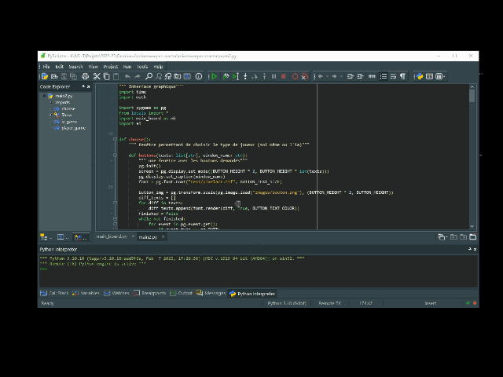

# A propos
Bienvenue sur le site de ressources du cours de Terminale NSI de l'[Ecole Internationale PACA](https://www.ecoleinternationalepaca.fr) .

>L'image `gif` ci-dessous présente un programme Python de résolution automatique de jeux de [Démineurs](https://fr.wikipedia.org/wiki/Démineur_(genre_de_jeu_vidéo)) par intelligence artificielle (AI) réalisé par un élève dans le cadre de son projet en classe de Terminale NSI. 

<figure markdown>
  { width="80%" }
  <figcaption >"Résolution de Démineurs par intelligence artificielle (AI)" par Louis, élève de Terminale NSI, 2022-23</figcaption>
</figure>

## Programme de Terminale NSI
* Le  [programme officiel](assets/spe247_annexe_1158933.pdf).

## Comment est construit ce site ? 
Ce site est rédigé en [Markdown](https://fr.wikipedia.org/wiki/Markdown) avec le thème [Material for MkDocs](https://squidfunk.github.io/mkdocs-material/).