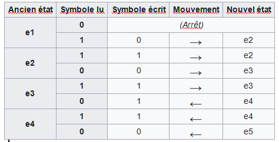

# Programme en tant que donnée, Calculabilité, Problème de l’arrêt

## Programme en tant que donnée

{width="30%" align=right}
{width="30%" align=right}


On a vu en classe de première avec l’architecture von Neumann que les données et les programmes sont stockés ensembles dans la mémoire de l’ordinateur. Rien n’empêche donc un programme d'utiliser le code d'un autre programme en mémoire pour le lire, l'écrire ou l’exécuter. 

!!! abstract "Cours" 
    La dualité entre programme et données est un concept fondamental en informatique : les programmes sont des données comme les autres.

Un programme peut donc lire un programme en entrée, écrire un programme en sortie ou exécuter un autre programme.


C'est une situation qui est souvent rencontrée en pratique :

-	Les **interpréteurs** sont des programmes qui prennent en entrée la description d’un autre programme et qui simulent ce programme. Un programme Python est interprété, c’est-à-dire qu’il est compilé en une description dans un codage que l’on appelle bytecode. Lorsqu’on cherche à lancer ce programme, l’interpréteur simule ce bytecode
-	Les **compilateurs** sont aussi des bons exemples. Le langage C est un langage compilé : une fois le code source terminée, le compilateur (qui est un logiciel comme un autre) "transforme" ce code source en langage machine.
-	Un **système d'exploitation** peut être vu comme un programme qui fait "tourner" d'autres programmes
-	Les **logiciels de téléchargement** permettent de télécharger d'autres logiciels.
-	Il existe des programmes de détection d'erreurs (ou preuve de correction)[^1.1] capables de lire d'autres programmes afin de détecter certaines erreurs dans leur code source.  

[^1.1]: Le développement de programmes de "détection d'erreurs" a connu une forte croissance en France, notamment depuis l'accident du vol 501 d'Ariane 5 du 4 juin 1996 ou encore de la mise au point du métro automatique Meteor (ligne 14 à Paris).

Dans le même ordre d'idée, une fonction Python peut lire et exécuter une autre fonction, par exemple la fonction `calcule` ci-dessous admet deux paramètres, une fonction `f` et une valeur `x`.

``` py
import math

def calcule(f, x):
    print(f(x))

calcule(math.sqrt, 5)
```

## Calculabilité et problème de la décision (Entscheidungsproblem)

<figure class="inline end" markdown>
  {align=right width=100} 
  <figcaption>David Hilbert <br> (1862-1943) </figcaption>
</figure>

Si nous avons l’intuition que l’on peut trouver un algorithme qui donne la solution pour la plupart des fonctions et des problèmes mathématiques que nous connaissons (somme, différence, produit, division, puissance, PGCD, etc…), une question fondamentale de l’informatique théorique est de déterminer si un problème donné peut être "calculé"[^1.2]  ou non par un algorithme que l’on peut programmer.  Est-il possible de tout programmer ? Suffit-il de donner la spécification d’une fonction ou d’un problème pour que l’on puisse la réaliser à l’aide d’un algorithme adéquat ? 

[^1.2]: Le mot « calcul » vient de calculus qui signifie caillou en latin. Pour se convaincre de la pertinence de cette origine, il suffit d’évoquer le décompte des nombres à l’aide de petits cailloux

Autrement dit, **est-ce que toute fonction est calculable** ?  Et de la même façon, **est-ce que tout problème de décision (dont la réponse est vraie ou fausse) est décidable** ? Ce problème est connu sous le nom du **problème de la décision**, ou sous son nom d'origine en allemand *Entscheidungsproblem*, en référence à la question posée par David Hilbert en 1928. 

!!! abstract "Cours" 
    On dit qu'une fonction est calculable ou qu’un problème de décision est décidable lorsqu'il existe un algorithme pour le résoudre : c'est-à-dire qu'il prend en entrée la donnée du problème, effectue des calculs bien définis, et termine toujours en temps fini[^1.3]  en répondant à la question posée. 

[^1.3]:   La notion de problème décidable ne fait aucune hypothèse sur le temps passé à résoudre la question — à part qu'il soit toujours fini. Ainsi, à l'intérieur des problèmes décidables, il y a tout ce qui concerne la complexité, entre les problèmes solubles dans un temps polynomial (P), et non polynomial (NP). Par exemple le problème du remplissage d'un sac à dos, ne pouvant supporter plus d'un certain poids, avec tout ou partie d'un ensemble donné d'objets ayant chacun un poids et une valeur. Les objets mis dans le sac à dos doivent maximiser la valeur totale, sans dépasser le poids maximum. Ce problème est difficile du point de vue de la complexité et l'on ne connaît pas de méthode générale pour construire une solution optimale, mais il est certainement décidable, il suffit par exemple d’énumérer toutes les solutions envisageables.

Deux mathématiciens, Alonzo Church et Alan Turing vont chacun à leur manière répondre à cette question. 


## Church et le lambda calcul

<figure class="inline end" markdown>
  {align=right width=100} 
  <figcaption>Alonzo Church<br> (1903-1995) </figcaption>
</figure>

!!! abstract "Cours" 
    Entre 1932 et 1936, Alonzo Church a identifié une classe de fonctions arithmétiques qui semblait posséder les propriétés intuitives des **fonctions calculables** : le lambda-calcul (ou λ-calcul).

    L'idée de base du lambda-calcul est que tout est fonction. Il est possible de fabriquer des fonctions en disant que si $E$ est une expression, on crée la fonction qui à $x$ fait correspondre l'expression $E$ ; on écrit $λx.E$ cette nouvelle fonction. 

|Notation classique|λ-calcul|
|:-:|:-:|
|$f:N→ N$<br>$x ⟼E$|$λx.E$|
|$g:N→ N$<br>$x ⟼2x+1$|$λx.2x + 1$|
|$h:N→ N$<br>$x ⟼x^2$|$λx.x×x$|


Une fonction est en particulier exprimée par une expression qui peut contenir des fonctions qui ne sont pas encore définies : ces dernières sont remplacées par des variables. Par exemple il est possible de construire :

- la fonction constante égale à $x$, à savoir $λy.x$ , puis
- la fonction qui fabrique les fonctions constantes, où la constante $x$ est un paramètre : $λx.(λy.x)$.
- etc.

Le lambda-calcul fournit un langage précis pour décrire les fonctions et les simplifier. La fonction $λx.(λy.x)$ peut aussi s’écrire $λx.λy.x$, c’est-à-dire une fonction qui prend deux paramètres $x$ et $y$ et renvoie simplement la valeur $x$.

En Python la fonction $λx.x × x$ qui renvoie le carré d'un nombre peut de programmer rapidement :

``` py
>>> f = lambda x: x*x  
>>> f(3)
9
```

Les fonctions lambda sont principalement utilisées pour être utilisées par d'autres fonctions qui prennent une fonction comme argument, par exemple :
``` py
>>> l = ['id01', 'id10', 'id02', 'id12', 'id03', 'id13']
>>> tri_l = sorted(l, key=lambda x: int(x[2:]))                           
>>> tri_l
['id01', 'id02', 'id03', 'id10', 'id12', 'id13']
```

Le lambda-calcul est à l’origine des fonctions lambda en Python (et dans d’autres langages comme Java, C#) et  des langages fonctionnels : CAML, Haskell, LISP, Scala… 

##	La machine de Turing


<figure class="inline end" markdown>
  {align=right width=100} 
  <figcaption>Alan Turing<br> (1912-1954) </figcaption>
</figure>


Alan Turing a publié en 1936 un article intitulé : « **On Computable Numbers, with an Application to the Entscheidungsproblem** »[^1.4] dans lequel il décrit un dispositif que son maître de thèse Alonzo Church appellera une machine de Turing. 

[^1.4]: Sur les nombres calculables avec une application au problème de la décision :[https://www.cs.virginia.edu/~robins/Turing_Paper_1936.pdf](https://www.cs.virginia.edu/~robins/Turing_Paper_1936.pdf).

!!! abstract "Cours" 
    Quoique son nom de « machine » puisse conduire à croire le contraire, une machine de Turing est un modèle abstrait (inventé avant l’apparition des ordinateurs) qui définit ce qu’est un calcul.

La machine de Turing est à l’origine des ordinateurs et des langages de programmation impératifs et fait d’Alan Turing le « père » de la science informatique.


{align=right width=55%} 
{align=right width=55%} 

{align=right width=45%} 

Une machine de Turing comporte les éléments suivants :

- Un **ruban** supposé infini contenant des caractères (typiquement des  0 et 1 mais pas que) ou vide (blanc ou ●).

- Une **tête de lecture/écriture** qui peut se déplacer vers la gauche ou vers la droite du ruban[^1.5]. 

- Une **variable d’état** qui mémorise l'état courant de la machine de Turing.

- Une **table d'actions** ou **programme**  qui indique quel symbole écrire, comment déplacer la tête de lecture, quel est le nouvel état, en fonction du symbole lu sur le ruban et de l'état courant de la machine. Si aucune action n'existe pour une combinaison donnée d'un symbole lu et d'un état courant, la machine s'arrête.

[^1.5]: Attention, dans certains cas c’est le ruban qui se déplace au lieu de la tête de lecture, les déplacements sont alors inversés.

On peut aussi représenter un programme sous la forme d’un graphe orienté avec les changements d’états et en écrivant sur les branches le caractère lu, le caractère écrit et le déplacement (dans l’ordre)


{align=center}
{align=center}


