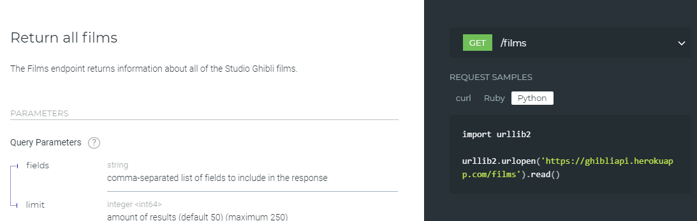

#	Modularité

!!! abstract "Cours" 
    La **modularité** consiste à découper un projet en plus petit programmes afin de :

    - Faciliter la réutilisation de bouts de codes sans avoir à les réécrire  ou dupliquer.
    - Faciliter la réalisation d’un gros projet en sous projets plus simples.
    - Donner une structure pour faciliter la compréhension du code et sa maintenance.


##	Modules et bibliothèques (rappels de 1ère)
!!! abstract "Cours"
    Un **module** est un programme Python regroupant des fonctions et des constantes (des variables dont la valeur ne change pas[^3.1]) ayant un rapport entre elles.  
    
    Un module doit être **importé** dans un programme avant de pouvoir utiliser ses fonctions et ses constantes.
    
    Une **bibliothèque** (ou *package* en anglais) regroupe des fonctions, des constantes et des **modules**.

[^3.1]: Par exemple la valeur de $\pi$ dans le module `math`.


### `import`

Pour importer un module dans un programme, il faut utiliser l'instruction `import` en début de programme :

``` py
import mesfonctions
```

Pour appeler une fonction ou utiliser une constante d'un module il faut écrire le nom du module suivi d'un point « . » puis du nom de la fonction ou de la constante.  

``` py linenums="1"
import mesfonctions

n = int(input('Entrez un nombre '))
print(mesfonctions.est_premier(n)) 
```

:warning: Prendre soin d’enregistrer ce programme dans le même répertoire que le fichier « mesfonctions.py ».

Il est aussi possible donner un alias à un module pour le renommer avec un nom plus simple à écrire, par exemple pour utiliser `mf` au lieu de `mesfonctions` :

``` py linenums="1"
import  mesfonctions  as mf

n = int(input('Entrez un nombre '))
print(mf.est_premier(n)) 
```


!!! abstract "Cours"
    === "Sans alias"
        Pour importer un module `nom_module`, il faut écrire en début de programme l’instruction : 

        `import nom_module`	
        
        puis pour utiliser une fonction `nom_fonction()` de ce module  :

        `nom_module.nom_fonction()`

    === "Avec alias"
        Pour importer un module `nom_module` en lui donnant un alias `nom_alias`, il faut écrire en début de programme l’instruction :

        `import nom_module as nom_alias`	
        
        puis pour utiliser une fonction `nom_fonction()` de ce module  :

        `nom_alias_module.nom_fonction()`


La fonction `help()` permet de savoir ce que contient un module :

``` py
>>> help(mesfonctions)
Help on module mesfonctions:
…
```

###	`from … import …`

Il existe une autre méthode pour importer des fonctions ou constantes depuis un module. Admettons que le module `mesfonctions` contienne des dizaines de fonctions, mais que nous ayons uniquement besoin dans notre programme de la fonction `est_premier`, dans ce cas il est préfèrable d'importer uniquement cette fonction plutôt que tout le module en utilisant l'instruction ``from mesfonctions import est_premier`. 

``` py linenums="1"
from  mesfonctions import est_premier

n = int(input('Entrez un nombre '))
print(est_premier(n))
```

À noter : 
> Ici on ne met pas le préfixe « `mesfonctions.` »  devant le nom de la fonction `est_premier`. 


On peut aussi donner un alias à une fonction :
`from mesfonctions import est_premier as estprems`
et utiliser ensuite la fonction `estprems()`.

!!! abstract "Cours"
   
    === "Sans alias"

        Pour importer une fonction `nom_fonction()` depuis le module `nom_module`, il faut écrire en début de programme l’instruction :
        
        `from nom_module import nom_fonction`		
        
        puis pour utiliser cette fonction :
        
        `nom_fonction()`


        
    === "Avec alias"


        Pour importer une fonction `nom_fonction()` en lui donnant un alias `nom_alias` depuis le module `nom_module`, il faut écrire en début de programme l’instruction :
        
        `from nom_module import nom_fonction as nom_alias`		
        
        puis pour utiliser cette fonction :
        
        `nom_alias()`


Il est aussi possible d'importer plusieurs fonctions d’un même module séparées par des virgules :

``` py
from mesfonctions import est_premier, une_autre_fonction
```
voire même toutes les fonctions d'un module en tapant « `*` » à la place du nom de la fonction à importer.

``` py
from mesfonctions import *
```

Mais cette dernière utilisation est vivement déconseillée, hormis dans des cas très particuliers par exemple des programmes très courts, car il peut y avoir des conflits entre des fonctions qui ont le même nom. Pour s’en convaincre, imaginons un programme écrit en utilisant l'instruction `pow(1, 2, 3)` qui fonctionnerait parfaitement jusqu'à ce qu'une modification necessitant le module `math` ajoute l'instruction `from math import *` en début de programme et génère une erreur inattendue [^3.2] là où il n'y en avait pas.

[^3.2]: La fonction standard Python `pow()` prend trois paramètres alors que la fonction `pow()` du module `math` n'en a que deux ! L'import de `from math import *` a importé la seconde fonction probablement à l'insu du programmeur.


Python offre des centaines de modules avec des milliers de fonctions déjà programmées. Il y a différents types de modules :

- ceux que l’on peut faire soi-même (comme `mesfonctions`).
- ceux qui sont inclus dans la bibliothèque standard de Python comme `random` ou `math`,
- ceux que l’on peut rajouter en les installant séparemment comme `numpy` ou `matplotlib`.

###	De l'utilité de la fonction 'main()'

On a vu auparavant la définition de la fonction `main()` contenant le programme principal, suivi du bout de code suivant :

``` py
if __name__ == '__main__':
    main()
```

Cette instruction conditionnelle vérifie si une variable appelée `__name__` est égale à `'__main__'` et dans ce cas exécute la fonction `main()`. 

L’interpréteur Python définit la variable `__name__` selon la manière dont le code est exécuté :

- directement en tant que script, dans ce cas Python affecte `'__main__'` à  `__name__`, l'instruction conditionnelle est vérifiée et la fonction `main()` est appelée ; ou alors 

- en important le code dans un autre script et dans ce cas la fonction `main()` n’est pas appelée.

En bref, la variable `__name__` détermine si le fichier est exécuté directement ou s'il a été importé.[^3.3] 


[^3.3]:
    On peut facilement se convaincre de l’utilité de la fonction `main()` en écrivant le programme qui affiche la décomposition d’un nombre en facteurs premiers sans `main()` dans le fichier « mesfonctions.py » :
    ``` py linenums="1"
    def est_premier(nombre):
        for div in range(2, nombre):
            if nombre % div == 0:
                return False
        return True

    nombre = int(input('Entrez un nombre '))
    premier = 2 # on commence par le plus petit nombre premier : 2
    while nombre > 1:
            if nombre % premier == 0:      # si premier divise nombre
                print(premier, end=" ")                 # alors on l'affiche
                nombre = nombre // premier     # et on recommence après avoir divisé nombre par premier
            else:                          # sinon, premier n'est pas un diviseur
                premier += 1                 # on cherche le nombre premier suivant
                while not(est_premier(premier)):
                    premier += 1
    ```
    Lorsque pour utiliser la fonction `est_premier` le module est importé dans un autre programme avec `import  mesfonctions`, toute la suite du programme de la décomposition d’un nombre en facteurs premiers est exécuté automatiquement.


###	Modules Python
Python offre des centaines de modules avec des milliers de fonctions déjà programmées. Il y a différents types de modules :
-	ceux que l’on peut faire soi-même (comme `mesfonctions`).
-	ceux qui sont inclus dans la bibliothèque standard de Python comme `random` ou `math`,
-	ceux que l’on peut rajouter en les installant comme `numpy` ou `matplotlib`,


|module|Description|
|---|---|
|`math`|Fonctions mathématiques.|
|`random`|Fonctions aléatoires.|
|`matplolib.pyplot`|Tracés de courbes et grpahiques.|
|`numpy`|Permet de faire du calcul scientifique.|
|`numpy`|Permet de faire du calcul scientifique.|
|`time`|Fonctions permettant de travailler avec le temps.|
|`turtle`|Fonctions de dessin.|
|`doctest`|Execute des tests ecrits dans la docstring d’une fonction.|

La fonction `dir` permet d’explorer le contenu d’un module :

``` py
>>> import math
>>> dir(math)
['__doc__',
 '__loader__',
 '__name__',
 '__package__',
 '__spec__',
 'acos',
 'acosh',
 'asin',
…
```

En plus de la documentation en ligne, la fonction `help` donne les spécifications d’une fonction.

``` py
>>> help(math.cos)
Help on built-in function cos in module math:

cos(...)
    cos(x)
    
    Return the cosine of x (measured in radians).
```

## API

!!! abstract "Cours"
    Une API (Application Programming Interface) est un ensemble de règles et de protocoles qui permettent à différents logiciels de communiquer entre eux. Elle définit les méthodes et les formats d'échange de données que les programmes peuvent utiliser pour interagir.

    {width=70%}
    {width=70%}


Il existe de nombreux types d'API mais le principe de base est toujours le même : deux applications informatiques peuvent intéragir sans que l'une ne connaîsse le fonctionnement interne de l'autre. Il suffit que la documentation décrive précisément les règles d'utilisation de l'API.Par exemple, en Python, pour utiliser une fonction d'un module externe, il suffit de connaître sa spécification (son nom, les paramètres et ce qu'elle retourne), il est inutile de savoir comment elle fonctionne.

Une API peut prendre différentes formes, telles que:

1. API Web: Une API Web permet aux applications de communiquer via Internet en utilisant les protocoles HTTP et HTTPS. 

2. API de système d'exploitation: Les systèmes d'exploitation, tels que Windows, macOS et Linux, fournissent des API qui permettent aux développeurs de créer des applications pour interagir avec le système et les périphériques.

3. API de bibliothèque: Les bibliothèques logicielles fournissent des API qui permettent aux développeurs d'utiliser certaines fonctionnalités ou fonctionnalités spécifiques sans avoir à comprendre les détails internes de leur mise en œuvre.

4. API de matériel: Certains matériels, comme les imprimantes, offrent également des API qui permettent aux logiciels d'interagir avec eux de manière standardisée.

Les API jouent un rôle essentiel dans le développement de logiciels car elles facilitent l'intégration de différentes parties d'une application ou de différents services pour créer des systèmes plus complexes et puissants.

{align=right width=50%}

Prenons pour exemple l'utilisation de l'API Web fournie par le Studio Ghibli pour récupérer des données sur ses films : [https://ghibliapi.vercel.app/ ](https://ghibliapi.vercel.app/ ). 

Observons la documentation : La section FILMS fournit l'URL du point d’accès à l’API, [https://ghibliapi.vercel.app/films](https://ghibliapi.vercel.app/films) et trois exemples de requêtes faites en curl, Ruby et Python.


Juste en dessous (ou en  cliquant sur le lien donné),  on peut observer les données qui vont être envoyées par l’API. Elles sont au format JSON.

!!! info inline end "Rappel" 
    JSON (JavaScript Object Notation) est un format de données textuelles dérivé de la notation des objets en JavaScript. 
    Comme XML, JSON permet de représenter de l’information structurée.
    Un fichier JSON se présente sous forme de listes et de dictionnaires (clé/valeur).

Commençons par importer ces données dans un fichier (noter que la fonction `urllib.request.urlopen()` remplace l’ancienne fonction `urllib2.urlopen()` donnée dans l’exemple de requête[^3.4]).

[^3.4]: Voir [https://docs.python.org/3/library/urllib.request.html](https://docs.python.org/3/library/urllib.request.html).

``` py
>>> import urllib.request
>>> url = 'https://ghibliapi.vercel.app/films'
>>> request = urllib.request.urlopen(url).read()
```

Les données sont importées dans un fichier binaire (en python un fichier binaire se présente sous la forme `b'….'`). 

``` py
>>> type(request)
<class 'bytes'>
>>> print(request)
b'[\n  {\n    "id": "2baf70d1-42bb-4437-b551-e5fed5a87abe",\n    "title": "Castle in the Sky",\n    "description": "The orphan Sheeta inherited a mysterious crystal that links her to the mythical ...
```

On peut maintenant utiliser le module json pour manipuler ces données dans un format plus adapté :

``` py
import urllib.request
import json

url = 'https://ghibliapi.vercel.app/films'
request = urllib.request.urlopen(url).read()
data = json.loads(request.decode())
print(data)
Cette fois on a obtenu un tableau de dictionnaire. On peut facilement l’exploiter, par exemple :
for movie in data:
    print(movie['title'])

```

Prenons un autre exemple d'appel d'une API Windows en utilisant la bibliothèque `ctypes`. 

``` py
import ctypes

# Pour utiliser l'API Windows User32.dll pour les fonctions de gestion de fenêtres
user32 = ctypes.windll.user32

# Définir les types de données pour la fonction MessageBox
user32.MessageBoxW.argtypes = (ctypes.c_void_p, ctypes.c_wchar_p, ctypes.c_wchar_p, ctypes.c_uint)
user32.MessageBoxW.restype = ctypes.c_int

# Afficher une boîte de dialogue MessageBox de l'API
result = user32.MessageBoxW(0, "Bonjour depuis Python!", "Titre de la boîte de dialogue", 1)
```