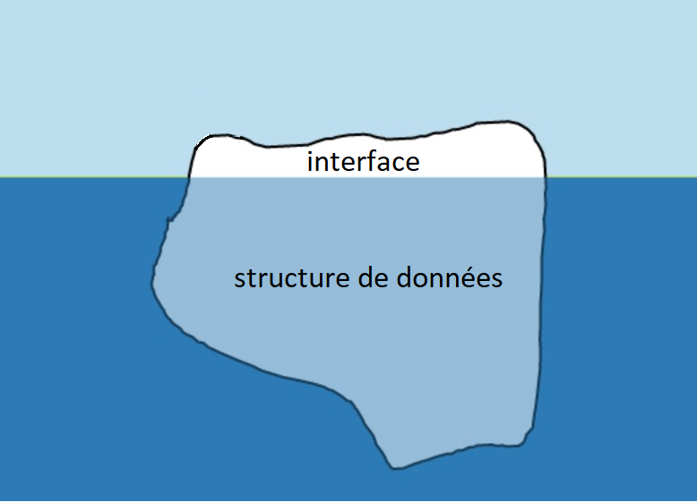

# Structures de données, interface et implémentation 

!!! abstract "Cours"
    Une **structure de données** ou type abstrait de données (TAD ) est un ensemble de données organisées et d'opérations sur ces données.

On parle de type abstrait car c'est une  "vue de l'esprit" permettant la manipulation de ces données par un algorithme sans rentrer dans les détails d'implémentation.  

Par exemples, les entiers relatifs avec les opérations: +, *, /, etc. ou les booléens avec AND, OR et NOT constituent des structures de données bien connues.

!!! abstract "Cours"
    L'**interface** d'une structure de données est l'ensemble des opérateurs nécessaires à la manipulation de cette structure. 

L'utilisateur d'une structure de données n'a besoin de connaître que son interface, comme la partie visible d'un iceberg. L'interface le renseigne sur toutes les opérations possibles sur cette structure de données, sans en connaître l'ensemble du fonctionnement interne qui lui est caché, comme la partie immergée de cet iceberg.

{width="50%"}
 
!!! abstract "Cours"
    L'interface d'une structure de données comporte un ensemble de fonctions de bases (appelées **primitives**), les principales permettant de **créer** (*Create*), **lire** (*Read*), **écrire** (*Update*) ou **supprimer** (*Delete*) (*CRUD* en abrégé) des données. 

Pour une même interface, il peut y avoir diverses implémentations de la même structure de données, qui dépendent par exemple de contraintes du langage de programmation utilisé ou de choix de programmation. 

!!! abstract "Cours"
    L'**implémentation** d'une  structure de données consiste à la "traduire" dans un langage informatique. 

Toutes les structures de données ne sont pas toutes implémentées dans tous les langages informatiques et il faut parfois les programmer pour les utiliser.

